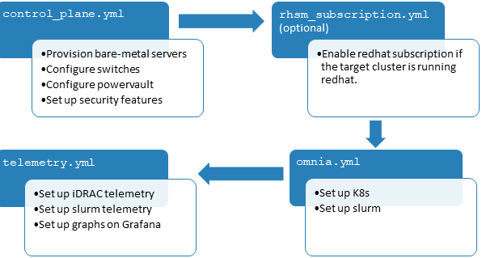

Omnia: Everything at once!
----------------------------------

|Omnia version| |Downloads| |Last Commit| |Commits Since 1.4| |Contributors| |Forks| |License|

Ansible playbook-based deployment of Slurm and Kubernetes on servers running an RPM-based Linux OS

Omnia (Latin: all or everything) is a deployment tool to turn servers with RPM-based Linux images into functioning Slurm/Kubernetes clusters.

.. image:: docs/source/images/omnia-logo-transparent.png

**Pre Requisites before installing Omnia**

- `Python3 <https://www.python.org/>`_

- `Ansible 2.12.7 <https://www.ansible.com/>`_

- `RockyOS <https://rockylinux.org/>`_ / `Red Hat <https://www.redhat.com/en/enterprise-linux-8>`_

**Using Omnia**

1. Set up your network based on the sample topologies provided `here <NetworkTopologies/index.html>`_

2. Verify that your system meets Omnia's `hardware <SupportMatrix/Hardware/index.html>`_ and `software requirements <SupportMatrix/OperatingSystems/index.html>`_

3. Ensure that all pre-requisites are met before each script.

4. Fill out all the required input parameters by script.

5. Run `Control_Plane <RunningControlPlane/index.html>`_ to provision OS's, `configure devices <RunningControlPlane/configuredevices/index.html>`_ and `set up security measures <RunningControlPlane/security/index.html>`_.

6. `Run Omnia on target cluster nodes <RunningOmnia/index.html>`_ to set up Kubernetes and Slurm.

**Troubleshooting Omnia**

* For a list of commonly encountered issues, check out our `FAQs <Troubleshooting/FAQ.html>`_.

* To troubleshoot Omnia, use our `Troubleshooting Guide <Troubleshooting/troubleshootingguide.html>`_.

**Omnia Community Members**

.. image:: https://download.logo.wine/logo/Dell_Technologies/Dell_Technologies-Logo.wine.png

.. image:: https://i.pcmag.com/imagery/articles/05PmkAe4XLJQ94pQo36E1uc-1..v1599074802.jpg

.. image:: https://www.shorttermprograms.com/images/cache/600_by_314/uploads/institution-logos/university-of-pisa.png

.. image:: https://1000logos.net/wp-content/uploads/2021/04/ASU-logo.png

.. image:: https://www.vizias.com/uploads/1/1/8/9/118906653/published/thick-blue-white-ring-letters-full.png

.. image:: https://user-images.githubusercontent.com/5414112/153955170-0a4b199a-54f0-42af-939c-03eac76881c0.png
