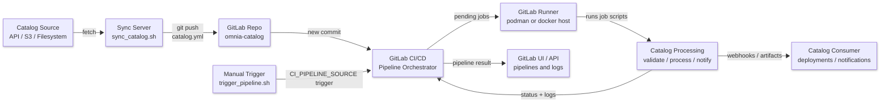

# BuildstreaM GitLab Catalog Pipeline Bundle

This directory packages everything needed to provision a standalone GitLab instance, secure it, register runners, and deploy the catalog pipeline. Follow the sections below in order before copying the repo templates.

## 1. GitLab Host Installation (RPM-based)

```bash
# Enable SSH + open firewall ports
sudo systemctl enable --now sshd
sudo firewall-cmd --permanent --add-service=http
sudo firewall-cmd --permanent --add-service=https
sudo firewall-cmd --permanent --add-service=ssh
sudo systemctl reload firewalld

# Install prerequisites and GitLab CE
sudo dnf install -y curl
curl "https://packages.gitlab.com/install/repositories/gitlab/gitlab-ce/script.rpm.sh" | sudo bash
sudo EXTERNAL_URL="https://gitlab.example.com" dnf install -y gitlab-ce

# Optional: Podman + Docker shim for runners
sudo dnf install -y podman-docker
sudo systemctl enable --now podman.socket
```

## 2. TLS Certificates and Storage Location

1. Generate a private CA (skip if you have an enterprise CA):
   ```bash
   openssl genrsa -out ca.key 4096
   openssl req -x509 -new -nodes -key ca.key -sha256 -days 3650 \
     -subj "/C=IN/ST=Karnataka/L=Bengaluru/O=Omnia/OU=IT/CN=Omnia Internal CA" \
     -out ca.crt
   ```
2. Create the GitLab host certificate (add SANs as required):
   ```bash
   openssl genrsa -out gitlab.example.com.key 2048
   cat > san.cnf <<'EOF'
   [req]
   default_bits = 2048
   prompt = no
   default_md = sha256
   req_extensions = req_ext
   distinguished_name = dn

   [dn]
   CN = gitlab.example.com

   [req_ext]
   subjectAltName = DNS:gitlab.example.com
   EOF

   openssl req -new -key gitlab.example.com.key -out gitlab.example.com.csr -config san.cnf
   openssl x509 -req -in gitlab.example.com.csr -CA ca.crt -CAkey ca.key -CAcreateserial \
     -out gitlab.example.com.crt -days 825 -sha256 -extensions req_ext -extfile san.cnf
   ```
3. Store the certs where GitLab expects them and reconfigure:
   ```bash
   sudo mkdir -p /etc/gitlab/ssl
   sudo cp gitlab.example.com.{crt,key} /etc/gitlab/ssl/
   sudo chmod 644 /etc/gitlab/ssl/gitlab.example.com.crt
   sudo chmod 600 /etc/gitlab/ssl/gitlab.example.com.key

   sudo editor /etc/gitlab/gitlab.rb   # set external_url + letsencrypt['enable']=false
   sudo gitlab-ctl reconfigure
   ```
4. Distribute `ca.crt` to every runner/host that needs to trust the GitLab endpoint (see Runner section below).

## 3. Launch and Access the GitLab UI

1. Obtain the auto-generated root password (valid for 24h):
   ```bash
   sudo cat /etc/gitlab/initial_root_password
   ```
2. Visit `https://gitlab.example.com`, sign in as `root`, and change the password immediately.
3. (Optional) Use the Rails console to generate a service PAT without the UI:
   ```bash
   sudo gitlab-rails runner 'u = User.find_by_username("root"); token = u.personal_access_tokens.create!(name: "bootstrap", scopes: [:api]); token.set_token(SecureRandom.hex(20)); token.save!; puts token.token'
   ```

## 4. Runner Deployment (Podman socket aware)

```bash
# Runner config path or Podman volume
sudo mkdir -p /srv/gitlab-runner/config
podman volume create gitlab-runner-config

# Preferred (binds Podman socket with SELinux label)
podman run -d --name gitlab-runner --restart always \
  -v /srv/gitlab-runner/config:/etc/gitlab-runner:Z \
  -v /run/podman/podman.sock:/var/run/docker.sock:Z \
  docker.io/gitlab/gitlab-runner:latest

# Alternate (mounts Docker socket path + Podman volume)
# podman run -d --name gitlab-runner --restart always \
#   -v /var/run/docker.sock:/var/run/docker.sock \
#   -v gitlab-runner-config:/etc/gitlab-runner \
#   docker.io/gitlab/gitlab-runner:latest
```

## 5. Project, PAT, and Runner Tokens (CLI)

### 5.1 Create a PAT (if not already generated)
- Use the Rails snippet above **or** create one under *User → Edit profile → Access Tokens*.

### 5.2 Create/lookup the project via API
```bash
export GITLAB_URL=https://gitlab.example.com
export PAT=<personal-access-token>

# Create the project (id + legacy runners_token returned)
curl -s --request POST \
  --header "PRIVATE-TOKEN: $PAT" \
  --data "name=omnia-catalog&visibility=private" \
  "$GITLAB_URL/api/v4/projects" | jq '{id, runners_token}'

# If project already exists, query it directly
curl -s --header "PRIVATE-TOKEN: $PAT" \
  "$GITLAB_URL/api/v4/projects?search=omnia-catalog" | jq '.[0] | {id, runners_token}'
```

### 5.3 Create a runner authentication token (GitLab 16+)
```bash
curl -s --request POST \
  --header "PRIVATE-TOKEN: $PAT" \
  --data "runner_type=project_type" \
  --data "project_id=<PROJECT_ID>" \
  --data "description=omnia-runner" \
  --data "run_untagged=true" \
  "$GITLAB_URL/api/v4/user/runners" | jq '{id, token}'
```

### 5.4 Register the containerized runner
```bash
export PROJECT_RUNNER_TOKEN=<glrt-token-from-step-5.3>
podman exec -it gitlab-runner gitlab-runner register \
  --non-interactive \
  --url "$GITLAB_URL" \
  --token "$PROJECT_RUNNER_TOKEN" \
  --executor docker \
  --docker-image alpine:latest \
  --description "omnia-runner" \
  --run-untagged=true
```

### 5.5 Generate a pipeline trigger token via API
```bash
curl -s --request POST \
  --header "PRIVATE-TOKEN: $PAT" \
  --data "description=catalog-trigger" \
  "$GITLAB_URL/api/v4/projects/<PROJECT_ID>/triggers"
```
Capture the `token` and store it (for example) in `inputs.env` for `trigger_pipeline.sh`.

## Bundle Contents

| File | Purpose |
| --- | --- |
| `catalog.yml` | Canonical catalog file that GitLab monitors for changes |
| `.gitlab-ci.yml` | Minimal pipeline (process stage) that runs when `catalog.yml` changes or when triggered |
| `sync_catalog.sh` | Fetches the latest catalog from a remote source, commits it, and pushes to GitLab |
| `trigger_pipeline.sh` | Fires the GitLab pipeline via the trigger API and injects custom variables (for example, `JOBID`) |
| `install_gitlab_runner.sh` | Deploys and registers a GitLab Runner (Podman container) so jobs actually execute |

```text
buildstreaM/
├── README.md
├── .gitlab-ci.yml
├── catalog.yml
├── install_gitlab_runner.sh
├── sync_catalog.sh
└── trigger_pipeline.sh
```

## End-to-End Flow



## Quick Start (CLI-only)

1. **Clone the project and copy assets**
   ```bash
   git clone https://gitlab.example.com/root/omnia-catalog.git
   cp -r buildstreaM/* omnia-catalog/
   ```

2. **Commit `catalog.yml` and `.gitlab-ci.yml`**
   ```bash
   cd omnia-catalog
   git add catalog.yml .gitlab-ci.yml scripts/
   git commit -m "add catalog pipeline"
   git push origin main
   ```

3. **Create a pipeline trigger token via API**
   ```bash
   export GITLAB_URL=https://gitlab.example.com
   export PAT=<personal-access-token>
   curl -s --request POST \
     --header "PRIVATE-TOKEN: $PAT" \
     --data "description=catalog-trigger" \
     "$GITLAB_URL/api/v4/projects/2/triggers"
   ```
   (Capture the `token` value for later use.)

4. **Install/register runner using the provided script**
   ```bash
   cd buildstram
   chmod +x install_gitlab_runner.sh
   sudo ./install_gitlab_runner.sh
   ```

5. **Configure script environment variables from CLI**
   ```bash
   cat > inputs.env <<'EOF'
   GITLAB_URL=https://gitlab.example.com
   PROJECT_PATH=root/omnia-catalog
   PIPELINE_TRIGGER_TOKEN=<token-from-step-3>
   RUNNER_REGISTRATION_TOKEN=<runner-token>
   EOF
   ```
   Source the file before running helper scripts: `source inputs.env`.

6. **Test the workflow entirely via CLI**
   ```bash
   ./sync_catalog.sh          # pulls remote catalog and pushes commit
   ./trigger_pipeline.sh test-123   # fires API trigger with custom ref
   git lab ci status          # or curl $GITLAB_URL/api/... to inspect jobs
   ```
   (Replace the last command with your preferred CLI to inspect pipeline status.)

> **Tip:** If you only need a reference implementation, leave the files inside `buildstreaM/`. If you want them active, copy them to your repo root or adjust your automation to pull from this directory.

## Required Files (copy as-is)

### `.gitlab-ci.yml`

```yaml
stages:
  - process

process_catalog:
  stage: process
  script:
    - echo "Pipeline running"
    - echo "Commit $CI_COMMIT_SHA"
    - cat catalog.yml
  rules:
    - changes:
        - catalog.yml
    - if: $CI_PIPELINE_SOURCE == "trigger"
    - if: $CI_PIPELINE_SOURCE == "push"
```

### `catalog.yml`

```yaml
# Canonical catalog file used for pipeline change detection
metadata:
  version: "3.0.0"
  last_updated: "2026-02-05T10:00:00Z"
  source: "https://api.example.com/catalog"
  description: "Sample catalog used to demonstrate the GitLab CI/CD flow"

items:
  - name: nginx
    version: "1.24.0"
    action: install
    parameters:
      config_profile: hardened

  - name: postgresql
    version: "18.0"
    action: install
    parameters:
      storage_class: fast-ssd
      replicas: 2

  - name: redis
    version: "7.2"
    action: configure
    parameters:
      ha_mode: true
      eviction_policy: volatile-lru

settings:
  environment: production
  region: us-east-1
  approvals_required: true
```

### `inputs.env` (example variable source)

Use a dedicated input file to keep reusable settings for scripts (`sync_catalog.sh`, runner install helpers, etc.). Source it before running scripts: `source inputs.env`.

```bash
# Paths
CATALOG_PATH=/repos/omnia-catalog/catalog.yml
CERT_PATH=/etc/gitlab/ssl/gitlab.example.com.crt

# GitLab project metadata
GITLAB_URL=https://gitlab.example.com
PROJECT_PATH=root/omnia-catalog
ACCESS_TOKEN=<personal-access-token>

# Runner / pipeline tokens
RUNNER_REGISTRATION_TOKEN=<runner-token>
PIPELINE_TRIGGER_TOKEN=<trigger-token>

# Misc toggles
BRANCH=main
REGION=us-east-1
```

> Adjust or expand the `inputs.env` keys to cover any other secrets/paths your environment requires (store sensitive values securely—CI variables or vaults in production).

## Implementation Scenarios

### Case 1 – Hosted GitLab (you manage the server)

1. **Provision & bootstrap the host**
   - Spin up a RHEL/Rocky/Ubuntu VM (≥ 8 vCPU/16 GB RAM) and point DNS `gitlab.example.com` at its IP.
   - Install prerequisites:
     ```bash
     sudo dnf install -y curl policycoreutils openssh-server
     curl https://packages.gitlab.com/install/repositories/gitlab/gitlab-ce/script.rpm.sh | sudo bash
     ```
   - Install GitLab with your HTTPS URL:
     ```bash
     sudo EXTERNAL_URL="https://gitlab.example.com" dnf install -y gitlab-ce
     ```

2. **Lay down SSL and apply config**
   - Copy your cert/key: `sudo cp gitlab.example.com.{crt,key} /etc/gitlab/ssl/`.
   - Edit `/etc/gitlab/gitlab.rb`:
     ```ruby
     external_url "https://gitlab.example.com"
     letsencrypt['enable'] = false
     nginx['ssl_certificate'] = "/etc/gitlab/ssl/gitlab.example.com.crt"
     nginx['ssl_certificate_key'] = "/etc/gitlab/ssl/gitlab.example.com.key"
     ```
   - `sudo gitlab-ctl reconfigure` and verify with `curl -I https://gitlab.example.com`.

3. **Seed the catalog repo**
   - Create the project `omnia-catalog` via UI or API.
   - Push the files:
     ```bash
     git clone ssh://git@gitlab.example.com/root/omnia-catalog.git
     cp -r buildstram/* omnia-catalog/
     cd omnia-catalog
     git add catalog.yml .gitlab-ci.yml scripts/
     git commit -m "seed catalog pipeline"
     git push origin main
     ```
   - Add CI variables and trigger tokens under *Settings → CI/CD*.

4. **Install and register the runner**
   - On the GitLab host (or worker), place the CA at `/srv/gitlab-runner/config/certs/gitlab.example.com.crt`.
   - Register:
     ```bash
     podman run --rm -it -v /srv/gitlab-runner/config:/etc/gitlab-runner:Z \
       -v /run/podman/podman.sock:/var/run/docker.sock:Z \
       docker.io/gitlab/gitlab-runner:latest register \
         --url https://gitlab.example.com/ \
         --registration-token <INSTANCE_OR_PROJECT_TOKEN> \
         --tls-ca-file /etc/gitlab-runner/certs/gitlab.example.com.crt \
         --executor docker --docker-image alpine:latest
     ```
   - Edit `/srv/gitlab-runner/config/config.toml` to include `pull_policy = "if-not-present"` and `extra_hosts = ["gitlab.example.com:<IP>"]` if DNS is internal.
   - Start the runner container with the `podman run -d ...` command from earlier.

5. **Validate end-to-end**
   - Run `./sync_catalog.sh` (updates `catalog.yml`, commits, pushes).
   - Execute `./trigger_pipeline.sh smoke-1` to test the trigger API.
   - Watch the pipeline in GitLab and confirm every stage uses the hosted runners without SSL/DNS errors.

### Case 2 – External GitLab (GitLab.com or existing instance)

1. **Project onboarding**
   - Request Maintainer access to the target group/project or create a new project in your namespace.
   - Push the `buildstram/` assets just like Case 1 (clone → copy files → commit/push).

2. **CI variables and triggers**
   - In the external GitLab UI, set project/group variables for API keys, endpoints, etc.
   - Create a pipeline trigger token and paste it into `trigger_pipeline.sh`.

3. **Runner options**
   - **Shared runners**: do nothing—ensure `.gitlab-ci.yml` pulls public images and doesn’t require privileged mode.
   - **Bring-your-own runner**: rerun the registration command above but set `--url` to the external GitLab (for SaaS, `https://gitlab.com/`). No GitLab install needed—just the runner container or package.
   - For private networks, add `extra_hosts` or a VPN so runners can reach internal systems referenced by the pipeline.

4. **Testing**
   - `./sync_catalog.sh` and `./trigger_pipeline.sh <test>`—both point to the external GitLab API URL.
   - Confirm pipeline logs, artifacts, and notifications match expectations.

> **Decision guide:** Use Case 1 when you control the GitLab infrastructure (custom SSL, air-gapped runners). Use Case 2 when GitLab is already hosted elsewhere and you only need to deploy this catalog pipeline plus runners.

## Appendix – Command Log (Hosted GitLab Example)

The following shell transcript shows a complete self-hosted bring-up using the commands captured during testing. Run these on the GitLab VM as `root` (or via `sudo`).

```bash
# Enable SSH and open required firewall services
sudo systemctl enable --now sshd
sudo firewall-cmd --permanent --add-service=http
sudo firewall-cmd --permanent --add-service=https
sudo firewall-cmd --permanent --add-service=ssh
sudo systemctl reload firewalld

# Install prerequisites and Omnibus GitLab
sudo dnf install -y curl
curl "https://packages.gitlab.com/install/repositories/gitlab/gitlab-ce/script.rpm.sh" | sudo bash
sudo EXTERNAL_URL="https://gitlab.example.com" dnf install -y gitlab-ce

# Optional: install Podman + Docker shim for runners
sudo dnf install -y podman-docker
sudo systemctl enable --now podman.socket

# Runner config volume
sudo mkdir -p /srv/gitlab-runner/config
podman volume create gitlab-runner-config

# Launch runner container (bind-mounted config + Podman socket)
podman run -d --name gitlab-runner --restart always \
  -v /srv/gitlab-runner/config:/etc/gitlab-runner:Z \
  -v /run/podman/podman.sock:/var/run/docker.sock:Z \
  docker.io/gitlab/gitlab-runner:latest
# Alternate volume-based form
# podman run -d --name gitlab-runner --restart always \
#   -v /var/run/docker.sock:/var/run/docker.sock \
#   -v gitlab-runner-config:/etc/gitlab-runner \
#   docker.io/gitlab/gitlab-runner:latest

# (Create personal access token for automation)
export GITLAB_URL="https://gitlab.example.com"
export PAT="<personal-access-token>"

# Create project and capture project ID + legacy runners_token
curl -s --request POST \
  --header "PRIVATE-TOKEN: $PAT" \
  --data "name=omnia-catalog&visibility=private" \
  "$GITLAB_URL/api/v4/projects" | grep -E '"id"|"runners_token"'

# GitLab 16+: create a runner via API to obtain a glrt token
curl -s --request POST \
  --header "PRIVATE-TOKEN: $PAT" \
  --data "runner_type=project_type" \
  --data "project_id=2" \
  --data "description=omnia-runner" \
  --data "run_untagged=true" \
  "$GITLAB_URL/api/v4/user/runners" | grep -E '"token"|"id"'

# Register the containerized runner (non-interactive)
export PROJECT_RUNNER_TOKEN="glrt-XXXXXXXX"
podman exec -it gitlab-runner gitlab-runner register \
  --non-interactive \
  --url "$GITLAB_URL" \
  --token "$PROJECT_RUNNER_TOKEN" \
  --executor docker \
  --docker-image alpine:latest \
  --description "omnia-runner" \
  --run-untagged=true

# After registration, push repo contents and run a pipeline
git clone https://gitlab.example.com/root/omnia-catalog.git
cp -r buildstram/* omnia-catalog/
cd omnia-catalog && git add . && git commit -m "bootstrap" && git push
```

> **Note:** PATs shown in examples must be rotated immediately after testing. Store final PATs/runner tokens in a secrets manager.
