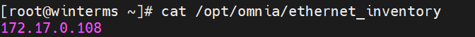
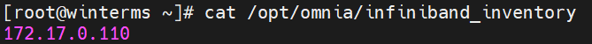
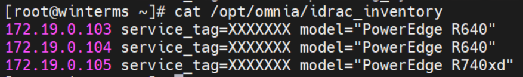
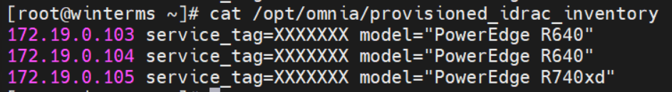
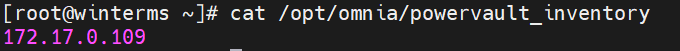
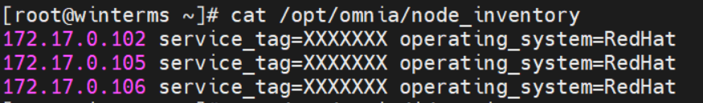

# Omnia Command Line Interface (CLI) Guide

## Enabling CLI on the control plane
To enable CLI on the control plane, disable AWX. This can be done by setting `awx_web_support` to `false` in `/ommia/control_plane/input_params/base_vars.yml`. If done before the initial run of `control_plane.yml`, Omnia will not install AWX on the control plane, thereby re-routing all other configuration via Ansible CLI.
>> **Note**: If `awx_web_support` is set to false on any subsequent runs of `control_plane.yml`, AWX will not be uninstalled. This will require user intervention. However, all configuration after `awx_web_support` is disabled will be via CLI.


## Running `control_plane.yml`
When AWX is disabled, the `control_plane.yml` script can only be invoked using CLI.
```
cd /omnia/control_plane
ansible-playbook control_plane.yml
```
>> **Note**: It is recommended that `control_plane.yml` is run from the control plane directory as explained above.

## Updating inventory
On executing Omnia control plane, all devices that can be managed by Omnia will be assigned an IP and device inventories will be created by device type in `/opt/omnia`. The inventories available are:
1. ethernet_inventory <br> 
2. infiniband_inventory <br> 
3. idrac_inventory <br> 
4. provisioned_idrac_inventory <br> 
5. powervault_inventory <br> 
6. node_inventory <br> 

## Configure devices
### [Ethernet Devices](Device_Configuration/Ethernet_Switches.md)
1. Verify that `/opt/omnia/ethernet_inventory` is created and updated with all ethernet switch IP details. This is done automatically when `control_plane.yml` is run. If it's not updated, run `ansible-playbook collect_device_info.yml` (dedicated NIC) or `ansible-playbook collect_node_info.yml` (LOM NIC) from the control_plane directory.
2. Run `ansible-playbook ethernet.yml -i /opt/omnia/ethernet_inventory` <br>

### [Infiniband switches](Device_Configuration/Infiniband_Switches.md)
1. Verify that `/opt/omnia/infiniband_inventory` is created and updated with all infiniband switch IP details. This is done automatically when `control_plane.yml` is run. If it's not updated, run `ansible-playbook collect_device_info.yml` (dedicated NIC) or `ansible-playbook collect_node_info.yml` (LOM NIC) from the control_plane directory.
2. Run `ansible-playbook infiniband.yml -i /opt/omnia/infiniband_inventory` <br>

### [Powervault Storage](Device_Configuration/PowerVault.md)
1. Verify that `/opt/omnia/powervault_inventory` is created and updated with all powervault IP details. This is done automatically when `control_plane.yml` is run. If it's not updated, run `ansible-playbook collect_device_info.yml` (dedicated NIC) or `ansible-playbook collect_node_info.yml` (LOM NIC) from the control_plane directory.
2. Run `ansible-playbook powervault.yml -i /opt/omnia/powervault_inventory` <br>

### [Servers](Device_Configuration/Servers.md)
1. Verify that `/opt/omnia/idrac_inventory` is created and updated with all iDRAC IP details. This is done automatically when `control_plane.yml` is run. If it's not updated, run `ansible-playbook collect_device_info.yml` from the control_plane directory.
2. Run `ansible-playbook idrac.yml -i /opt/omnia/idrac_inventory` <br>

## Enable Red Hat subscription
Before running `omnia.yml`, it is mandatory that red hat subscription be set up on manager/ compute nodes running Red Hat.
* To set up Red hat subscription, fill in the [rhsm_vars.yml file](Input_Parameter_Guide/Control_Plane_Parameters/Device_Parameters/rhsm_vars.md). Once it's filled in, run the template using AWX or Ansible. <br>
* The flow of the playbook will be determined by the value of `redhat_subscription_method` in `rhsm_vars.yml`.
    - If `redhat_subscription_method` is set to `portal`, pass the values `username` and `password` on the AWX screen. For CLI, run the command: <br> `ansible-playbook rhsm_subscription.yml -i inventory -e redhat_subscription_username= "<username>" -e redhat_subscription_password="<password>"`
    - If `redhat_subscription_method` is set to `satellite`, pass the values `organizational identifier` and `activation key` on the AWX screen. For CLI, run the command: <br> `ansible-playbook rhsm_subscription.yml -i inventory -e redhat_subscription_activation_key= "<activation-key>" -e redhat_subscription_org_id ="<org-id>"`

## Disable Red Hat subscription <br>
`ansible_playbook omnia/control_plane/rhsm_unregister.yml -i inventory`

## Installing clusters
If all inventories and groups are assigned per the [Omnia Pre Requisites](PreRequisites/OMNIA_PreReqs.md): 
* The `node_inventory` file in `opt/omnia` should have a list of all nodes (IPs) that are provisioned by Omnia. Assign groups to all nodes based on the below criteria:
    * The __manager__ group should have exactly 1 manager node.
    * The __compute__ group should have at least 1 node.
    * The __login_node__ group is optional. If present, it should have exactly 1 node.
    * The **nfs_node** group is optional. If powervault is configured by omnia control plane, then the host connected to the powervault (That is the nfs server) should be part of nfs_node group.
Run `omnia.yml` to create the cluster
`ansible-playbook omnia.yml -i inventory` 

>> **Note**:
>> * To skip the creation of a Kubernetes cluster, use the skip tag:  `ansible-playbook omnia.yml -i inventory --skip-tags kubernetes`
>> * To skip the creation of a Slurm cluster, use the skip tag:  `ansible-playbook omnia.yml -i inventory --skip-tags slurm`

## Installing job management tools
### Installing Jupyterhub <br>
`ansible-playbook platforms/jupyterhub.yml -i inventory`
### Installing Kubeflow <br>
`ansible-playbook platforms/kubeflow.yml -i inventory`
 


