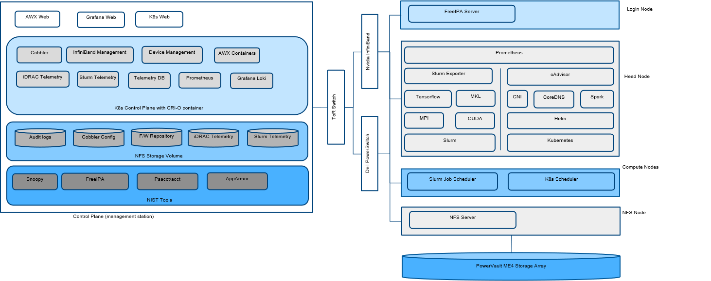

# Install the Omnia Control Plane

## Typical layout of an HPC cluster supported by Omnia 1.2
Using Omnia 1.2, you can provision and monitor hardware devices such as servers, storage devices, network switches, and InfiniBand switches in an HPC cluster. To enable Omnia to provision or configure the supported hardware devices, Omnia requires the following connections to be made available in your HPC cluster environment. 



* Connecting a Pass-Through Switch: Provision and configure a 1GBE pass-through switch which will be used as a pass-through uplink switch. One of the NIC on the control plane must be connected to a data port on the pass-through switch and a second connection must be established from a data port on the pass-through switch to the management port of the TOR network switch.  
>> **Note:**  Omnia is not responsible for provisioning and configuring the pass-through switch.
* Establishing a management network: From the data ports on the pass-through switch, connect to the following ports:
	* iDRAC ports on manager and compute nodes
	* Management port on the network switches
	* Management port on the PowerVault devices
	* Management port on the InfiniBand switches  

  Through this management network, management DHCP assigns IP addresses to the devices in the HPC cluster. 
* Establishing a data network: 
	* Connect one of the data ports on the PowerVault device to the NIC of the compute node. 
	* For InfiniBand DHCP, connect NIC on the control plane to one of the data ports of the InfiniBand Switch. Next, connect one of the data ports of the InfiniBand switch to the NIC on the compute node. 
* Establishing a host network: For Cobbler DHCP to assign an IP address to the compute node NIC, connect NIC of the control plane to the data port on the network switch. Connect another data port on the network switch to the NIC on the compute node. Omnia will provision OS on the compute nodes using PXE when the iDRAC Enterprise license is missing on any of the compute nodes in the HPC cluster.

>> __Note__:
	* Cobbler web support has been discontinued from Omnia 1.2 onwards.
	* Note that the PowerVault NFS server should have separate NICs configured for management, data (Connecting to other compute nodes) and a dedicated data connection to the storage array.

Depending on the pass-through switch configured in your HPC environment, the number of racks will be limited based on the number of ports available on the pass-through switch. To support additional racks, you can form an L1-L2 topology and configure a network of Passthrough Switches. A typical layout of an HPC cluster with a network of pass-through switches is as per the following illustration:  


>>__Note__: Refer to the [Control Plane Pre-Requisites](../PreRequisites/Control_Plane_PreReqs.md) file to ensure smooth running of the control_plane.

## Steps to deploy the Omnia Control Plane

1. On the control plane, change the working directory to the directory where you want to clone the Omnia Git repository.
2. Clone the Omnia repository using the command:
``` 
git clone https://github.com/dellhpc/omnia.git 
```
<!---
From release branch: 
``` 
git clone -b release https://github.com/dellhpc/omnia.git 
```-->
3. Change the directory to **omnia** using the command: `cd omnia`
4. Edit the *omnia_config.yml* file to:
* Specify the Kubernetes version which will be installed on the manager and compute nodes in the **k8s_version** variable. By default, it is set to **1.16.7**. Edit this variable to change the version. Supported versions are 1.16.7 and 1.19.3.
* To configure a login node in the cluster. By default, the *login_node_required* variable is set to "true". Using the login node, cluster administrators can provide access to users to log in to the login node to schedule Slurm jobs. However, if you do not want to configure the login node, then you can set the variable to "false". Without the login node, Slurm jobs can be scheduled only through the manager node.

>> __Note__: Ensure that the parameter `enable_security_support` in `telemetry\input_params\base_vars.yml` is set to 'false' before editing the following variables.

To configure the login node, refer to [Install_Omnia](INSTALL_OMNIA_CLI.md).
* To enable security features on the Control Plane, use the steps provided [here](../Security/ENABLE_SECURITY_CONTROL_PLANE.md).
* To deploy Grafana on the Control Plane, use the steps provided [here](../Telemetry_Visualization/TELEMETRY.md).

>> **Note**:
>> * Supported values for Kubernetes CNI are calico and flannel. The default value of CNI considered by Omnia is calico.	
>> * The default value of Kubernetes Pod Network CIDR is 10.244.0.0/16. If 10.244.0.0/16 is already in use within your network, select a different Pod Network CIDR. For more information, see __https://docs.projectcalico.org/getting-started/kubernetes/quickstart__.  
>> * The default path of the Ansible configuration file is `/etc/ansible/`. If the file is not present in the default path, then edit the `ansible_conf_file_path` variable to update the configuration path.
>> * If you choose to enable security on the login node, simply follow the steps mentioned [here](../Security/ENABLE_SECURITY_LOGIN_NODE.md).


5. Change the directory to **control_plane/input_params** using the command: `cd omnia/control_plane/input_params`
6. Edit the *base_vars.yml* file to update the required variables.
>> **Note:** The IP address *192.168.25.x* is used for PowerVault Storage communications. Therefore, do not use this IP address for other configurations.**  
 
7. Provided that the host_mapping_file_path is updated as per the provided template, Omnia deploys the control plane and assigns the component roles by executing the omnia.yml file.  To deploy the Omnia control plane, run the following command: 
```
ansible-playbook control_plane.yml
```  
8. If the host_mapping_file_path is not provided, then you must manually assign the component roles through the AWX UI. Go to [Assign component roles using AWX UI](USING_AWX_PLAYBOOKS.md#assign-component-roles-using-awx-ui).

Omnia creates a log file which is available at: `/var/log/omnia.log`.  


## Configurations Performed by Omnia Control Plane
The installation of omnia control plane depends largely on the variables entered in `base_vars.yml`. These variables decide how many functionalities of Omnia are actually required in your environment.
The network configuration performed by Omnia depends on the value of `network_interface_type` in `base_vars.yml`. Omnia Control plane then provides the user with the choice of assigning management/communication IPs (`device_config_support`) to all available servers, switches and powervault devices per the chosen network architecture. When true, all applicable devices are given new IPs. It is recommended that when `device_config_support` is true, __a device mapping file (Example [here](../../examples/mapping_device_file.csv)) is used__ to keep assigned IPs persistent between control plane reboots. If `idrac_support` true, the devices are expected to have their own IPs furnished in the filepath mentioned under `device_ip_list_path`. Having the IPs allows omnia to reach and configure switches, servers and powervaults without disturbing the existing network set up. Users can choose which devices require configuration using the variables `ethernet_switch_support`, `ib_switch_support` and `powervault_support`. Table of all supported parameter combinations and the expected outcome is provided below:
<table>
<thead>
  <tr>
    <th>&nbsp;&nbsp;&nbsp;<br>network_interface_type&nbsp;&nbsp;&nbsp;</th>
    <th>&nbsp;&nbsp;&nbsp;<br>device_config_support&nbsp;&nbsp;&nbsp;</th>
    <th>&nbsp;&nbsp;&nbsp;<br>idrac_support&nbsp;&nbsp;&nbsp;</th>
    <th>&nbsp;&nbsp;&nbsp;<br>Outcome&nbsp;&nbsp;&nbsp;</th>
    <th>&nbsp;&nbsp;&nbsp;<br>One Touch Config Support&nbsp;&nbsp;&nbsp;</th>
  </tr>
</thead>
<tbody>
  <tr>
    <td rowspan="4">&nbsp;&nbsp;&nbsp;<br>Dedicated&nbsp;&nbsp;&nbsp;</td>
    <td>&nbsp;&nbsp;&nbsp;<br>TRUE&nbsp;&nbsp;&nbsp;</td>
    <td>&nbsp;&nbsp;&nbsp;<br>TRUE&nbsp;&nbsp;&nbsp;</td>
    <td>&nbsp;&nbsp;&nbsp;<br>Omnia will assign IPs to all the&nbsp;&nbsp;&nbsp;management ports of the different devices. iDRAC and PXE provisioning is&nbsp;&nbsp;&nbsp;supported. Here, ethernet, InfiniBand and powervault configurations are&nbsp;&nbsp;&nbsp;supported.&nbsp;&nbsp;&nbsp;</td>
    <td>&nbsp;&nbsp;&nbsp;<br>Yes&nbsp;&nbsp;&nbsp;</td>
  </tr>
  <tr>
    <td>&nbsp;&nbsp;&nbsp;<br>TRUE&nbsp;&nbsp;&nbsp;</td>
    <td>&nbsp;&nbsp;&nbsp;<br>FALSE&nbsp;&nbsp;&nbsp;</td>
    <td>&nbsp;&nbsp;&nbsp;<br>An assert failure on&nbsp;&nbsp;&nbsp;control_plane_common will manifest and Omnia Control Plane will fail.&nbsp;&nbsp;&nbsp;</td>
    <td>&nbsp;&nbsp;&nbsp;<br>No&nbsp;&nbsp;&nbsp;</td>
  </tr>
  <tr>
    <td>&nbsp;&nbsp;&nbsp;<br>FALSE&nbsp;&nbsp;&nbsp;</td>
    <td>&nbsp;&nbsp;&nbsp;<br>TRUE&nbsp;&nbsp;&nbsp;</td>
    <td>&nbsp;&nbsp;&nbsp;<br>Assuming the device_ip_list is&nbsp;&nbsp;&nbsp;populated, mgmt_container will not be used to assign the IPs to all the mgmt&nbsp;&nbsp;&nbsp;ports as a device_ip_list indicates that IP assignment is&nbsp;&nbsp;&nbsp;already done. However, ethernet, InfiniBand, powervault configurations are&nbsp;&nbsp;&nbsp;supported.&nbsp;&nbsp;&nbsp;</td>
    <td>&nbsp;&nbsp;&nbsp;<br>Yes&nbsp;&nbsp;&nbsp;</td>
  </tr>
  <tr>
    <td>&nbsp;&nbsp;&nbsp;<br>FALSE&nbsp;&nbsp;&nbsp;</td>
    <td>&nbsp;&nbsp;&nbsp;<br>FALSE&nbsp;&nbsp;&nbsp;</td>
    <td>&nbsp;&nbsp;&nbsp;<br>No IPs will be assigned by&nbsp;&nbsp;&nbsp;Omnia. Provisioning will only be through PXE.&nbsp;&nbsp;&nbsp;</td>
    <td>&nbsp;&nbsp;&nbsp;<br>No&nbsp;&nbsp;&nbsp;</td>
  </tr>
  <tr>
    <td rowspan="4">&nbsp;&nbsp;&nbsp;<br>lom&nbsp;&nbsp;&nbsp;</td>
    <td rowspan="2">&nbsp;&nbsp;&nbsp;<br>TRUE&nbsp;&nbsp;&nbsp;</td>
    <td rowspan="4">&nbsp;&nbsp;&nbsp;<br>TRUE&nbsp;&nbsp;&nbsp;</td>
    <td>&nbsp;&nbsp;&nbsp;<br>When roce_nic_ip is populated,&nbsp;&nbsp;&nbsp;Omnia will assign IPs to both the management and data ports. Cobbler/pxe&nbsp;&nbsp;&nbsp;provisioning will be done via the `roce_network_nic`.&nbsp;&nbsp;&nbsp;</td>
    <td>&nbsp;&nbsp;&nbsp;<br>Yes&nbsp;&nbsp;&nbsp;</td>
  </tr>
  <tr>
    <td>&nbsp;&nbsp;&nbsp;<br>When roce_nic_ip is not&nbsp;&nbsp;&nbsp;populated,  the cobbler container will be used to assign IPs to both the&nbsp;&nbsp;&nbsp;iDRAC management port and the data ports. Both iDRAC and pxe mode of&nbsp;&nbsp;&nbsp;provisioning are supported. Here, ethernet, InfiniBand and powervault&nbsp;&nbsp;&nbsp;configurations are not supported.&nbsp;&nbsp;&nbsp;</td>
    <td>&nbsp;&nbsp;&nbsp;<br>No&nbsp;&nbsp;&nbsp;</td>
  </tr>
  <tr>
    <td rowspan="2">&nbsp;&nbsp;&nbsp;<br>FALSE&nbsp;&nbsp;&nbsp;</td>
    <td>&nbsp;&nbsp;&nbsp;<br>When roce_nic_ip is populated,&nbsp;&nbsp;&nbsp;management network container will come up, and it will be used to assign the&nbsp;&nbsp;&nbsp;management and data port IPs. This only will provide internet connection, if&nbsp;&nbsp;&nbsp;DNS settings are filled in base_vars.yml. <br>&nbsp;&nbsp;&nbsp;<br>Along with this , Cobbler PXE provisioning will be done&nbsp;&nbsp;&nbsp;over the high speed  data path or roce.&nbsp;&nbsp;&nbsp;</td>
    <td>&nbsp;&nbsp;&nbsp;<br>No&nbsp;&nbsp;&nbsp;</td>
  </tr>
  <tr>
    <td>&nbsp;&nbsp;&nbsp;<br>When roce_nic_ip is not&nbsp;&nbsp;&nbsp;populated, cobbler container will come up and will be responsible for&nbsp;&nbsp;&nbsp;mgmt. and data IP assignment as well as for providing the DNS configurations(&nbsp;&nbsp;&nbsp;if the parameters are given)&nbsp;&nbsp;&nbsp;</td>
    <td>&nbsp;&nbsp;&nbsp;<br>No&nbsp;&nbsp;&nbsp;</td>
  </tr>
</tbody>
</table>

>> __Note:__
>> * When `network interface` type is `lom`, `idrac_support` is assumed to be true irrespective of user input.
>> * Despite the value of `mgmt_network_nic` and `host_network_nic` being the same in LOM environments, the IPs assigned for management and data should not be in the same range. The start and end values of the management IP range and the host IP range cannot be the same.

Once all network configuration is complete, Omnia uses AWX to integrate a centralized log system, receive live updates of running jobs, scheduled jobs, etc. AWX can also be used to assign component roles, install kuberenetes, JupyterHub, Kubeflow, Slurm, Prometheus and Grafana.


Once all network configuration is complete, Omnia uses AWX to integrate a centralized log system, receive live updates of running jobs, scheduled jobs, etc. AWX can also be used to assign component roles, install kuberenetes, JupyterHub, Kubeflow, Slurm, Prometheus and Grafana.

## Credentials used by Omnia

The file `login_vars.yml` is populated with all credentials used by Omnia to deploy services.

If you want to view or edit the *login_vars.yml* file, run the following commands:
1. `cd input_params`
2. `ansible-vault view login_vars.yml --vault-password-file .login_vault_key` or `ansible-vault edit login_vars.yml --vault-password-file .login_vault_key`.

>> **Note**: It is suggested that you use the ansible-vault view or edit commands and that you do not use the ansible-vault decrypt or encrypt commands. If you have used the ansible-vault decrypt or encrypt commands, provide 644 permission to *login_vars.yml*.

## Default Ansible AWX configurations  
* The role used to deploy AWX within the *control_plane.yml* file: *webui_awx*.  
* All the pods are deployed in the specific namespace: *awx*.  
* The AWX reference source code repository: https://github.com/ansible/awx.git 

Omnia performs the following configurations on AWX:
* The organization's name is set to **DellEMC**.
* The project name is set to **omnia** which is the playbook's directory for the templates.
* For networking switches, InfiniBand switches, iDRAC, and PowerVault Storage, four inventories are available- **ethernet_inventory**, **infiniband_inventory**, **idrac_inventory**, **provisioned_idrac_inventory**, and **powervault_me4_inventory**.
* IP addresses of the hosts are stored in **node_inventory**.
* The device credentials are stored in **idrac_credential**, **ethernet_credential**, **infiniband_credential**, and **powervault_me4_credential**. The **node_credential** stores the credentials of nodes in the cluster. 
* Four groups are created under **node_inventory**-manager, compute, login, and nfs. All nodes in the inventory are to be added to these groups from the AWX UI by the user.
* iDRAC, networking switches, InfiniBand switches, and PowerVault storage devices can be configured using the respective templates: **idrac_template**, **ethernet_template**, **infiniband_template**, and **powervault_me4_template**. **deploy_omnia_template** is used to deploy Kubernetes and Slurm on the compute nodes. 
* Schedules are created for the **node_inventory_job** (every **60 minutes**) and the **device_inventory_job** (**once daily**) to dynamically retrieve and update node and device details to AWX. These jobs can also be run manually (node_inventory_job, device_inventory_job) if required.

>> **Note**: The AWX configurations are automatically performed by Omnia, and Dell Technologies recommends that you do not change the default configurations that are provided by Omnia as the functionality may be impacted.  

The AWX UI can be used to run playbooks such as `omnia.yml`. To set up red hat subscription, Slurm, Kubernetes, JupyterHub , configure devices etc, check out [Using AWX Playbooks](USING_AWX_PLAYBOOKS.md).


## Creating a new cluster 
From Omnia 1.2, the cobbler container OS will follow the OS on the control plane but will deploy multiple OS's based on the `provision_os` value in `base_vars.yml`.

 * When creating a new cluster, ensure that the iDRAC state is not PXE.
 * On adding the cluster, run the iDRAC template before running `control_plane.yml`
 * If the new cluster is to run on a different OS than the previous cluster, update the parameters `provision_os` and `iso_file_path` in `base_vars.yml`. Then run `control_plane.yml` 
 
>> Example: In a scenario where the user wishes to deploy Red Hat and Rocky on their multiple servers, below are the steps they would use:
>> 1. Set `provision_os` to redhat and `iso_file_path` to `/root/RedHat-8.5-DVD-x86_64-Current.iso`.
>> 2. Run `control_plane.yml` to provision leap and create a profile called `RedHat-x86_64` in the cobbler container.
>> 3. Set `provision_os` to rocky and `iso_file_path` to `/root/Rocky-8.x-x86_64-minimal.iso`.
>> 4. Run `control_plane.yml` to provision rocky and create a profile called `rocky-x86_64` in the cobbler container.


>> __Note:__ All compute nodes in a cluster must run the same OS. 

