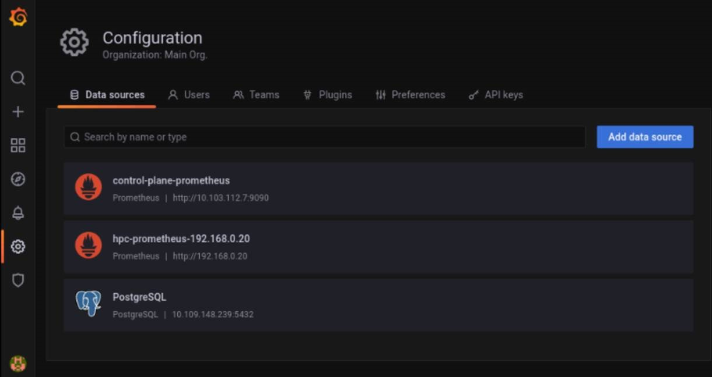

# Monitor Kubernetes and Slurm
Omnia provides playbooks to configure additional software components for Kubernetes such as JupyterHub and Kubeflow. For workload management (submitting, controlling, and managing jobs) of HPC, AI, and Data Analytics clusters, you can access Kubernetes and Slurm dashboards and other supported applications. 

## Before accessing the dashboards
To access any of the dashboards, ensure that a compatible web browser is installed. If you are connecting remotely to your Linux server by using MobaXterm version later than 8 or other X11 Clients though *ssh*, follow the below-mentioned steps to launch the Firefox Browser:  
* On the control plane:
	1. Connect using *ssh*. Run `ssh <user>@<IP-address>`, where *IP-address* is the private IP of the control plane.
	2. `dnf install mesa-libGL-devel -y`
	3. `dnf install firefox -y`
	4. `dnf install xorg-x11-xauth`
	5. `export DISPLAY=:10.0`
	6. `logout and login back`
	7. To launch Firefox from terminal, run `firefox&`.  
	
* On the manager node:
	1. Connect using *ssh*. Run `ssh <user>@<IP-address>`, where *IP-address* is the private IP of the manager node.
	2. `yum install firefox -y`
	3. `yum install xorg-x11-xauth`
	4. `export DISPLAY=:10.0`
	5. `logout and login back`
	6. To launch Firefox from terminal, run `firefox&`

>> **Note**: When the PuTTY or MobaXterm session ends, you must run **export DISPLAY=:10.0** command each time, else Firefox cannot be launched again.  

## Access FreeIPA Dashboard  
The FreeIPA Dashboard can be accessed from the control plane, manager, and login nodes. To access the dashboard:
1.	Install the Firefox Browser.
2.	Open the Firefox Browser and enter the url: `https://<hostname>`. For example, enter `https://manager.example.com`.
3.	Enter the username and password. If the admin or user has obtained a Kerberos ticket, then the credentials need not be provided.  

**Note**: To obtain a Kerberos ticket, perform the following actions:
1. Enter `kinit <username>`
2. When prompted, enter the password.

An administrator can create users on the login node using FreeIPA. The users will be prompted to change the passwords upon first login.

## Access Kubernetes Dashboard
1. To verify if the **Kubernetes-dashboard** service is in the Running state, run `kubectl get pods --namespace kubernetes-dashboard`.
2. To start the Kubernetes dashboard, run `kubectl proxy`.
3. To retrieve the encrypted token, run `kubectl get secret -n kubernetes-dashboard $(kubectl get serviceaccount admin-user -n kubernetes-dashboard -o jsonpath="{.secrets[0].name}") -o jsonpath="{.data.token}" | base64 --decode`.
4. Copy the encrypted token value.
5. On a web browser on the control plane (for control_plane.yml) or manager node (for omnia.yml) enter http://localhost:8001/api/v1/namespaces/kubernetes-dashboard/services/https:kubernetes-dashboard:/proxy/.
6. Select the authentication method as __Token__.
7. On the Kubernetes Dashboard, paste the copied encrypted token and click **Sign in** to access the Kubernetes Dashboard.

## Access Kubeflow Dashboard
1. Before accessing the Kubeflow Dashboard, run `kubectl -n kubeflow get applications -o yaml profiles`. Wait till **profiles-deployment** enters the Ready state.
2. To retrieve the **External IP** or **CLUSTER IP**, run `kubectl get services istio-ingressgateway --namespace istio-system`.
3. On a web browser installed on the manager node, enter the **External IP** or **Cluster IP** to open the Kubeflow Central Dashboard.  

For more information about the Kubeflow Central Dashboard, see https://www.kubeflow.org/docs/components/central-dash/overview/.

## Access JupyterHub Dashboard

1. To verify if the JupyterHub services are running, run `kubectl get pods --namespace jupyterhub`.
2. Ensure that the pod names starting with __hub__ and __proxy__ are in the **Running** state.
3. To retrieve the **External IP** or **CLUSTER IP**, run `kubectl get services proxy-public --namespace jupyterhub`.
4. On a web browser installed on the manager node, enter the **External IP** or **Cluster IP** to open the JupyterHub Dashboard.
5. JupyterHub is running with a default dummy authenticator. Enter any username and password combination to access the dashboard.

For more information about configuring username and password, and to access the JupyterHub Dashboard, see https://zero-to-jupyterhub.readthedocs.io/en/stable/jupyterhub/customization.html.

## Access Prometheus UI

Prometheus is installed:
  * As a Kubernetes role (**A**), when both Slurm and Kubernetes are installed.
  * On the host when only Slurm is installed (**B**).

**A**. When Prometheus is installed as a Kubernetes role.  
* Access Prometheus with local host:  
    1. Run the following commands:  
       `export POD_NAME=$(kubectl get pods --namespace default -l "app=prometheus,component=server" -o jsonpath="{.items[0].metadata.name}")`  
       `echo $POD_NAME`  
       `kubectl --namespace default port-forward $POD_NAME 9090`  
    2. To launch the Prometheus UI, in the web browser, enter `http://localhost:9090`.
  
* Access Prometheus with a private IP address:
    1. Run `kubectl get services --all-namespaces`.
    2. From the list of services, find  the **prometheus-xxxx-server** service under the **Name** column, and copy the **EXTERNAL-IP** address.  
   For example, in the below list of services, `192.168.2.150` is the external IP address for the service `prometheus-1619158141-server`.
   
		NAMESPACE	|	NAME	|	TYPE	|	CLUSTER-IP	|	EXTERNAL-IP	|	PORT(S)	|	AGE  
		---------	|	----	|	----	|	----------	|	-----------	|	-------	|	----  
		default	|	kubernetes	|	ClusterIP	|	10.96.0.1	|	none	|	443/TCP	|	107m  
		default	|	**prometheus-1619158141-server**	|	LoadBalancer	|	10.97.40.140	|	**192.168.2.150**	|	80:31687/TCP	|	106m  
    3. To open Firefox, run `firefox&`.
    4. Enter the copied External IP address to access Prometheus. For example, enter `192.168.2.150` to access Prometheus UI.

**B**. When Prometheus is installed on the host.
1. Navigate to Prometheus folder. The default path is `/var/lib/prometheus-2.23.0.linux-amd64/`.
2. Start the web server: `./prometheus`.  
3. To launch the Prometheus UI, in the web browser, enter `http://localhost:9090`. 

**Note**: 
* If Prometheus is installed through Slurm without installing Kubernetes, then it will be removed when Kubernetes is installed because Prometheus would be running as a pod. 
* Only a single instance of Prometheus is installed when both Kubernetes and Slurm are installed.

## Accessing Cluster metrics (fetched by Prometheus) on Grafana 

* Once `control_plane.yml` is run, Prometheus is added to Grafana as a datasource (hpc-prometheus). This allows Grafana to display statistics from the Compute Nodes that have been polled using Prometheus on the Control Plane.

* Select the dashboard () tab to view the list of Prometheus based dashboards. Some default dashboards include CoreDNS, Prometheus Overview, Kubernetes Networking etc.

>> **Note**: Both the control plane and HPC clusters can be monitored on these dashboards by toggling the datasource at the top of each dashboard. 

## Accessing Control Plane metrics (fetched by Prometheus) on Grafana

* Once `control_plane.yml` is run, Prometheus is added to Grafana as a datasource. This allows Grafana to display statistics from the Control Plane that have been polled using Prometheus.

* Select the dashboard () tab to view the list of Prometheus based dashboards. Some default dashboards include CoreDNS, Prometheus Overview, Kubernetes Networking etc.

>> **Note**: Both the control plane and HPC clusters can be monitored on these dashboards by toggling the datasource at the top of each dashboard:

| Data Source | Description | Source |
|-------------|-------------|--------|
|  hpc-prometheus-manager-nodeIP            | Manages the Kubernetes and Slurm Cluster on the Manager and Compute nodes.            |  This datasource is set up when `Omnia.yml` is run.      |
| control_plane_prometheus            | Monitors the Single Node cluster running on the Control Plane            | This datasource is set up when `control_plane.yml` is run.        |

| Type        | Subtype           | Dashboard Name                    | Available DataSources                               |
|-------------|-------------------|-----------------------------------|-----------------------------------------------------|
|             |                   | CoreDNS                           | control-plane-prometheus, hpc-prometheus-manager-nodeIP |
| Kubernetes |                   | API Types                         | control-plane-prometheus, hpc-prometheus-manager-nodeIP |
| Kubernetes | Compute Resources | Cluster                           | control-plane-prometheus, hpc-prometheus-manager-nodeIP |
| Kubernetes | Compute Resources | Namespace (Pods)                  | control-plane-prometheus, hpc-prometheus-manager-nodeIP |
| Kubernetes | Compute Resources | Node (Pods)                       | control-plane-prometheus, hpc-prometheus-manager-nodeIP |
| Kubernetes | Compute Resources | Pod                               | control-plane-prometheus, hpc-prometheus-manager-nodeIP |
| Kubernetes | Compute Resources | Workload                          | control-plane-prometheus, hpc-prometheus-manager-nodeIP |
| Kubernetes |                   | Kubelet                           | control-plane-prometheus, hpc-prometheus-manager-nodeIP |
| Kubernetes | Networking        | Cluster                           | control-plane-prometheus, hpc-prometheus-manager-nodeIP |
| Kubernetes | Networking        | Namespace (Pods)                  | control-plane-prometheus, hpc-prometheus-manager-nodeIP |
| Kubernetes | Networking        | Namespace (Workload)              | control-plane-prometheus, hpc-prometheus-manager-nodeIP |
| Kubernetes | Networking        | Pod                               | control-plane-prometheus, hpc-prometheus-manager-nodeIP |
| Kubernetes | Networking        | Workload                          | control-plane-prometheus, hpc-prometheus-manager-nodeIP |
| Kubernetes |                   | Scheduler                         | control-plane-prometheus, hpc-prometheus-manager-nodeIP |
| Kubernetes |                   | Stateful Sets                     | control-plane-prometheus, hpc-prometheus-manager-nodeIP |
|             |                   | Prometheus Overview               | control-plane-prometheus, hpc-prometheus-manager-nodeIP |
| Slurm       |                   | CPUs/GPUs, Jobs, Nodes, Scheduler | hpc-prometheus-manager-nodeIP                           |
| Slurm       |                   | Node Exporter Server Metrics      | hpc-prometheus-manager-nodeIP                           |