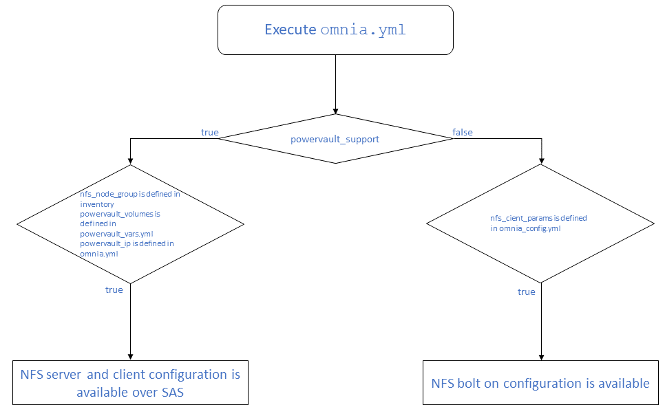
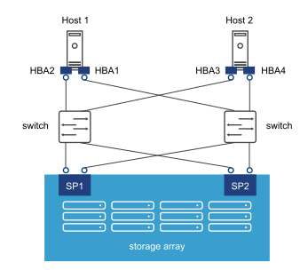

# Prerequisites before installing `omnia.yml`

* Verify that all inventory files are updated.
* If the target cluster requires more than 10 kubernetes nodes, use a docker enterprise account to avoid docker pull limits.
* Verify that all nodes are assigned a group. Use the [linked example file](../../examples/host_inventory_file.ini) as a reference.
  * The manager group should have exactly 1 manager node.
  * The compute group should have at least 1 node.
  * The login_node group is optional. If present, it should have exactly 1 node.
  * The nfs_node group is optional. If powervault is configured by omnia control plane, then the host connected to the powervault (That is the nfs server) should be part of nfs_node group. There should be only 1 nfs server in the group.
  * Users should also ensure that all repos are available on the target nodes running Red Hat.
>> **Note**: The inventory file accepts both IPs and FQDNs as long as they can be resolved by DNS.
* For RedHat clusters, ensure that [RedHat subscription](../Installation_Guides/ENABLING_OMNIA_FEATURES.md#red-hat-subscription) is enabled on all target nodes.

## Features enabled by `omnia.yml`
* Slurm: Once all the required parameters in [omnia_config.yml](../Input_Parameter_Guide/omnia_config.md) are filled in, `omnia.yml` can be used to set up slurm.
* [Login Node (Additionally secure login node)](#enabling-security-login-node)
* Kubernetes: Once all the required parameters in [omnia_config.yml](../Input_Parameter_Guide/omnia_config.md) are filled in, `omnia.yml` can be used to set up kubernetes.
* [BeeGFS bolt on installation](#installing-beegfs-client)
* [NFS bolt on support](#nfs-bolt-on)
* [NFS server-client configuration (With powervault)](#nfs-server-configuration)

## Optional features installed by `omnia.yml`

### Installing BeeGFS Client
* If the user intends to use BeeGFS, ensure that a BeeGFS cluster has been set up with beegfs-mgmtd, beegfs-meta, beegfs-storage services running.
  Ensure that the following ports are open for TCP and UDP connectivity:

  | Port | Service                           |
  |------|-----------------------------------|
  | 8008 | Management service (beegfs-mgmtd) |
  | 8003 | Storage service (beegfs-storage)  |
  | 8004 | Client service (beegfs-client)    |
  | 8005 | Metadata service (beegfs-meta)    |
  | 8006 | Helper service (beegfs-helperd)   |

To open the ports required, use the following steps:
1. `firewall-cmd --permanent --zone=public --add-port=<port number>/tcp`
2. `firewall-cmd --permanent --zone=public --add-port=<port number>/udp`
3. `firewall-cmd --reload`
4. `systemctl status firewalld`

* Ensure that the nodes in the inventory have been assigned roles: manager, compute, login_node (optional), nfs_node

### NFS configuration
Based on the value of `powervault_support`, NFS configuration can take one of two forms:

#### NFS bolt-on
* Ensure that an external NFS server is running. NFS clients are mounted using the external NFS server's IP.
* Fill out the `nfs_client_params` variable in the `omnia_config.yml` file in JSON format using the samples provided [here](../Input_Parameter_Guide/omnia_config.md)
* This role runs on manager, compute and login nodes.
* Make sure that `/etc/exports` on the NFS server is populated with the same paths listed as `server_share_path` in the `nfs_client_params` in `omnia_config.yml`.
* Post configuration, enable the following services (using this command: `firewall-cmd --permanent --add-service=<service name>`) and then reload the firewall (using this command: `firewall-cmd --reload`).
  - nfs
  - rpc-bind
  - mountd
* Omnia supports all NFS mount options. Without user input, the default mount options are nosuid,rw,sync,hard,intr. For a list of mount options, [click here](https://linux.die.net/man/5/nfs).
* The fields listed in `nfs_client_params` are:
  - server_ip: IP of NFS server
  - server_share_path: Folder on which NFS server mounted
  - client_share_path: Target directory for the NFS mount on the client. If left empty, respective `server_share_path value` will be taken for `client_share_path`.
  - client_mount_options: The mount options when mounting the NFS export on the client. Default value: nosuid,rw,sync,hard,intr.

* There are 3 ways to configure the feature:
  1. **Single NFS node** : A single NFS filesystem is mounted from a single NFS server. The value of `nfs_client_params` would be   `- { server_ip: xx.xx.xx.xx, server_share_path: "/mnt/share", client_share_path: "/mnt/client", client_mount_options: "nosuid,rw,sync,hard,intr" }`
  2. **Multiple Mount NFS Filesystem**: Multiple filesystems are mounted from a single NFS server. The value of `nfs_client_params` would be  ` - { server_ip: xx.xx.xx.xx, server_share_path: "/mnt/server1", client_share_path: "/mnt/client1", client_mount_options: "nosuid,rw,sync,hard,intr" }`   `- { server_ip: xx.xx.xx.xx, server_share_path: "/mnt/server2", client_share_path: "/mnt/client2", client_mount_options: "nosuid,rw,sync,hard,intr" }`
  3. **Multiple NFS Filesystems**: Multiple filesystems are mounted from multiple NFS servers. The value of `nfs_client_params` would be   ` - { server_ip: xx.xx.xx.xx, server_share_path: "/mnt/server1", client_share_path: "/mnt/client1", client_mount_options: "nosuid,rw,sync,hard,intr" }`   `- { server_ip: yy.yy.yy.yy, server_share_path: "/mnt/server2", client_share_path: "/mnt/client2", client_mount_options: "nosuid,rw,sync,hard,intr" }`   `- { server_ip: zz.zz.zz.zz, server_share_path: "/mnt/server3", client_share_path: "/mnt/client3", client_mount_options: "nosuid,rw,sync,hard,intr" } `

#### Enabling Security: Login Node

* Verify that the login node host name has been set. If not, use the following steps to set it.
    * Set hostname of the login node to hostname.domainname format using the below command:
      `hostnamectl set-hostname <hostname>.<domainname>`
  >>Eg: `hostnamectl set-hostname login-node.omnia.test`
    * Add the set hostname in `/etc/hosts` using vi editor.

  `vi /etc/hosts`

    * Add the IP of the login node with the above hostname using `hostnamectl` command in last line of the file.

  __Eg:__  xx.xx.xx.xx <hostname>

>> **Note**:
>>	* The Hostname should not contain the following characters: , (comma), \. (period) or _ (underscore). However, the **domain name** is allowed commas and periods.
>>	* The Hostname cannot start or end with a hyphen (-).
>>	* No upper case characters are allowed in the hostname.
>>	* The hostname cannot start with a number.

### NFS server configuration
* Ensure that powervault support is enabled by setting `powervault_support` to true in `base_vars.yml`. By default, a volume called 'omnia_home' will be created on the powervault to mount on the nfs_node.
>> **Warning**: Powervault will only be available over SAS if the powervault has been configured using [`powervault.yml`](../Device_Configuration/PowerVault.md).
* For multiple NFS volumes, enter the following details in JSON list format in `powervault_vars.yml` under `powervault_volumes`:
    - name [Mandatory]: The name of the NFS export.
    - server_share_path [Mandatory]: The path at which volume is mounted on nfs_node. This directory will be assigned 755 permissions during NFS server configuration.
    - server_export_options: (Default) rw,sync,no_root_squash
    - client_shared_path: The path at which volume is mounted on manager, compute, login node. Unless specified otherwise, the client path will inherit the options from the `server_export_path`.
    - client_mount_options: Default value is- nosuid,rw,sync,hard,intr (unless specified otherwise)
* Only one NFS server is configured per run of `omnia.yml`. To configure multiple NFS servers, update the following per execution:
  * `powervault_ip` in `omnia_config.yml`
  * nfs_node group IP in the node inventory
* The default entry for `powervault_volumes` will look like this:   `  - { name: omnia_home, server_share_path: /home/omnia_home, server_export_options: ,client_share_path: , client_mount_options: }`  
* Ensure that `powervault_ip` is populated. The right powervault IP can be found in `/opt/omnia/powervault_inventory`. If it's not present, run `ansible-playbook collect_device_info.yml` (dedicated NIC) or `ansible-playbook collect_node_info.yml` (LOM NIC) from the control_plane directory.
>> **Note**: In a single run of omnia, only one NFS Server is configured. To configure multiple NFS Servers, add one IP in the nfs_node group and populate the variables accordingly per run of `omnia.yml`. To configure another nfs node, update variables and run `nfs_sas.yml`.
* If NFS server configuration is to happen via SAS, the following conditions are to be met:
  * There should be multiple network paths available between the NFS server and the Powervault to ensure high availability. For more information, click [here](https://access.redhat.com/documentation/en-us/red_hat_enterprise_linux/8/html/configuring_device_mapper_multipath/overview-of-device-mapper-multipathing_configuring-device-mapper-multipath).  
  
  * Set `powervault_protocol` to 'sas' in `powervault_vars.yml`.
* If NFS server configuration is to happen via ISCSI, the following conditions are to be met:
  * The powervault in use is from the ME4 series.

  

