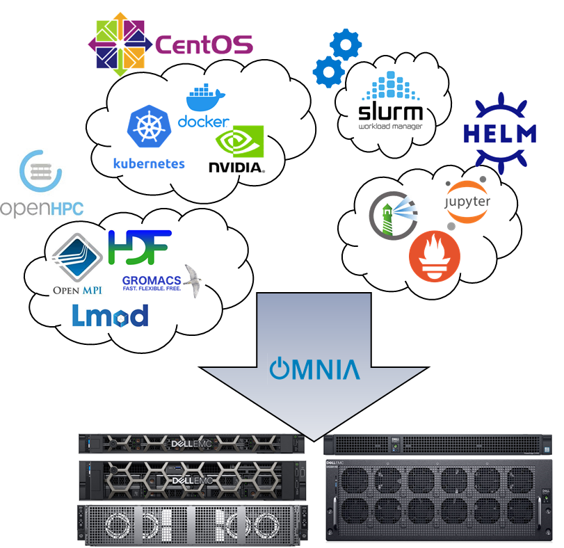

**Omnia** (Latin: all or everything) is a deployment tool to configure Dell EMC PowerEdge servers running standard RPM-based Linux OS images into clusters capable of supporting HPC, AI, and data analytics workloads. It uses Slurm, Kubernetes, and other packages to manage jobs and run diverse workloads on the same converged solution. It is a collection of [Ansible](https://ansible.org) playbooks, is open source, and is constantly being extended to enable comprehensive workloads.

## What Omnia Does
Omnia can build clusters which use Slurm or Kubernetes (or both!) for workload management. Omnia will install software from a variety of sources, including:
- Standard CentOS and [ELRepo](http://elrepo.org) repositories
- Helm repositories
- Source code compilation
- [OpenHPC](https://openhpc.community) repositories (_coming soon!_)
- [OperatorHub](https://operatorhub.io) (_coming soon!_)

Whenever possible, Omnia will leverage existing projects rather than reinvent the wheel.

### Omnia Stacks
Omnia can install Kubernetes or Slurm (or both), along with additional drivers, services, libraries, and user applications.

 

## Installing Omnia
Omnia requires that servers already have an RPM-based Linux OS running on them, and are all connected to the Internet. Currently all Omnia testing is done on [CentOS](https://centos.org). Please see [PREINSTALL](PREINSTALL_OMNIA.md) for instructions on network setup.

Once servers have functioning OS and networking, you can use Omnia to install and start Slurm and/or Kubernetes. Please see [INSTALL](INSTALL_OMNIA.md) for detailed instructions.  

## Installing the Omnia appliance
Ensure all the prerequisites listed in the [PREINSTALL_OMNIA_APPLIANCE](PREINSTALL_OMNIA_APPLIANCE.md) are met before installing the Omnia appliance.

For detailed instructions on installing the Omnia appliance, see [INSTALL_OMNIA_APPLIANCE](INSTALL_OMNIA_APPLIANCE.md).

# Requirements Matrix

Software and hardware requirements  |   Version
----------------------------------  |   -------
OS installed on the management node  |  CentOS 7.9 2009
OS deployed by Omnia on bare-metal servers | CentOS 7.9 2009 Minimal Edition
Cobbler  |  2.8.5
Ansible AWX Version  |  15.0.0
Slurm Workload Manager  |  20.11.2
Kubernetes Controllers  |  1.16.7
Kubeflow  |  1
Prometheus  |  2.23.0
Supported PowerEdge servers  |  R640, R740, R7525, C4140, DSS8440, and C6420

__Note:__ For more information about the supported software and compatible versions, see the **Software Supported** section.

## Software Managed by Omnia
Software	|	Licence	|	Compatible Version	|	Description
-----------	|	-------	|	----------------	|	-----------------
MariaDB	|	GPL 2.0	|	5.5.68	|	Relational database used by Slurm
Slurm	|	GNU General Public	|	20.11.2	|	HPC Workload Manager
Docker CE	|	Apache-2.0	|	20.10.2	|	Docker Service
NVIDIA container runtime	|	Apache-2.0	|	3.4.2	|	Nvidia container runtime library
Python PIP	|	MIT Licence	|	3.2.1	|	Python Package
Python2	|	-	|	2.7.5	|	-
Kubelet	|	Apache-2.0	|	1.16.7	|	Provides external, versioned ComponentConfig API types for configuring the kubelet
Kubeadm	|	Apache-2.0	|	1.16.7	|	"fast paths" for creating Kubernetes clusters
Kubectl	|	Apache-2.0	|	1.16.7	|	Command line tool for Kubernetes
JupyterHub	|	Modified BSD Licence	|	0.9.6	|	Multi-user hub
Kfctl	|	Apache-2.0	|	1.0.2	|	CLI for deploying and managing Kubeflow
Kubeflow	|	Apache-2.0	|	1	|	Cloud Native platform for machine learning
Helm	|	Apache-2.0	|	3.5.0	|	Kubernetes Package Manager
Helm Chart	|	-	|	0.9.0	|	-
TensorFlow	|	Apache-2.0	|	2.1.0	|	Machine Learning framework
Horovod	|	Apache-2.0	|	0.21.1	|	Distributed deep learning training framework for Tensorflow
MPI	|	Copyright (c) 2018-2019 Triad National Security,LLC. All rights reserved.	|	0.2.3	|	HPC library
CoreDNS	|	Apache-2.0	|	1.6.2	|	DNS server that chains plugins
CNI	|	Apache-2.0	|	0.3.1	|	Networking for Linux containers
AWX	|	Apache-2.0	|	15.0.0	|	Web-based User Interface
PostgreSQL	|	Copyright (c) 1996-2020, PostgreSQL Global Development Group	|	10.15	|	Database Management System
Redis	|	BSD-3-Clause Licence	|	6.0.10	|	In-memory database
NGINX	|	BSD-2-Clause Licence	|	1.14	|	-

# Known Issues
* Hosts are not displayed on the AWX UI.  
	Resolution:
	* Verify if `provisioned_hosts.yml` is available under `omnia/appliance/roles/inventory/files`.
	* If hosts are not listed, then servers are not PXE booted yet.
	* If hosts are listed, then an IP address is assigned to them by DHCP. However, PXE boot is still in process or is not initiated.
	* Check for the reachable and unreachable hosts using the tool provided under `omnia/appliance/tools` named `provisioned_report.yml`. To run provisioned_report.yml, run the following command under `omnia/appliance` directory: `ansible-playbook -i roles/inventory/files/provisioned_hosts.yml tools/provisioned_report.yml`.

# Frequently Asked Questions
* Why is the error "Wait for AWX UI to be up" displayed when `appliance.yaml` fails?  
	Cause: 
	1. This error occurs when AWX is not accessible even after five minutes of wait time. 
	2. When __isMigrating__ or __isInstalling__ is seen in the failure message.  
	
  Resolution:  
	Wait for AWX UI to be accessible at http://\<management-station-IP>:8081, and then run the `appliance.yaml` file again.  

* What are the steps to be followed after the nodes in a Kubernetes cluster are rebooted?  
	Resolution: 
	Wait for 10 to 15 minutes after the Kubernetes cluster is rebooted. Then, verify the status of cluster using these services:
	* `kubectl get nodes` on the manager node provides correct k8s cluster status.  
	* `kubectl get pods --all-namespaces` on the manager node displays all the pods in the running state.
	* `kubectl cluster-info` on the manager node displays both k8s master and kubeDNS are in the running state.

* What to do when the Kubernetes services are not in the Running state?  
	Resolution:
	1. Verify if the pods are in the running state by using the command: `kubectl get pods --all-namespaces`
	2. If the pods are not in the running state, delete the pods using the command:`kubectl delete pods <name of pod>`
	3. Run the corresponding playbook: `omnia.yml`, `jupyterhub.yml`, or `kubeflow.yml`.

* What to do when the JupyterHub or Prometheus UI are not accessible?  
	Resolution:
	1. Run the following command to ensure **nfs-client** pod and all prometheus server pods are in the running state: `kubectl get pods --namespace default`

* Why does the `appliance.yml` fail during the Cobbler configuration with an error during the Run import command?  
	Cause:
	* Issue occurs when the mounted .iso file is corrupted.
	
  Resolution:
	1. Go to __var__->__log__->__cobbler__->__cobbler.log__ to view the error.
	2. If the error message is **repo verification failed** then it signifies that the .iso file is not mounted properly.
	3. Verify if the downloaded .iso file is valid and correct.
	4. Delete the Cobbler container using `docker rm -f cobbler` and rerun `appliance.yml`.

* Why does the PXE boot fail with tftp timeout or service timeout errors?  
	Cause:
	* Issue occurs when server is RAID controlled, or when more than two servers in the same network have Cobbler services running.  
	
  Resolution:  
	1. Create a Non-RAID or virtual disk in the server.  
	2. Check if other systems except for the management node has cobblerd running. If yes, then stop the Cobbler container using the following commands: `docker rm -f cobbler` and `docker image rm -f cobbler`.

* After the cluster is rebooted, what to do when the Slurm services are not started automatically?  
	Resolution: Manually restart the slurmd services on the manager node by running the following commands:
	* `systemctl restart slurmdbd`
	* `systemctl restart slurmctld`
	* `systemctl restart prometheus-slurm-exporter`

	Manually restart the following service on all the compute nodes: `systemctl status slurmd`

* What to do when the Slurm services fail because the `slurm.conf` is not configured properly?  
	Resolution:
	1. Run the following commands:
		* `slurmdbd -Dvvv`
		* `slurmctld -Dvvv`
	2. Verify `/var/lib/log/slurmctld.log` file.

* How to troubleshoot the error "ports are unavailable" when Slurm database connection fails?  
	Resolution:
	1. Run the following commands:
		* `slurmdbd -Dvvv`
		*`slurmctld -Dvvv`
	2. Verify the `/var/lib/log/slurmctld.log` file.
	3. Verify: netstat -antp | grep LISTEN
	4. If they are in the Listening state, stop (kill) PID of that specific port
	5. Restart all slurm services:
		* slurmctl restart slurmctld on manager node
		* systemctl restart slurmdbd on manager node
		* systemctl restart slurmd on compute node

# Limitations
1. The supported version of all the components are as per the `Requirements Matrix` and `Software Managed by Omnia` sections, and other versions than those listed are not supported by Omnia. This is to ensure that there is no impact to the functionality of Omnia.
2. Removal of Slurm and Kubernetes component roles are not supported. However, skip tags can be provided at the start of installation to select the component roles.​
3. After the installation of the Omnia appliance, changing the manager node is not supported. If you need to change the manager node, you must redeploy the entire cluster.  
4. Dell Technologies provides support to the Dell developed modules of Omnia. All the other third-party tools deployed by Omnia are outside the support scope.​

##### Contributing to Omnia
The Omnia project was started to give members of the [Dell Technologies HPC Community](https://dellhpc.org) a way to easily setup clusters of Dell EMC servers, and to contribute useful tools, fixes, and functionality back to the HPC Community.

###### Open to All
While we started Omnia within the Dell Technologies HPC Community, that doesn't mean that it's limited to Dell EMC servers, networking, and storage. This is an open project, and we want to encourage *everyone* to use and contribute to Omnia!

####### Anyone Can Contribute!
It's not just new features and bug fixes that can be contributed to the Omnia project! Anyone should feel comfortable contributing. We are asking for all types of contributions:
* New feature code
* Bug fixes
* Documentation updates
* Feature suggestions
* Feedback
* Validation that it works for your particular configuration

If you would like to contribute, see [CONTRIBUTING](https://github.com/dellhpc/omnia/b