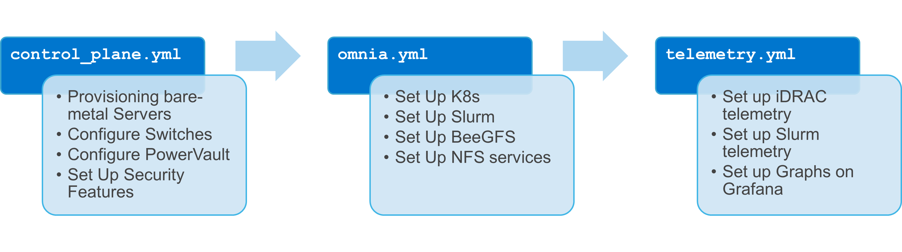

**Omnia** (Latin: all or everything) is a deployment tool to configure Dell EMC PowerEdge servers running standard RPM-based Linux OS images into clusters capable of supporting HPC, AI, and data analytics workloads. It uses Slurm, Kubernetes, and other packages to manage jobs and run diverse workloads on the same converged solution. It is a collection of [Ansible](https://ansible.com) playbooks, is open source, and is constantly being extended to enable comprehensive workloads.

#### Current release version
1.2.1

#### Previous release version
1.2

## Blogs about Omnia
- [Introduction to Omnia](https://infohub.delltechnologies.com/p/omnia-open-source-deployment-of-high-performance-clusters-to-run-simulation-ai-and-data-analytics-workloads/)
- [Taming the Accelerator Cambrian Explosion with Omnia](https://infohub.delltechnologies.com/p/taming-the-accelerator-cambrian-explosion-with-omnia/)
- [Containerized HPC Workloads Made Easy with Omnia and Singularity](https://infohub.delltechnologies.com/p/containerized-hpc-workloads-made-easy-with-omnia-and-singularity/)
- [Solution Overview: Dell EMC Omnia Software](https://infohub.delltechnologies.com/section-assets/omnia-solution-overview)
- [Solution Brief: Omnia Software](https://infohub.delltechnologies.com/section-assets/omnia-solution-brief)

## What Omnia does
Omnia can deploy and configure devices, and build clusters that use Slurm or Kubernetes (or both!) for workload management. Omnia will install software from a variety of sources, including:
- Helm repositories
- Source code compilation
- [OperatorHub](https://operatorhub.io)

Whenever possible, Omnia will leverage existing projects rather than reinvent the wheel.

### Omnia stacks
Omnia can deploy firmware, install Kubernetes or Slurm (or both), along with additional drivers, services, libraries, and user applications.

  

## What's new in this release
- Added support for Red Hat on both control plane and compute nodes
- Added support for BOSS controllers
- Added support for bolt-on BeeGFS configuration
- Added ability to upgrade kernel on Red Hat devices
- Added support for shared LOM (LAN on Motherboard) configuration

# Using Omnia
1. Verify that your system meets Omnia's [hardware](Support_Matrix/Hardware/README.md) and [software requirements](Support_Matrix/Software/README.md)
2. Ensure that all [pre-requisites](PreRequisites/README.md) are met.
3. Fill out all the required [input parameters](Input_Parameter_Guide/README.md).
4. [Run Control_Plane](Installation_Guides/INSTALL_OMNIA_CONTROL_PLANE.md) to provision OS's, [configure devices](Device_Configuration/README.md) and set up [security measures](Security/README.md).
5. [Run Omnia](Installation_Guides/INSTALL_OMNIA_CLI.md) to set up Kubernetes and Slurm.
6. Run the telemetry playbook to [set up](Installation_Guides/INSTALL_TELEMETRY.md) and use [Telemetry and Visualization Services](Telemetry_Visualization/README.md)

## Troubleshooting Omnia
* For a list of commonly encountered issues, check out our [FAQs](Troubleshooting/FAQ.md).
* To troubleshoot Omnia, use our [Troubleshooting Guide](Troubleshooting/Troubleshooting_Guide.md).

# Contributing to Omnia
The Omnia project was started to give members of the [Dell Technologies HPC Community](https://dellhpc.org) a way to easily set up clusters of Dell EMC servers, and to contribute useful tools, fixes, and functionality back to the HPC Community.

# Open to All
While we started Omnia within the Dell Technologies HPC Community, that doesn't mean that it's limited to Dell EMC servers, networking, and storage. This is an open project, and we want to encourage *everyone* to use and contribute to Omnia!

# Anyone can contribute!
It's not just new features and bug fixes that can be contributed to the Omnia project! Anyone should feel comfortable contributing. We are asking for all types of contributions:
* New feature code
* Bug fixes
* Documentation updates
* Feature suggestions
* Feedback
* Validation that it works for your particular configuration

If you would like to contribute, see [CONTRIBUTING](https://github.com/dellhpc/omnia/blob/release/CONTRIBUTING.md).
