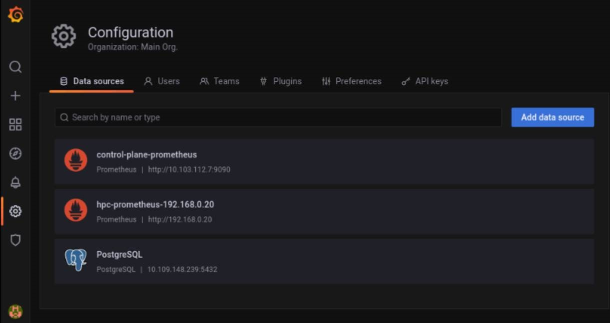
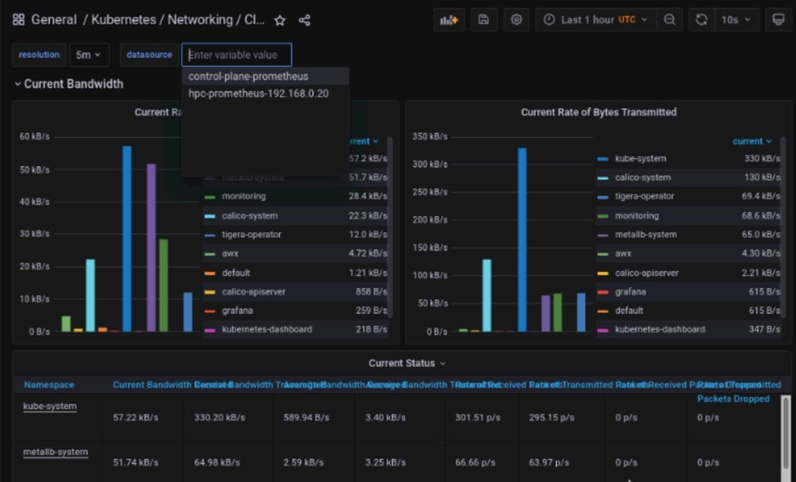

# Monitoring The Management Station

To monitor the Management Station, Omnia uses the Grafana UI with a Loki integration (This can be set up using the steps provided [here](Install_Telemetry.md)).  

## Accessing Loki via Grafana

[Loki](https://grafana.com/docs/loki/latest/fundamentals/overview/) is a datastore used to efficiently hold log data for security purposes. Using the `promtail` agent, logs are collated and streamed via a HTTP API.

>> __Note:__ When `control_plane.yml` is run, Loki is automatically set up as a data source on the Grafana UI.

### Querying Loki 

Loki uses basic regex based syntax to filter for specific jobs, dates or timestamps.

* Select the Explore  tab to select control-plane-loki from the drop down.
* Using [LogQL queries](https://grafana.com/docs/loki/latest/logql/log_queries/), all logs in `/var/log` can be accessed using filters (Eg: `{job=”Omnia”}` )

## Viewing Logs on the Dashboard

All log files can be viewed via the Dashboard tab (). The Default Dashboard displays `omnia.log` and `syslog`. Custom dashboards can be created per user requirements.

## Accessing Prometheus data via Grafana

* Once `control_plane.yml` is run, Prometheus is added to Grafana as a datasource. This allows Grafana to display statistics from the Control Plane that have been polled using Prometheus.

* Select the dashboard () tab to view the list of Prometheus based dashboards. Some default dashboards include CoreDNS, Prometheus Overview, Kuberenetes Networking etc.

>> __Note:__ Both the control plane and HPC clusters can be monitored on these dashboards by toggling the datasource at the top of each dashboard:

| Data Source | Description | Source |
|-------------|-------------|--------|
|  hpc-prometheus-headnodeIP            | Manages the Kuberenetes and Slurm Cluster on the Manager and Compute nodes.            |  This datasource is set up when `Omnia.yml` is run.      |
| control_plane_prometheus            | Monitors the Single Node cluster running on the Management Station            | This datasource is set up when `control_plane.yml` is run.        |

| Type        | Subtype           | Dashboard Name                    | Available DataSources                               |
|-------------|-------------------|-----------------------------------|-----------------------------------------------------|
|             |                   | CoreDNS                           | control-plane-prometheus, hpc-prometheus-headnodeIP |
| Kuberenetes |                   | API Types                         | control-plane-prometheus, hpc-prometheus-headnodeIP |
| Kuberenetes | Compute Resources | Cluster                           | control-plane-prometheus, hpc-prometheus-headnodeIP |
| Kuberenetes | Compute Resources | Namespace (Pods)                  | control-plane-prometheus, hpc-prometheus-headnodeIP |
| Kuberenetes | Compute Resources | Node (Pods)                       | control-plane-prometheus, hpc-prometheus-headnodeIP |
| Kuberenetes | Compute Resources | Pod                               | control-plane-prometheus, hpc-prometheus-headnodeIP |
| Kuberenetes | Compute Resources | Workload                          | control-plane-prometheus, hpc-prometheus-headnodeIP |
| Kuberenetes |                   | Kubelet                           | control-plane-prometheus, hpc-prometheus-headnodeIP |
| Kuberenetes | Networking        | Cluster                           | control-plane-prometheus, hpc-prometheus-headnodeIP |
| Kuberenetes | Networking        | Namespace (Pods)                  | control-plane-prometheus, hpc-prometheus-headnodeIP |
| Kuberenetes | Networking        | Namespace (Workload)              | control-plane-prometheus, hpc-prometheus-headnodeIP |
| Kuberenetes | Networking        | Pod                               | control-plane-prometheus, hpc-prometheus-headnodeIP |
| Kuberenetes | Networking        | Workload                          | control-plane-prometheus, hpc-prometheus-headnodeIP |
| Kuberenetes |                   | Scheduler                         | control-plane-prometheus, hpc-prometheus-headnodeIP |
| Kuberenetes |                   | Stateful Sets                     | control-plane-prometheus, hpc-prometheus-headnodeIP |
|             |                   | Prometheus Overview               | control-plane-prometheus, hpc-prometheus-headnodeIP |
| Slurm       |                   | CPUs/GPUs, Jobs, Nodes, Scheduler | hpc-prometheus-headnodeIP                           |
| Slurm       |                   | Node Exporter Server Metrics      | hpc-prometheus-headnodeIP                           |

