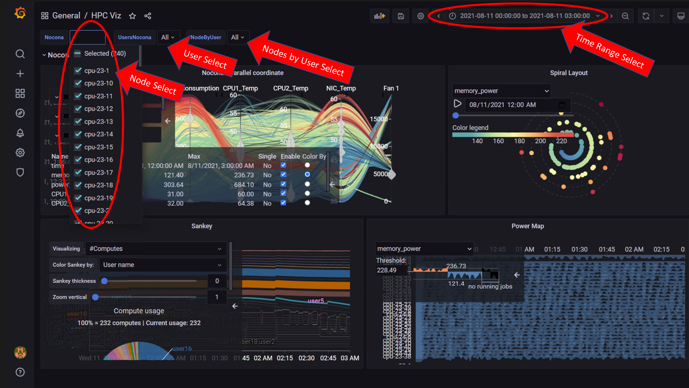

# Viewing Performance Stats on Grafana

Using [Texas Technical University data visualization lab](https://idatavisualizationlab.github.io/HPCC), data polled from iDRAC and Slurm can be processed to generate live graphs. These Graphs can be accessed on the Grafana UI.

Once `control_plane.yml` is executed and Grafana is set up, use `telemetry.yml` to initiate the Graphs. Data polled via Slurm and iDRAC is streamed into internal databases. This data is processed to create the 4 graphs listed below.

>> __Note__: This feature only works on Nodes using iDRACs with a datacenter license running a minimum firmware of 4.0.

## All your data in a glance

Using the following graphs, data can be visualized to gather correlational information.
1. [Parallel Coordinates](Visualizations/ParallelCoordinates.md)
2. [Sankey Layout](Visualizations/SankeyLayout.md)
3. [Spiral Layout](Visualizations/SpiralLayout.md)
4. [Power Map](Visualizations/PowerMaps.md)

>> __Note:__ The timestamps used for the time metric are based on the `timezone` set in `control_plane/input_params/base_vars.yml`.  In the event of a mismatch between the timezone on the browser being used to access Grafana UI and the timezone in `base_vars.yml`, the time range being used to filter information on the Grafana UI will have to be adjusted per the timezone in `base_vars.yml`.

### The Multi-factor Visualization Dashboard
The Multi-factor Visualization Dashboard has 4 interactive visualization panels that allow you to see all the graphs mentioned above in a single view.

Using the Node and User dropdowns on the left, nodes and users can be filtered to collect data within a given time-frame (Select the time frame on the top-right of the view).

To interact with a specific panel, click on the __Panel Name__ and then select the __View__ option from the dropdown menu.

