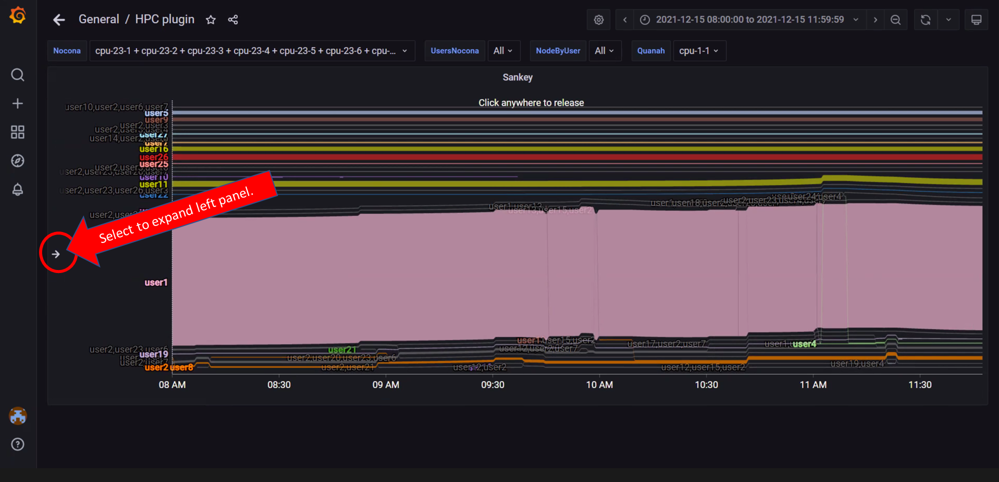
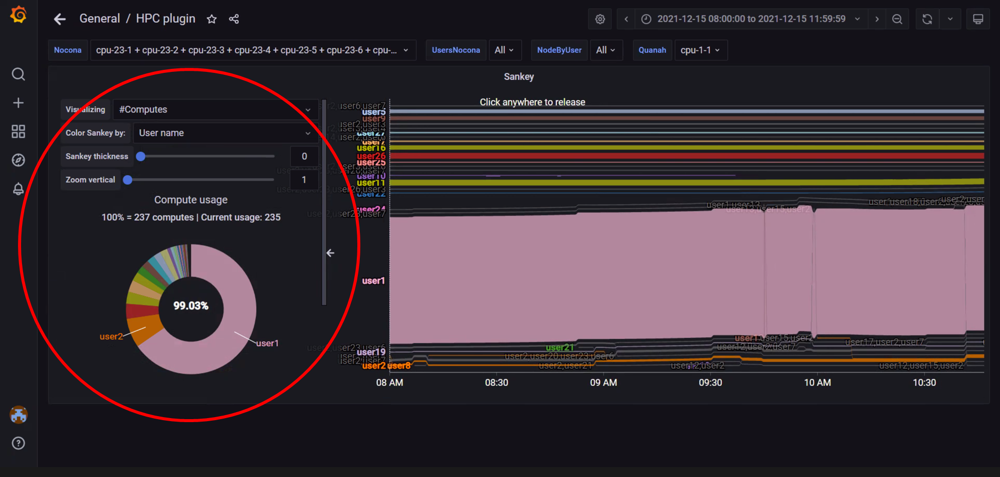
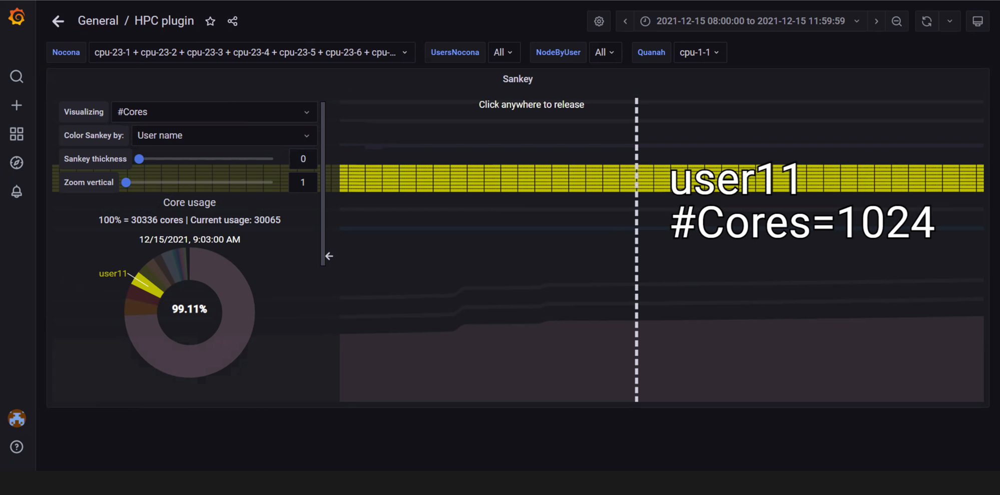

# Sankey Layout
Sankey layout is a multi-factor visualization that incorporates compute node and hardware telemetry metrics with related job and user information from the slurm job scheduler.  The horizontal Sankey graph displays relative user usage of the compute or core (selectable) resources over the time-range selected.  Interacting with the graph by hovering or clicking will bring up job and compute/core related info and display pie charts and specific metric behavior graphs in the optional left-hand panel.

>> **Note**: Given the amount of data that a Sankey Viewer uses for its display, it does not refresh automatically every 5 seconds. To refresh the view, refresh the page manually. 

>> **Note**: In the above image, the left panel can be expanded to customize the view and get more information on selected Nodes/Jobs/Users.

>> **Note**: In the above image, the left panel is expanded to view customization options like:
>> 1. Nodes vs Cores
>> 2. Color Coding
>> 3. Sankey Thickness
>> 4. Zoom

>> **Note**: In the above image, the __Edit__ option from the dropdown under the view name (In this case, Sankey) is used to toggle anonymity for usernames in the visualization.

>> **Note**: In the above image, hovering over the graph has displayed user, job id, compute (or core) id, and job start/stop information. Click on the graph to toggle between freezing and un-freezing the view for point-in-time information.

>> **Note**: In the above image, the view is zoomed into using a mouse scroll forward. The graph has been customized using the left panel to display the number of cores used by user11.

