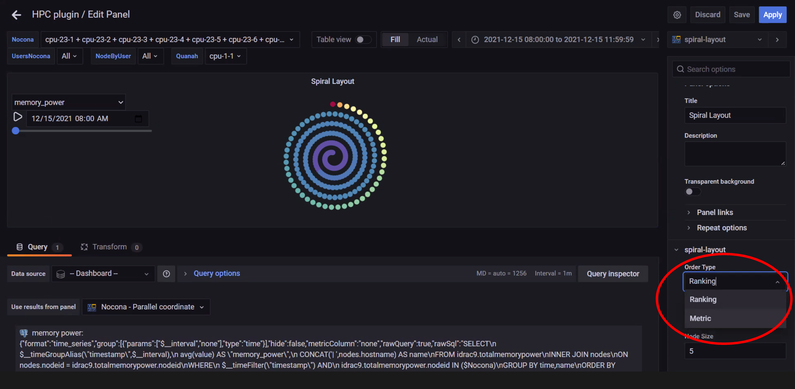

# Spiral Layout
Spiral Layouts are best for viewing the change in a single metric over time. The spiral organization of node representation can represent a large number (100s to 1000s) of compute nodes in a compact visual. Nodes can be ordered on the spiral by rank per metric value or by metric value.  Hovering over a node will display a heatmap of the node metric value over the dataset time-range.

>> **Note**: In the above image, the spiral visualization displays compute nodes on a spiral graphing layout. This example orders the compute nodes by __Power Consumption__ at the time indicated by the time range slider.

>> **Note**: In the above image, all compute nodes are arranged on the spiral graph by their ranking order. The dropdown on the left is used to select what metric is shown.

>> **Note**: In the above image, a heat map of the metric for that node is displayed for the data set time range selected. Hovering over a node in the graph displays node information on the right. Click on the graph to toggle between freezing and un-freezing the graph.

>> **Note**: In the above image, behaviour of the Spiral Layout view can be updated using the __Edit__ option from the highlighted dropdown.

>>**Note**: In the above image, the edit panel offers the option to:
>> 1. Change the order type
>> 2. Change the number of rings displayed
>> 3. Change the Node size on the graph

