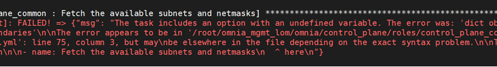
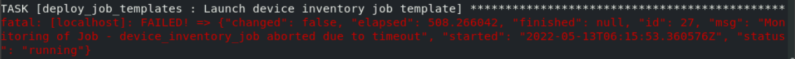
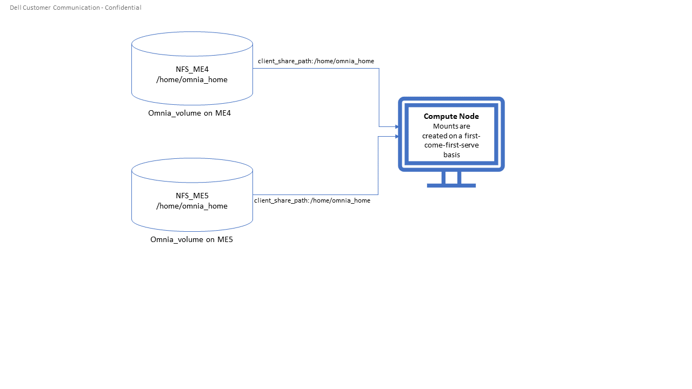
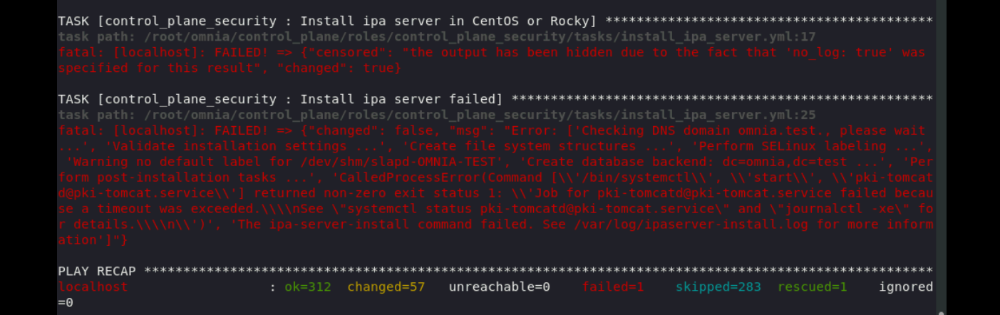

# Frequently Asked Questions

## What to do when hosts do not show on the AWX UI?  
  **Resolution**: 
* Verify if the provisioned_hosts.yml file is present in the omnia/control_plane/roles/collect_node_info/files/ folder.
* Verify whether the hosts are listed in the provisioned_hosts.yml file.
* If hosts are not listed, then servers are not PXE booted yet.
If hosts are listed, then an IP address has been assigned to them by DHCP. However, hosts are not displayed on the AWX UI as the PXE boot is still in process or is not initiated.
* Check for the reachable and unreachable hosts using the provision_report.yml tool present in the omnia/control_plane/tools folder. To run provision_report.yml, in the omnia/control_plane/ directory, run playbook -i roles/collect_node_info/files/provisioned_hosts.yml tools/provision_report.yml.

## How do I find the version of Omnia being used?
If `control_plane.yml` has run, a version file is created here: `/opt/omnia/omnia_version`.

## What are the mapping files required when configuring in a LOM setup?
| File name               | Purpose                                                                                               | Associated Variable  (base_vars.yml)   | Format                           | Sample File Path                                     |
|-------------------------|-------------------------------------------------------------------------------------------------------|----------------------------------------|----------------------------------|------------------------------------------------------|
| Host mapping            | __Mapping file listing all devices (barring iDRAC) and provisioned hosts for DHCP configurations__    | `host_mapping_file_path`               | xx:yy:zz:aa:bb,server,172.17.0.5 | omnia/examples/host_mapping_file_os_provisioning.csv |
| Management mapping file | __Mapping file listing iDRACs for DHCP configurations__                                               | `mgmt_mapping_file_path`               | xx:yy:zz:aa:bb,172.17.0.5        | omnia/examples/mapping_device_file.csv               |

## Why does the task 'nfs_client: Mount NFS client' fail with `No route to host`?
**Potential Cause**:
* There's a mismatch in the share path listed in `/etc/exports` and in `omnia_config.yml` under `nfs_client_params`. <br>
**Resolution**:
* Ensure that the input paths are a perfect match down to the character to avoid any errors.

## Why does the task 'control plane security: Authenticate as admin' fail?
**Potential Cause**: <br>
The required services are not running on the control plane. Verify the service status using: <br>
`systemctl status sssd-kcm.socket` <br>
`systemctl status sssd.service` <br>
**Resolution**: <br>
* Restart the services using: <br>
`systemctl start sssd-kcm.socket` <br>
`systemctl start sssd.service` <br>
* Re-run `control_plane.yml` using the tags `init` and `security`. <br>
`Ansible-playbook control_plane.yml –tags init,security`

## Why does the task 'Gather facts from all the nodes' stuck when re-running `omnia.yml`?
**Potential Cause**: Corrupted entries in the `/root/.ansible/cp/` folder. For more information on this issue, [check this out](https://github.com/ansible/ansible/issues/17349)! <br>
**Resolution**: Clear the directory `/root/.ansible/cp/` using the following commands: <br>
`cd /root/.ansible/cp/` <br>
`rm -rf *`  <br>
Alternatively, run the task manually: <br>
`cd omnia/tools`
`ansible-playbook gather_facts_resolution.yml`

## Why does the task 'nfs_client: Mount NFS client' fail with `Failed to mount NFS client. Make sure NFS Server is running on IP xx.xx.xx.xx`?
**Potential Cause**:
* The required services for NFS may not be running:
- nfs
- rpc-bind
- mountd <br>
  **Resolution**:
* Enable the required services using `firewall-cmd --permanent --add-service=<service name>` and then reload the firewall using `firewall-cmd --reload`.

## Why does `configure_device_cli` fail when `awx_web_support` is set to true in `base_vars.yml`?
**Potential Cause**: CLI templates require that AWX is disabled when deployed. <br>
**Resolution**: Set `awx_web_support` to false when deploying `configure_device_cli`.


## What to do when `omnia.yml` fails with `nfs-server.service might not be running on NFS Server. Please check or start services`?
**Potential Cause**: nfs-server.service is not running on the target node. <br>
**Resolution**: Use the following commands to bring up the service: <br>
`systemctl start nfs-server.service` <br>
`systemctl enable nfs-server.service`

## Why are service tags missing in the node inventory?
**Potential Cause**: Temporary network glitches may cause a loss of information. <br>
**Resolution**: Re-run the playbook `collect_node_info.yml` to repopulate the data. Use the command `ansible-playbook collect_node_info.yml` to run the playbook.


## Why do Password-less SSH tasks fail while running `collect_node_info.yml`?
**Potential Cause**:
* Incorrect credentials in `login_vars.yml`
* The target device may not be server running an OS. (It may be a device on a LOM network)

**Resolution**:
* Correct the credentials in `login_vars.yml` if the target is a server.
* Ignore the error if your target device is a storage device, switch etc.

## Why do Kubernetes Pods show `ImagePullBack` or `ErrPullImage` errors in their status?
**Potential Cause**:
    * The errors occur when the Docker pull limit is exceeded.
  **Resolution**:
    * For `omnia.yml` and `control_plane.yml` : Provide the docker username and password for the Docker Hub account in the *omnia_config.yml* file and execute the playbook.
    * For HPC cluster, during `omnia.yml execution`, a kubernetes secret 'dockerregcred' will be created in default namespace and patched to service account. User needs to patch this secret in their respective namespace while deploying custom applications and use the secret as imagePullSecrets in yaml file to avoid ErrImagePull. [Click here for more info](https://kubernetes.io/docs/tasks/configure-pod-container/pull-image-private-registry/)
>> **Note**: If the playbook is already executed and the pods are in __ImagePullBack__ state, then run `kubeadm reset -f` in all the nodes before re-executing the playbook with the docker credentials.

## What to do after a reboot if kubectl commands return: `The connection to the server head_node_ip:port was refused - did you specify the right host or port?`
  On the control plane or the manager node, run the following commands:
    * `swapoff -a`
    * `systemctl restart kubelet`

## What to do if AWX auto aborts jobs (Omnia template typically) when executed on a cluster larger than 5 nodes?
Use CLI to execute Omnia by default by disabling AWX (set `awx_web_support` in `base_vars.yml` to `false`).

## How to clear up the configuration if `control_plane.yml` fails at the webui_awx stage?
  In the `webui_awx/files` directory, delete the `.tower_cli.cfg` and `.tower_vault_key` files, and then re-run `control_plane.yml`.

## Why does the task 'Control Plane Common: Fetch the available subnets and netmasks' fail with `no ipv4_secondaries present`? <br>
 <br>
**Potential Cause**: If a shared LOM environment is in use, the management network/host network NIC may only have one IP assigned to it. <br>
**Resolution**: Ensure that the NIC used for host and data connections has 2 IPs assigned to it.

## Why does the task 'Deploy Job Templates: Launch Device Inventory Job Template' fail with `Monitoring of Job- device_inventory_job aborted due to timeout` happen? <br>
 <br>
**Potential Cause**: <br>
This error is caused by design. There is a mismatch between the AWX version (20.0.0) and the AWX galaxy collection (19.4.0) version used by control plane. At the time of design (Omnia 1.2.1), these were the latest available versions of AWX/AWX galaxy collection. This will be fixed in later code releases.

>> **Note**: This failure does not stop the execution of other tasks. Check the AWX log to verify that the script has run successfully.

## Why does provisioning RHEL 8.3 fail on some nodes with "dasbus.error.DBusError: 'NoneType' object has no attribute 'set_property'"?
This error is known to Red Hat and is being addressed [here](https://bugzilla.redhat.com/show_bug.cgi?id=1912898). Red Hat has offered a user intervention [here](https://access.redhat.com/solutions/5872751). Omnia recommends that in the event of this failure, any OS other than RHEL 8.3.

## Why do AWX job templates fail when `awx_web_support` is false in `base_vars.yml`?
As a pre-requisite to running AWX job templates, AWX should be enabled by setting `awx_web_support` to true in `base_vars.yml`.
 

## Why are inventory details not updated in AWX?
**Potential Cause**:
    The provided device credentials may be invalid. <br>
**Resolution** :
    Manually validate/update the relevant login information on the AWX settings screen

## Why aren't all IPs that are available in `dhcp.leases` and `mgmt_provisioned_hosts.yml` updated in the Device Inventory Job/ iDRAC inventory during `control_plane.yml` execution?
**Potential Cause**:
    Certain IPs may not update in AWX immediately because the device may be assigned an IP previously and the DHCP lease has not expired. <br>
**Resolution:**
    Wait for the DHCP lease for the relevant device to expire or restart the switch/device to clear the lease.

## Why is the host list empty when executing `control_plane.yml`?
Hosts that are not in DHCP mode do not get populated in the host list when `control_plane.yml` is run.

## Why does the task 'Install Packages' fail on the NFS node with the message: `Failure in talking to yum: Cannot find a valid baseurl for repo: base/7/x86_64.`  
**Potential Cause**:
    There are connections missing on the NFS node.  
**Resolution**:
        Ensure that there are 3 NICs being used on the NFS node:
                1. For provisioning the OS
                2. For connecting to the internet (Management purposes)
                3. For connecting to PowerVault (Data Connection)

## Why is the Infiniband NIC down after provisioning the server? <br>
1. For servers running Rocky, enable the Infiniband NIC manually, use `ifup <InfiniBand NIC>`. 
2. If your server is running LeapOS, ensure the following pre-requisites are met before manually bringing up the interface:
   1. The following repositories have to be installed:
      * [Leap OSS](http://download.opensuse.org/distribution/leap/15.3/repo/oss/)
      * [Leap Non OSS](http://download.opensuse.org/distribution/leap/15.3/repo/non-oss/)
   2. Run: `zypper install -n rdma-core librdmacm1 libibmad5 libibumad3 infiniband-diags` to install IB NIC drivers.  (If the drivers do not install smoothly, reboot the server to apply the required changes)
   3. Run: `service network status` to verify that `wicked.service` is running.
   4. Verify that the ifcfg-< InfiniBand NIC > file is present in `/etc/sysconfig/network`.
   5. Once all the above pre-requisites are met, bring up the interface manually using `ifup <InfiniBand NIC>`. <br>
Alternatively, run `omnia.yml` to activate the NIC.

## What to do if AWX jobs fail with `Error creating pod: container failed to start, ImagePullBackOff`?
**Potential Cause**:<br>
 After running `control_plane.yml`, the AWX image got deleted due to space considerations (use `df -h` to diagnose the issue.).<br>
**Resolution**:<br>
    Delete unnecessary files from the partition`` and then run the following commands:<br>
    1. `cd omnia/control_plane/roles/webui_awx/files`
    2. `buildah bud -t custom-awx-ee awx_ee.yml`

## Why do pods and images appear to get deleted automatically?
**Potential Cause**: <br>
Lack of space in the root partition (/) causes Linux to clear files automatically (Use `df -h` to diagnose the issue).<br>
  **Resolution**:
* Delete large, unused files to clear the root partition (Use the command `find / -xdev -size +5M | xargs ls -lh | sort -n -k5` to identify these files). Before running Omnia Control Plane, it is recommended to have a minimum of 50% free space in the root partition.
* Once the partition is cleared, run `kubeadm reset -f`
* Re-run `control_plane.yml`

## Why does the task 'control_plane_common: Setting Metric' fail?
**Potential Cause**:
    The device name and connection name listed by the network manager in `/etc/sysconfig/network-scripts/ifcfg-<nic name>` do not match.

  **Resolution**:
1. Use `nmcli connection` to list all available connections and their attributes.<br>
    _Expected Output:_<br>
    
2. For any connections that have mismatched names and device names, edit the file `/etc/sysconfig/network-scripts/ifcfg-<nic name>` using vi editor.

## Are hosts automatically cleaned up from the AWX UI when re-deploying the cluster? 
No. Before re-deploying the cluster, users have to manually delete all hosts from the awx UI.

## Why is the error "Wait for AWX UI to be up" displayed when `control_plane.yml` fails?  
**Potential Causes**: 
1. AWX is not accessible even after five minutes of wait time. 
2. __isMigrating__ or __isInstalling__ is seen in the failure message.
	
  **Resolution**:  
Wait for AWX UI to be accessible at http://\<management-station-IP>:8081, and then run the `control_plane.yml` file again, where __management-station-IP__ is the IP address of the management node.

## Why does Omnia Control Plane fail at Task: `control_plane_common: Assert Value of idrac_support if mngmt_network container needed`?
When `device_config_support` is set to true, `idrac_support` also needs to be set to true. 

## Why does the `idrac.yml` template hang during the import SCP file task on certain target nodes?
**Potential Causes**: <br>
1. The server hardware does not allow for auto rebooting
2. Pending jobs may be running at the time of applying the SCP configuration.

**Resolution**: <br>

1. Login to the iDRAC console to check if the server is stuck in boot errors (F1 prompt message). If true, clear the hardware error or disable POST (PowerOn Self Test).
2. Reset iDRAC to clear the job queue (If a job is pending).

## Why is the iDRAC server not reachable after running `idrac.yml` for certain target nodes?
**Potential Causes**: <br>
1. The server hardware does not allow for auto rebooting
2. PXE booting is hung on the node

**Resolution**: <br>

1. Login to the iDRAC console to check if the server is stuck in boot errors (F1 prompt message). If true, clear the hardware error or disable POST (PowerOn Self Test).
2. Hard-reboot the server to bring up the server and verify that the boot process runs smoothly. (If it gets stuck again, disable PXE and try provisioning the server via iDRAC.)

## What to do if the nodes in a Kubernetes cluster reboot:
Wait for 15 minutes after the Kubernetes cluster reboots. Next, verify the status of the cluster using the following commands:
* `kubectl get nodes` on the manager node to get the real-time k8s cluster status.  
* `kubectl get pods --all-namespaces` on the manager node to check which the pods are in the **Running** state.
* `kubectl cluster-info` on the manager node to verify that both the k8s master and kubeDNS are in the **Running** state.

## What to do when the Kubernetes services are not in the __Running__  state:
1. Run `kubectl get pods --all-namespaces` to verify that all pods are in the **Running** state.
2. If the pods are not in the **Running** state, delete the pods using the command:`kubectl delete pods <name of pod>`
3. Run the corresponding playbook that was used to install Kubernetes: `omnia.yml`, `jupyterhub.yml`, or `kubeflow.yml`.

## What to do when the JupyterHub or Prometheus UI is not accessible:
Run the command `kubectl get pods --namespace default` to ensure **nfs-client** pod and all Prometheus server pods are in the **Running** state. 

## While configuring Cobbler, why does the `control_plane.yml` fail during the Run import command?  
Cause:
* The mounted .iso file is corrupt.
	
  **Resolution**:
1. Go to __var__->__log__->__cobbler__->__cobbler.log__ to view the error.
2. If the error message is **repo verification failed**, the .iso file is not mounted properly.
3. Verify that the downloaded .iso file is valid and correct.
4. Delete the Cobbler container using `docker rm -f cobbler` and rerun `control_plane.yml`.

## How to enable DHCP routing on Compute Nodes:

To enable routing, update the `primary_dns` and `secondary_dns` in `base_vars` with the appropriate IPs (hostnames are currently not supported). For compute nodes that are not directly connected to the internet (ie only host network is configured), this configuration allows for internet connectivity.

## Why does PXE boot fail with tftp timeout or service timeout errors?  
**Potential Causes**:
* RAID is configured on the server.
* Two or more servers in the same network have Cobbler services running.  
* The target compute node does not have a configured PXE device with an active NIC.

  **Resolution**:  
1. Create a Non-RAID or virtual disk on the server.  
2. Check if other systems except for the management node have cobblerd running. If yes, then stop the Cobbler container using the following commands: `docker rm -f cobbler` and `docker image rm -f cobbler`.
3. On the server, go to `BIOS Setup -> Network Settings -> PXE Device`. For each listed device (typically 4), configure an active NIC under `PXE device settings`


## What to do when Slurm services do not start automatically after the cluster reboots:

* Manually restart the slurmd services on the manager node by running the following commands:
```
systemctl restart slurmdbd
systemctl restart slurmctld
systemctl restart prometheus-slurm-exporter
```
* Run `systemctl status slurmd` to manually restart the following service on all the compute nodes.

## Why do Slurm services fail? 

**Potential Cause**: The `slurm.conf` is not configured properly. 
 
Recommended Actions:
1. Run the following commands:
```
slurmdbd -Dvvv
slurmctld -Dvvv
```
2. Refer the `/var/lib/log/slurmctld.log` file for more information.

## What causes the "Ports are Unavailable" error?

Cause: Slurm database connection fails.  

Recommended Actions:
1. Run the following commands:
```
slurmdbd -Dvvv
slurmctld -Dvvv
```
2. Refer the `/var/lib/log/slurmctld.log` file.
3. Check the output of `netstat -antp | grep LISTEN` for  PIDs in the listening state.
4. If PIDs are in the **Listening** state, kill the processes of that specific port.
5. Restart all Slurm services:

`slurmctl restart slurmctld` on manager node

`systemctl restart slurmdbd` on manager node

`systemctl restart slurmd` on compute node

		
## Why do Kubernetes Pods stop communicating with the servers when the DNS servers are not responding?

**Potential Cause**: The host network is faulty causing DNS to be unresponsive
 
  **Resolution**:
1. In your Kubernetes cluster, run `kubeadm reset -f` on all the nodes.
2. On the management node, edit the `omnia_config.yml` file to change the Kubernetes Pod Network CIDR. The suggested IP range is 192.168.0.0/16. Ensure that the IP provided is not in use on your host network.
3. Execute omnia.yml and skip slurm `ansible-playbook omnia.yml --skip-tags slurm`

## Why does pulling images to create the Kubeflow timeout causing the 'Apply Kubeflow Configuration' task to fail?
  
**Potential Cause**: Unstable or slow Internet connectivity.  
  **Resolution**:
1. Complete the PXE booting/format the OS on the manager and compute nodes.
2. In the omnia_config.yml file, change the k8s_cni variable value from `calico` to `flannel`.
3. Run the Kubernetes and Kubeflow playbooks.  

## What to do if jobs hang in 'pending' state on the AWX UI:

Run `kubectl rollout restart deployment awx -n awx` from the control plane and try to re-run the job.

If the above solution **doesn't work**,
1. Delete all the inventories, groups and organization from AWX UI.
2. Delete the folder: `/var/nfs_awx`.
3. Delete the file: `omnia/control_plane/roles/webui_awx/files/.tower_cli.cfg`.
4. Re-run *control_plane.yml*.

## Why is my NFS mount not visible on the client?

**Potential Cause**: The directory being used by the client as a mount point is already in use by a different NFS export. <br>
**Resolution**: Verify that the directory being used as a mount point is empty by using `cd <client share path> | ls` or `mount | grep <client share path>`. If empty, re-run the playbook.



## What to do after a control plane reboot?
1. Once the control plane reboots, wait for 10-15 minutes to allow all k8s pods and services to come up. This can be verified using:
* `kubectl get pods --all-namespaces`
2. If the pods do not come up, check `/var/log/omnia/startup_omnia/startup_omnia_yyyy-mm-dd-HHMMSS.log` for more information.
3. Cobbler profiles are not persistent across reboots. The latest profile will be available post-reboot based on the values of `provision_os` and `iso_file_path` in `base_vars.yml`. Re-run `control_plane.yml` with different values for `provision_os` and `iso_file_path` to restore the profiles.
4. Devices that have had their IP assigned dynamically via DHCP may get assigned new IPs. This in turn can cause duplicate entries for the same device on AWX. Clusters may also show inconsistency and ambiguity.

## How to clear existing DHCP leases after a management NIC IP change?
If `device_config_support` is set to TRUE,
1. Reboot the ethernet TOR (Top of the Rack) switches in your environment.
2. If the leases aren't cleared, reboot the devices that have not registered the new IP. <br>
If `device_config_support` is set to FALSE, no reboots are required.

## Why is permission denied when executing the `idrac.yml` file or other .yml files from AWX?
**Potential Cause**: The "PermissionError: [Errno 13] Permission denied" error is displayed if you have used the ansible-vault decrypt or encrypt commands.  
  **Resolution**:

* Update permissions on the relevant .yml using `chmod 664 <filename>.yml`

It is recommended that the ansible-vault view or edit commands are used and not the ansible-vault decrypt or encrypt commands.

## What to do if the LC is not ready:
* Verify that the LC is in a ready state for all servers: `racadm getremoteservicesstatus`
* Launch iDRAC template.

## What to do if the network CIDR entry of iDRAC IP in /etc/exports file is missing:
* Add an additional network CIDR range of iDRAC IPs in the */etc/exports* file if the iDRAC IP is not in the management network range provided in base_vars.yml.

## What to do if a custom ISO file is not present on the device:
* Re-run the *control_plane.yml* file.

## What to do if the *management_station_ip.txt* file under *provision_idrac/files* folder is missing:
* Re-run the *control_plane.yml* file.

## Is Disabling 2FA supported by Omnia?
* Disabling 2FA is not supported by Omnia and must be manually disabled.

## The provisioning of PowerEdge servers failed. How do I clean up before starting over?
1. Delete the respective iDRAC IP addresses from the *provisioned_idrac_inventory* on the AWX UI or delete the *provisioned_idrac_inventory* to delete the iDRAC IP addresses of all the servers in the cluster.
2. Launch the iDRAC template from the AWX UI.

## What to do if PowerVault throws the error: `Error: The specified disk is not available. - Unavailable disk (0.x) in disk range '0.x-x'`:
1. Verify that the disk in question is not part of any pool: `show disks`
2. If the disk is part of a pool, remove it and try again.

## Why does PowerVault throw the error: `You cannot create a linear disk group when a virtual disk group exists on the system.`?
At any given time only one type of disk group can be created on the system. That is, all disk groups on the system have to exclusively be linear or virtual. To fix the issue, either delete the existing disk group or change the type of pool you are creating.

## Is provisioning servers using BOSS controller supported by Omnia?
Provisioning server using BOSS controller is now supported by Omnia 1.2.1. 

## What to do when iDRAC template execution throws a warning regarding older firmware versions:
**Potential Cause**: Older firmware version in PowerEdge servers. Omnia supports only iDRAC 8 based Dell EMC PowerEdge Servers with firmware versions 2.75.75.75 and above and iDRAC 9 based Dell EMC PowerEdge Servers with Firmware versions 4.40.40.00 and above.

1. Update iDRAC firmware version in PowerEdge servers manually to the supported version.
2. Re-run idrac_template.

## What steps have to be taken to re-run control_plane.yml after a Kubernetes reset?
1. Delete the folder: `/var/nfs_awx`
2. Delete the file:  `/<project name>/control_plane/roles/webui_awx/files/.tower_cli.cfg`

Once complete, it's safe to re-run control_plane.yml.

## Why does the 'Initialize Kubeadm' task fail with 'nnode.Registration.name: Invalid value: \"<Host name>\"'?

**Potential Cause**: The control_plane playbook does not support hostnames with an underscore in it such as 'mgmt_station'.

As defined in RFC 822, the only legal characters are the following:
1. Alphanumeric (a-z and 0-9): Both uppercase and lowercase letters are acceptable, and the hostname is case-insensitive. In other words, dvader.empire.gov is identical to DVADER.EMPIRE.GOV and Dvader.Empire.Gov.

2. Hyphen (-): Neither the first nor the last character in a hostname field should be a hyphen.

3. Period (.): The period should be used only to delimit fields in a hostname (e.g., dvader.empire.gov)

## What to do when JupyterHub pods are in 'ImagePullBackOff' or 'ErrImagePull' status after executing jupyterhub.yml:
**Potential Cause**: Your Docker pull limit has been exceeded. For more information, click [here](https://www.docker.com/increase-rate-limits)
1. Delete Jupyterhub deployment by executing the following command in manager node: `helm delete jupyterhub -n jupyterhub`
2. Re-execute jupyterhub.yml after 8-9 hours.

## What to do when Kubeflow pods are in 'ImagePullBackOff' or 'ErrImagePull' status after executing kubeflow.yml:
**Potential Cause**: Your Docker pull limit has been exceeded. For more information, click [here](https://www.docker.com/increase-rate-limits)
1. Delete Kubeflow deployment by executing the following command in manager node: `kfctl delete -V -f /root/k8s/omnia-kubeflow/kfctl_k8s_istio.v1.0.2.yaml`
2. Re-execute kubeflow.yml after 8-9 hours

## Can Cobbler deploy both Rocky and CentOS at the same time?
No. During Cobbler based deployment, only one OS is supported at a time. If the user would like to deploy both, please deploy one first, **unmount `/mnt/iso`** and then re-run cobbler for the second OS.

## Why do Firmware Updates fail for some components with Omnia?
Due to the latest `catalog.xml` file, Firmware updates may fail for certain components. Omnia execution doesn't get interrupted but an error gets logged on AWX. For now, please download those individual updates manually.

## Why does the Task [network_ib : Authentication failure response] fail with the message 'Status code was -1 and not [302]: Request failed: <urlopen error [Errno 111] Connection refused>' on Infiniband Switches when running `infiniband.yml`?
To configure a new Infiniband Switch, it is required that HTTP and JSON gateway be enabled. To verify that they are enabled, run:

`show web` (To check if HTTP is enabled)

`show json-gw` (To check if JSON Gateway is enabled)

To correct the issue, run:

`web http enable` (To enable the HTTP gateway)

`json-gw enable` (To enable the JSON gateway)

## Why does the `BeeGFS-client` service fail?
**Potential Causes**:
1. SELINUX may be enabled. (use `sestatus` to diagnose the issue)
2. Ports 8008, 8003, 8004, 8005 and 8006 may be closed. (use `systemctl status beegfs-mgmtd, systemctl status beegfs-meta, systemctl status beegfs-storage` to diagnose the issue)
3. The BeeGFS set up may be incompatible with Red Hat. 

**Resolution**:
1. If SeLinux is enabled, update the file `/etc/sysconfig/selinux` and reboot the server.
2. Open all ports required by BeeGFS: 8008, 8003, 8004, 8005 and 8006
3. Check the [support matrix for Red Hat or Rocky](../Support_Matrix/Software/Operating_Systems) to verify your set-up.
4. For further insight into the issue, check out `/var/log/beegfs-client.log`

## How many active NICs are configured by `idrac.yml`?
Upto 4 active NICs can be configured by `idrac.yml`. Past the first 4 NICs, all NICs will be ignored.

## Why are the PXE device settings not configured by Omnia on some servers?
While the NIC qualifies as active, it may not qualify as a PXE device NIC (It may be a mellanox NIC). In such a situation, Omnia assumes that PXE device settings are already configured and proceeds to attempt a PXE boot. <br> 
If this is not the case, manually configure a PXE device NIC and re-run `idrac.yml` to proceed.

## What to do when `control_plane.yml` fail with 'Error: kinit: Connection refused while getting default ccache' while completing the control plane security role?
1. Start the sssd-kcm.socket: `systemcl start sssd-kcm.socket`
2. Re-run `control_plane.yml`

## Why does installing FreeIPA fail on Red Hat servers?

**Potential Causes**: Required repositories may not be enabled by your red hat subscription. <br>
**Resolution**: Enable all required repositories via your red hat subscription.

## Why would FreeIPA server/client installation fail?
**Potential Cause**:
The hostnames of the manager and login nodes are not set in the correct format.  
**Resolution**:
If you have enabled the option to install the login node in the cluster, set the hostnames of the nodes in the format: *hostname.domainname*. For example, *manager.omnia.test* is a valid hostname for the login node. **Note**: To find the cause for the failure of the FreeIPA server and client installation, see *ipaserver-install.log* in the manager node or */var/log/ipaclient-install.log* in the login node.

## Why does FreeIPA installation fail on the control plane when the public NIC provided is static?
**Potential Cause**: The network config file for the public NIC on the control plane does not define any DNS entries. <br>
**Resolution**: Ensure the fields `DNS1` and `DNS2` are updated appropriately in the file `/etc/sysconfig/network-scripts/ifcfg-<NIC name>`.


