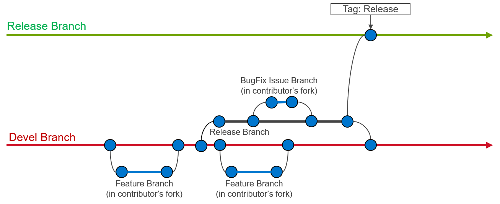

Creating A Pull Request
======================

Contributions to Omnia are made through `Pull Requests (PRs) <https://help.github.com/en/github/collaborating-with-issues-and-pull-requests/about-pull-requests>`_. To make a pull request against Omnia, use the following steps.

Create an issue
----------------

`Create an issue <https://help.github.com/en/github/managing-your-work-on-github/creating-an-issue>`_ and describe what you are trying to solve. It does not matter whether it is a new feature, a bug fix, or an improvement. All pull requests must be associated to an issue. When creating an issue, be sure to use the appropriate issue template (bug fix or feature request) and complete all of the required fields. If your issue does not fit in either a bug fix or feature request, then create a blank issue and be sure to including the following information:

    * **Problem description:** Describe what you believe needs to be addressed
    * **Problem location:** In which file and at what line does this issue occur?
    * **Suggested resolution:** How do you intend to resolve the problem?

Fork the repository
--------------------

All work on Omnia should be done in a `fork of the repository <https://help.github.com/en/github/getting-started-with-github/fork-a-repo>`_. Only maintainers are allowed to commit directly to the project repository.

Issue branch
------------

`Create a new branch <https://help.github.com/en/desktop/contributing-to-projects/creating-a-branch-for-your-work>`_ on your fork of the repository. All contributions should be branched from devel.::

        git checkout devel
        git checkout -b <new-branch-name>

**Branch name:**  The branch name should be based on the issue you are addressing. Use the following pattern to create your new branch name: ``issue-xxxx``, e.g., ``issue-1023``.

Commit changes
--------------

* It is important to commit your changes to the issue branch. Commit messages should be descriptive of the changes being made.
* All commits to Omnia need to be signed with the `Developer Certificate of Origin (DCO) <https://developercertificate.org/>`_ in order to certify that the contributor has permission to contribute the code. In order to sign commits, use either the ``--signoff`` or ``-s`` option to ``git commit``::

    git commit --signoff
    git commit -s

Make sure you have your user name and e-mail set. The ``--signoff | -s`` option will use the configured user name and e-mail, so it is important to configure it before the first time you commit. Check the following references:

    * `Setting up your github user name <https://help.github.com/articles/setting-your-username-in-git/>`_

    * `Setting up your e-mail address <https://help.github.com/articles/setting-your-commit-email-address-in-git/>`_

.. caution::
    When preparing a pull request it is important to stay up-to-date with the project repository. We recommend that you rebase against the upstream repo frequently. ::

        git pull --rebase upstream devel #upstream is dell/omnia
        git push --force origin <pr-branch-name> #origin is your fork of the repository (e.g., <github_user_name>/omnia.git)

PR description
---------------

Be sure to fully describe the pull request. Ideally, your PR description will contain:
    1. A description of the main point (i.e., why was this PR made?),
    2. Linking text to the related issue (i.e., This PR closes issue #<issue_number>),
    3. How the changes solves the problem
    4. How to verify that the changes work correctly.

Developer Certificate of Origin
--------------------------------

 ::

    Developer Certificate of Origin
    Version 1.1

    Copyright (C) 2004, 2006 The Linux Foundation and its contributors.
    1 Letterman Drive
    Suite D4700
    San Francisco, CA, 94129

    Everyone is permitted to copy and distribute verbatim copies of this
    license document, but changing it is not allowed.

    Developer's Certificate of Origin 1.1

    By making a contribution to this project, I certify that:

    (a) The contribution was created in whole or in part by me and I
        have the right to submit it under the open source license
        indicated in the file; or

    (b) The contribution is based upon previous work that, to the best
        of my knowledge, is covered under an appropriate open source
        license and I have the right under that license to submit that
        work with modifications, whether created in whole or in part
        by me, under the same open source license (unless I am
        permitted to submit under a different license), as indicated
        in the file; or

    (c) The contribution was provided directly to me by some other
        person who certified (a), (b) or (c) and I have not modified
        it.

    (d) I understand and agree that this project and the contribution
        are public and that a record of the contribution (including all
        personal information I submit with it, including my sign-off) is
        maintained indefinitely and may be redistributed consistent with
        this project or the open source license(s) involved.

