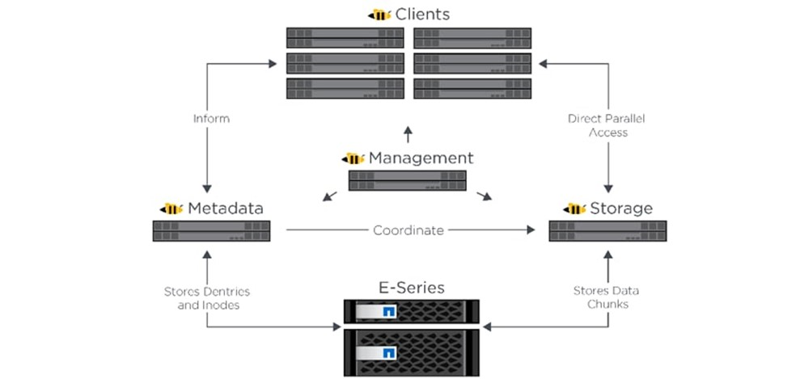

BeeGFS bolt on
--------------

BeeGFS is a hardware-independent POSIX parallel file system (a.k.a. Software-defined Parallel Storage) developed with a strong focus on performance and designed for ease of use, simple installation, and management.

**Pre Requisites before installing BeeGFS client**

* Ensure that the BeeGFS server is set up using the `linked steps <../../Appendices/BeeGFSServer.html>`_.
* Ensure that a ``connAuthFile`` is configured on the server as explained `here <../../Appendices/BeeGFSServer.html>`_

.. caution:: Configuring a ``connAuthFile`` is now mandatory. Services will no longer start if a ``connAuthFile`` is not configured

* Ensure that the following ports are open for TCP and UDP connectivity:

        +------+-----------------------------------+
        | Port | Service                           |
        +======+===================================+
        | 8008 | Management service (beegfs-mgmtd) |
        +------+-----------------------------------+
        | 8003 | Storage service (beegfs-storage)  |
        +------+-----------------------------------+
        | 8004 | Client service (beegfs-client)    |
        +------+-----------------------------------+
        | 8005 | Metadata service (beegfs-meta)    |
        +------+-----------------------------------+
        | 8006 | Helper service (beegfs-helperd)   |
        +------+-----------------------------------+

To open the ports required, use the following steps:

    1. ``firewall-cmd --permanent --zone=public --add-port=<port number>/tcp``

    2. ``firewall-cmd --permanent --zone=public --add-port=<port number>/udp``

    3. ``firewall-cmd --reload``

    4. ``systemctl status firewalld``

* Ensure that the nodes in the inventory have been assigned **only** these roles: manager and compute.

* Nodes provisioned using the Omnia provision tool do not require a RedHat subscription to set up BeeGFS on RHEL cluster nodes.

* For RHEL cluster nodes not provisioned by Omnia, ensure that RedHat subscription is enabled on all cluster nodes. Every cluster node will require a RedHat subscription.

.. note:: BeeGFS services over RDMA is only supported on RHEL 8.3 and above due to limitations on BeeGFS. When setting up your cluster with RDMA support, check the BeeGFS documentation to provide appropriate values in ``input/storage_config.yml``.

* If the cluster runs Rocky, ensure that versions running are compatible by checking our `support matrix <../../Overview/SupportMatrix/OperatingSystems/Rocky.html>`_.

**Installing the BeeGFS client via Omnia**

After the required parameters are filled in ``input/storage_config.yml``, Omnia installs BeeGFS on manager and compute nodes while executing the ``omnia.yml`` playbook.

.. caution:: Do not remove or comment any lines in the ``input/storage_config.yml`` file.

+---------------------------------+------------------------------------------------------------------------------------------------------------------------------------------------------------------------------------------------------------------------------------------------------+
| Name                            | Details                                                                                                                                                                                                                                              |
+=================================+======================================================================================================================================================================================================================================================+
| beegfs_support                  | This variable is used to install beegfs-client on compute and manager   nodes                                                                                                                                                                        |
|      ``boolean``                |                                                                                                                                                                                                                                                      |
|      Optional                   | Choices:                                                                                                                                                                                                                                             |
|                                 |                                                                                                                                                                                                                                                      |
|                                 |      *  ``false`` <- Default                                                                                                                                                                                                                         |
|                                 |                                                                                                                                                                                                                                                      |
|                                 |      *  ``true``                                                                                                                                                                                                                                     |
+---------------------------------+------------------------------------------------------------------------------------------------------------------------------------------------------------------------------------------------------------------------------------------------------+
| beegfs_rdma_support             | This variable is used if user has RDMA-capable network hardware (e.g.,   InfiniBand)                                                                                                                                                                 |
|      ``boolean``                |                                                                                                                                                                                                                                                      |
|      Optional                   | Choices:                                                                                                                                                                                                                                             |
|                                 |                                                                                                                                                                                                                                                      |
|                                 |      * ``false`` <- Default                                                                                                                                                                                                                          |
|                                 |                                                                                                                                                                                                                                                      |
|                                 |      * ``true``                                                                                                                                                                                                                                      |
+---------------------------------+------------------------------------------------------------------------------------------------------------------------------------------------------------------------------------------------------------------------------------------------------+
| beegfs_ofed_kernel_modules_path | The path where separate OFED kernel modules are installed.                                                                                                                                                                                           |
|      ``string``                 |                                                                                                                                                                                                                                                      |
|      Optional                   |      **Default value**: ``"/usr/src/ofa_kernel/default/include"``                                                                                                                                                                                    |
+---------------------------------+------------------------------------------------------------------------------------------------------------------------------------------------------------------------------------------------------------------------------------------------------+
| beegfs_mgmt_server              | BeeGFS management server IP. Note: The provided IP should have an   explicit BeeGFS management server running .                                                                                                                                      |
|      ``string``                 |                                                                                                                                                                                                                                                      |
|      Required                   |                                                                                                                                                                                                                                                      |
+---------------------------------+------------------------------------------------------------------------------------------------------------------------------------------------------------------------------------------------------------------------------------------------------+
| beegfs_mounts                   | Beegfs-client file system mount location. If ``storage_yml`` is being   used to change the BeeGFS mounts location, set beegfs_unmount_client to   true                                                                                               |
|      ``string``                 |      **Default value**: "/mnt/beegfs"                                                                                                                                                                                                                |
|      Optional                   |                                                                                                                                                                                                                                                      |
+---------------------------------+------------------------------------------------------------------------------------------------------------------------------------------------------------------------------------------------------------------------------------------------------+
| beegfs_unmount_client           | Changing this value to true will unmount running instance of BeeGFS   client and should only be used when decommisioning BeeGFS, changing the mount   location or changing the BeeGFS version.                                                       |
|      ``boolean``                |                                                                                                                                                                                                                                                      |
|      Optional                   | Choices:                                                                                                                                                                                                                                             |
|                                 |                                                                                                                                                                                                                                                      |
|                                 |      * ``false`` <- Default                                                                                                                                                                                                                          |
|                                 |                                                                                                                                                                                                                                                      |
|                                 |      * ``true``                                                                                                                                                                                                                                      |
+---------------------------------+------------------------------------------------------------------------------------------------------------------------------------------------------------------------------------------------------------------------------------------------------+
| beegfs_client_version           | Beegfs client version needed on compute and manager nodes.                                                                                                                                                                                           |
|      ``string``                 |                                                                                                                                                                                                                                                      |
|      Optional                   |      **Default value**: 7.2.6                                                                                                                                                                                                                        |
+---------------------------------+------------------------------------------------------------------------------------------------------------------------------------------------------------------------------------------------------------------------------------------------------+
| beegfs_version_change           | Use this variable to change the BeeGFS version on the target nodes.                                                                                                                                                                                  |
|      ``boolean``                |                                                                                                                                                                                                                                                      |
|      Optional                   | Choices:                                                                                                                                                                                                                                             |
|                                 |                                                                                                                                                                                                                                                      |
|                                 |      * ``false`` <- Default                                                                                                                                                                                                                          |
|                                 |                                                                                                                                                                                                                                                      |
|                                 |      * ``true``                                                                                                                                                                                                                                      |
+---------------------------------+------------------------------------------------------------------------------------------------------------------------------------------------------------------------------------------------------------------------------------------------------+
| beegfs_secret_storage_filepath  | * The filepath (including the filename) where the ``connauthfile`` is   placed.                                                                                                                                                                      |
|      ``string``                 | * Recommended for Beegfs version >= 7.2.7.                                                                                                                                                                                                           |
|      Optional                   |                                                                                                                                                                                                                                                      |
|                                 |                                                                                                                                                                                                                                                      |
|                                 |      **Default value**: ``/home/connauthfile``                                                                                                                                                                                                       |
+---------------------------------+------------------------------------------------------------------------------------------------------------------------------------------------------------------------------------------------------------------------------------------------------+

.. note::
    * BeeGFS client-server communication can take place over TCP or RDMA. If RDMA support is required, set ``beegfs_rdma_support`` should be set to true. Also, OFED should be installed on all cluster nodes.
    * For BeeGFS communication happening over RDMA, the ``beegfs_mgmt_server`` should be provided with the Infiniband IP of the management server.
    * The parameter inventory refers to the `inventory file <../../samplefiles.html>`_ listing manager, login and compute nodes.)

If ``input/storage_config.yml`` is populated before running ``omnia.yml``, BeeGFS client will be set up during the run of ``omnia.yml``.

If ``omnia.yml`` is not leveraged to set up BeeGFS, run the ``storage.yml`` playbook : ::

    cd storage
    ansible-playbook storage.yml -i inventory

.. note:: Once BeeGFS is successfully set up, set ``enable_omnia_nfs`` (``input/omnia_config.yml``) to false and  ``omnia_usrhome_share`` (``input/omnia_config.yml``) to an accessible share path in BeeGFS to use the path across the cluster for deployments.