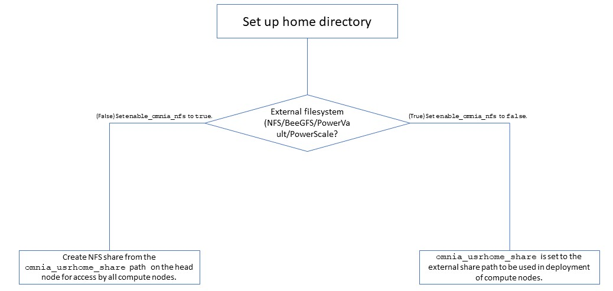

Building clusters
------------------

1. In the ``input/omnia_config.yml``, ``input/security_config.yml``, ``input/telemetry_config.yml`` and [optional] ``input/storage_config.yml`` files, provide the `required details <schedulerinputparams.html>`_.

.. note::
    * Use the parameter ``scheduler_type`` in ``input/omnia_config.yml`` to customize what schedulers are installed in the cluster.
    * Without the login node, Slurm jobs can be scheduled only through the manager node.

2. Create an inventory file in the *omnia* folder. Check out the `sample inventory for more information <../../samplefiles.html>`_.

    * *[Manager]* group should contain the manager node IP address. [1]_
    * *[compute]* group should contain all compute node IP addresses.
    * *[login]* group should contain the login node IP.
.. [1] In a multi-node setup, IP's cannot be repeated in the manager or compute groups. That is, don't include the manager node IP address in the compute group. In a single node setup, the compute node and the manager node must be the same.

.. include:: ../../Appendices/hostnamereqs.rst

.. note::
     * RedHat nodes that are not configured by Omnia need to have a valid subscription. To set up a subscription, `click here <https://omnia-doc.readthedocs.io/en/latest/Roles/Utils/rhsm_subscription.html>`_.
     * Omnia creates a log file which is available at: ``/var/log/omnia.log``.
     * If only Slurm is being installed on the cluster, docker credentials are not required.

3. ``omnia.yml`` is a wrapper playbook comprising of:

    i. ``security.yml``: This playbook sets up centralized authentication (LDAP/FreeIPA) on the cluster. For more information, `click here. <Authentication.html>`_
    ii. ``scheduler.yml``: This playbook sets up job schedulers (Slurm or Kubernetes) on the cluster.
    iii. ``storage.yml``: This playbook sets up storage tools like `BeeGFS <BeeGFS.html>`_ and `NFS <NFS.html>`_.
    iv. ``telemetry.yml``: This playbook sets up `Omnia telemetry and/or iDRAC telemetry <../../Roles/Telemetry/index.html>`_. It also installs `Grafana <https://grafana.com/>`_ and `Loki <https://grafana.com/oss/loki/>`_ as Kubernetes pods.

To run ``omnia.yml``: ::

        ansible-playbook omnia.yml -i inventory

.. note::
    * To visualize the cluster (Slurm/Kubernetes) metrics on Grafana (On the control plane)  during the run of ``omnia.yml``, add the parameters ``grafana_username`` and ``grafana_password`` (That is ``ansible-playbook omnia.yml -i inventory -e grafana_username="" -e grafana_password=""``).
    * Having the same node in the manager and login groups in the inventory is not recommended by Omnia.
    * If you want to view or edit the ``omnia_config.yml`` file, run the following command:

                - ``ansible-vault view omnia_config.yml --vault-password-file .omnia_vault_key`` -- To view the file.

                - ``ansible-vault edit omnia_config.yml --vault-password-file .omnia_vault_key`` -- To edit the file.

    * Use the ansible-vault view or edit commands and not the ansible-vault decrypt or encrypt commands. If you have used the ansible-vault decrypt or encrypt commands, provide 644 permission to the parameter files.

**Setting up a shared home directory**

Users wanting to set up a shared home directory for the cluster can do it in one of two ways:

    * **Using the head node as an NFS host**: Set ``enable_omnia_nfs`` (``input/omnia_config.yml``) to true and provide a share path which will be configured on all nodes in ``omnia_usrhome_share`` (``input/omnia_config.yml``). During the execution of ``omnia.yml``, the NFS share will be set up for access by all cluster  nodes.
    * **Using an external filesystem**: Configure the external file storage using ``storage.yml``. Set ``enable_omnia_nfs`` (``input/omnia_config.yml``) to false and provide the external share path in ``omnia_usrhome_share`` (``input/omnia_config.yml``). Run ``omnia.yml`` to configure access to the external share for deployments.

**Slurm job based user access**

To ensure security while running jobs on the cluster, users can be assigned permissions to access cluster  nodes only while their jobs are running. To enable the feature: ::

    cd scheduler
    ansible-playbook job_based_user_access.yml -i inventory

.. note::

    * The inventory queried in the above command is to be created by the user prior to running ``omnia.yml`` as ``scheduler.yml`` is invoked by ``omnia.yml``

    * Only users added to the 'slurm' group can execute slurm jobs. To add users to the group, use the command: ``usermod -a -G slurm <username>``.

**Running Slurm MPI jobs on clusters**

To enhance the productivity of the cluster, Slurm allows users to run jobs in a parallel-computing architecture. This is used to efficiently utilize all available computing resources. `Click here for more information. <../Benchmarks/index.html>`_

.. note::

    * Omnia does not install MPI packages by default. Users hoping to leverage the Slurm-based MPI execution feature are required to install the relevant packages from a source of their choosing. For information on setting up Intel OneAPI on the cluster, `click here <../Benchmarks/OneAPI.html>`_.
    * Ensure there is an NFS node on which to host slurm scripts to run.
    * Running jobs as individual users (and not as root) requires that passwordSSH be enabled between cluster  nodes for the user.

