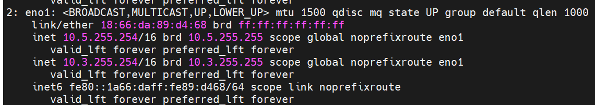

switch_based
-------------

**Pre requisites**

* IP address for ToR switch needs to be provided.

* Switch port range where all BMC NICs are connected should be provided.

* SNMP v3 should be enabled on the switch.

* Non-admin user credentials for the switch need to be provided.

.. note::
    * To create an SNMPv3 user on S series switches (running  OS10), use the following commands:
        - To create SNMP view: ``snmp-server view test_view internet included``
        - To create SNMP group: ``snmp-server group testgroup 3 auth read test_view``
        - To create SNMP users: ``snmp-server user authuser1 testgroup 3 auth sha authpasswd1``
    * To verify the changes made, use the following commands:
        - To view the SNMP views: ``show snmp view``
        - To view the SNMP groups: ``show snmp group``
        - To view the SNMP users: ``show snmp user``
    * To save this configuration for later use, run: ``copy running-configuration startup-configuration``
    * For more information on SNMP on S series switch `click here <https://www.dell.com/support/manuals/en-cr/dell-emc-os-9/s3048-on-9.14.2.6-cli-pub/snmp-server-user?guid=guid-dbed1721-656a-4ad4-821c-589dbd371bf9&lang=en-us>`_
    * For more information on SNMP on N series switch `click here <https://www.dell.com/support/kbdoc/en-us/000133707/how-to-configure-snmpv3-on-dell-emc-networking-n-series-switches>`_

* IPMI over LAN needs to be enabled for the BMC. ::

    racadm set iDRAC.IPMILan.Enable 1
    racadm get iDRAC.IPMILan

* BMC credentials should be the same across all servers and provided as input to Omnia.

* Target servers should be configured to boot in PXE mode with appropriate NIC as the first boot device.

* Set the IP address of the control plane with a /16 subnet mask. The control plane NIC connected to remote servers (through the switch) should be configured with two IPs (BMC IP and admin IP) in a shared LOM or hybrid set up. In the case dedicated network topology, a single IP (admin IP) is required.

.. caution::
    * Do not use daisy chain ports or the port used to connect to the control plane in ``switch_based_details`` in ``input/provision_config.yml``. This can cause IP conflicts on servers attached to potential target ports.
    * Omnia does not validate SNMP switch credentials, if the provision tool is run with incorrect credentials, use the clean-up script and re-run the provision tool with the correct credentials.
    * If you are re-provisioning your cluster (that is, re-running the ``provision.yml`` playbook) after a `clean-up <../../CleanUpScript.html>`_, ensure to use a different ``admin_nic_subnet`` in ``input/provision_config.yml`` to avoid a conflict with newly assigned servers. Alternatively, disable any OS available in the ``Boot Option Enable/Disable`` section of your BIOS settings (``BIOS Settings`` > ``Boot Settings`` > ``UEFI Boot Settings``) on all target nodes.
    * ``admin_nic_subnet``, ``ib_nic_subnet`` and ``bmc_nic_subnet`` should have the same subnet mask (Omnia only supports /16 subnet masks currently).

.. note::
    * The IP range *x.y.246.1* - *x.y.255.253* (where x and y are provided by the first two octets of ``bmc_nic_subnet``) are reserved by Omnia.
    * If any of the target nodes have a pre-provisioned IP, do not use a ``bmc_subnet`` and/or ``ip_start_range``/``ip_end_range`` that encapsulates the pre-provisioned IP.
        - For example, if there are target nodes hosted at 10.3.0.11 and 10.3.0.12, ``bmc_subnet`` = 10.3.0.0 with ``ip_start_range`` = 10.3.0.1/ ``ip_end_range`` = 10.3.0.255 will cause a conflict with newly assigned servers however, ``bmc_subnet`` = 10.3.0.0 with ``ip_start_range`` = 10.3.0.100/ ``ip_end_range`` = 10.3.0.150 would be accepted. Alternatively, a different subnet would be acceptable,ie ``bmc_subnet`` = 10.13.0.0.

The following parameters need to be populated in ``input/provision_config.yml`` to discover target nodes using a mapping file.

.. caution::
    * Do not remove or comment any lines in the ``input/provision_config.yml`` file.
    * **THE ROCKY LINUX OS VERSION ON THE CLUSTER WILL BE UPGRADED TO THE LATEST 8.x VERSION AVAILABLE IRRESPECTIVE OF THE PROVISION_OS_VERSION PROVIDED IN PROVISION_CONFIG.YML.**

.. csv-table:: Parameters
   :file: ../../../Tables/switch-based.csv
   :header-rows: 1

.. [1] Boolean parameters do not need to be passed with double or single quotes.

.. note::

    The ``input/provision_config.yml`` file is encrypted on the first run of the provision tool:

        To view the encrypted parameters: ::

            ansible-vault view provision_config.yml --vault-password-file .provision_vault_key

        To edit the encrypted parameters: ::

            ansible-vault edit provision_config.yml --vault-password-file .provision_vault_key

To clear the configuration on Omnia provisioned switches and ports, `click here <../../../Roles/Utils/portcleanup.html>`_.

To continue to the next steps:

* `Provisioning the cluster <../installprovisiontool.html>`_