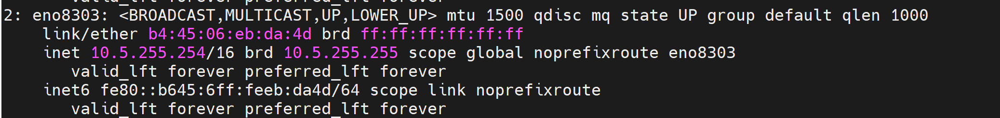

Before you run the provision tool
---------------------------------

* (Recommended) Run ``prereq.sh`` to get the system ready to deploy Omnia. Alternatively, ensure that `Ansible 2.12.10 <https://docs.ansible.com/ansible/latest/reference_appendices/release_and_maintenance.html>`_ and `Python 3.8 <https://www.python.org/downloads/release/python-380/>`_ are installed on the system. SELinux should also be disabled.

* If the control plane is running on the minimal edition of the OS, ensure that ``chrony`` and ``podman`` are installed before running ``provision.yml``.

* Set the IP address of the control plane with a /16 subnet mask. The control plane NIC connected to remote servers (through the switch) should be configured with two IPs (BMC IP and admin IP) in a shared LOM or hybrid set up. In the case dedicated network topology, a single IP (admin IP) is required.

.. figure:: ../../images/ControlPlaneNic.png

            *Control plane NIC IP configuration in a LOM setup*

            *Control plane NIC IP configuration in a dedicated setup*

* Set the hostname of the control plane using the ``hostname``. ``domain name`` format.

    .. include:: ../../Appendices/hostnamereqs.rst

    For example, ``controlplane.omnia.test`` is acceptable. ::

        hostnamectl set-hostname controlplane.omnia.test

.. note:: The domain name specified for the control plane should be the same as the one specified under ``domain_name`` in ``input/provision_config.yml``.

* To provision the bare metal servers, download one of the following ISOs to the control plane:

    1. `Rocky 8 <https://rockylinux.org/>`_

    2. `RHEL 8.x <https://www.redhat.com/en/enterprise-linux-8>`_

.. caution:: **THE ROCKY LINUX OS VERSION ON THE CLUSTER WILL BE UPGRADED TO THE LATEST 8.x VERSION AVAILABLE IRRESPECTIVE OF THE PROVISION_OS_VERSION PROVIDED IN PROVISION_CONFIG.YML.**

.. note:: Ensure the ISO provided has downloaded seamlessly (No corruption). Verify the SHA checksum/ download size of the ISO file before provisioning to avoid future failures.

Note the compatibility between cluster OS and control plane OS below:

        +---------------------+--------------------+------------------+
        |                     |                    |                  |
        | Control Plane OS    | cluster  Node OS    | Compatibility   |
        +=====================+====================+==================+
        |                     |                    |                  |
        | RHEL [1]_           | RHEL               | Yes              |
        +---------------------+--------------------+------------------+
        |                     |                    |                  |
        | RHEL [1]_           | Rocky              | Yes              |
        +---------------------+--------------------+------------------+
        |                     |                    |                  |
        | Rocky               | Rocky              | Yes              |
        +---------------------+--------------------+------------------+

.. [1] Ensure that control planes running RHEL have an active subscription or are configured to access local repositories. The following repositories should be enabled on the control plane: **AppStream**, **Code Ready Builder (CRB)**, **BaseOS**. For RHEL control planes running 8.5 and below, ensure that sshpass is additionally available to install or download to the control plane (from any local repository).

* To **optionally** set up CUDA and OFED using the provisioning tool, download the required repositories to the control plane from here to deploy on the target nodes:

    1. `For NVIDIA GPUs: <https://developer.nvidia.com/cuda-downloads/>`_: CUDA is a parallel computing platform and application programming interface that allows software to use certain types of graphics processing units for general purpose processing, an approach called general-purpose computing on GPUs.

    2. `For Mellanox <https://network.nvidia.com/products/infiniband-drivers/linux/mlnx_ofed/>`_: OFED (OpenFabrics Enterprise Distribution) is open-source software for RDMA and kernel bypass applications. OFED can be used in business, research and scientific environments that require highly efficient networks, storage connectivity and parallel computing.

* Ensure that all connection names under the network manager match their corresponding device names.
    To verify network connection names: ::

            nmcli connection

    To verify the device name: ::

    ip link show

In the event of a mismatch, edit the file  ``/etc/sysconfig/network-scripts/ifcfg-<nic name>`` using vi editor.

* When discovering nodes via snmpwalk or a mapping file, all target nodes should be set up in PXE mode before running the playbook.

* Nodes provisioned using the Omnia provision tool do not require a RedHat subscription to run ``provision.yml`` on RHEL target nodes.

* For RHEL target nodes not provisioned by Omnia, ensure that RedHat subscription is enabled on all target nodes. Every target node will require a RedHat subscription.

* Users should also ensure that all repos (AppStream, BaseOS and CRB) are available on the RHEL control plane.

.. note::
   * Enable a repository from your RHEL subscription, run the following commands: ::

            subscription-manager repos --enable=codeready-builder-for-rhel-8-x86_64-rpms
            subscription-manager repos --enable=rhel-8-for-x86_64-appstream-rpms
            subscription-manager repos --enable=rhel-8-for-x86_64-baseos-rpms

    * Enable an offline repository by creating a ``.repo`` file in ``/etc/yum.repos.d/``. Refer the below sample content: ::

                [RHEL-8-appstream]

                name=Red Hat AppStream repo

                baseurl=http://xx.yy.zz/pub/Distros/RedHat/RHEL8/8.6/AppStream/x86_64/os/

                enabled=1

                gpgcheck=0

                [RHEL-8-baseos]

                name=Red Hat BaseOS repo

                baseurl=http://xx.yy.zz/pub/Distros/RedHat/RHEL8/8.6/BaseOS/x86_64/os/

                enabled=1

                gpgcheck=0

                [RHEL-8-crb]

                name=Red Hat CRB repo

                baseurl=http://xx.yy.zz/pub/Distros/RedHat/RHEL8/8.6/CRB/x86_64/os/

                enabled=1

                gpgcheck=0

    * Verify your changes by running: ::

            yum repolist enabled
            Updating Subscription Management repositories.
            Unable to read consumer identity
            This system is not registered with an entitlement server. You can use subscription-manager to register.
                repo id                                                           repo name
                RHEL-8-appstream-partners                                         Red Hat Enterprise Linux 8.6.0 Partners (AppStream)
                RHEL-8-baseos-partners                                            Red Hat Enterprise Linux 8.6.0 Partners (BaseOS)
                RHEL-8-crb-partners                                               Red Hat Enterprise Linux 8.6.0 Partners (CRB)

* Uninstall epel-release if installed on the control plane as Omnia configures epel-release on the control plane. To uninstall epel-release, use the following commands: ::

        dnf remove epel-release -y

* Ensure that the ``pxe_nic`` and ``public_nic`` are in the firewalld zone: public.

.. note::

    * After configuration and installation of the cluster, changing the control plane is not supported. If you need to change the control plane, you must redeploy the entire cluster.

    * For servers with an existing OS being discovered via BMC, ensure that the first PXE device on target nodes should be the designated active NIC for PXE booting.

