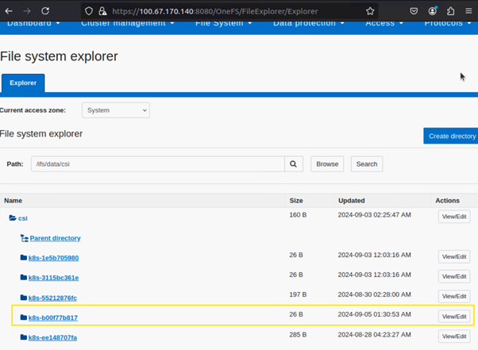

Deploy CSI drivers for Dell PowerScale storage solutions
===========================================================

Dell PowerScale is a flexible and secure scale-out NAS (network attached storage) solution designed to simplify storage requirements for AI and HPC workloads. To enable the PowerScale storage solution on the Kubernetes clusters, Omnia installs the Dell CSI PowerScale driver (version 2.13.0) on the nodes using helm charts. Once the PowerScale CSI driver is installed, the PowerScale nodes can be connected to the Kubernetes clusters for storage requirements.
To know more about the CSI PowerScale driver, `click here <https://dell.github.io/csm-docs/docs/deployment/helm/drivers/installation/isilon/>`_.

.. caution:: PowerScale CSI driver installation is only supported on RHEL 8.8 and Rocky Linux 8.8 clusters.

.. note:: Omnia doesn't configure any PowerScale device via OneFS (operating system for PowerScale). Omnia configures the deployed Kubernetes cluster to interact with the PowerScale storage.

PowerScale SmartConnect [Optional]
-------------------------------------

* To utilize the PowerScale SmartConnect hostname, it is necessary for the user to have an upstream DNS server that includes delegation mappings of hostname to PowerScale IP addresses. During the provisioning of cluster nodes, users can specify the IP of the upstream ``DNS`` server in the ``input/network_spec.yml`` file. This ensures that the Omnia cluster recognizes and is aware of the upstream DNS server, enabling the use of PowerScale SmartConnect hostname functionality. For example: ::

    ---
        Networks:
        - admin_network:
            nic_name: <network name>
            netmask_bits: "16"
            static_range: <static ip range>
            dynamic_range: <dynamic ip range>
            correlation_to_admin: true
            admin_uncorrelated_node_start_ip: ""
            network_gateway: ""
            DNS: <upstream DNS server>
            MTU: "1500"

* If the user did not specify the upstream DNS server during the provisioning process and wishes to utilize PowerScale SmartConnect afterwards, then the user must first add the upstream DNS server IP to the ``DNS`` entry in ``input/network_spec.yml``  and then re-run the ``discovery-provision.yml`` playbook.

Prerequisites
--------------

1. Download the ``secret.yaml`` file template from this `link <https://github.com/dell/csi-powerscale/blob/main/samples/secret/secret.yaml>`_.

2. Update the following parameters in the ``secret.yaml`` file as per your cluster details and keep the rest as default values. For example:

    *	clusterName: <desired cluster name>
    *	username: <username>
    *	password: <password>
    *	endpoint: <endpoint_IP>
    .. note:: If PowerScale SmartConnect hostname is configured, user can provide the PowerScale hostname for ``endpoint``. Otherwise user can provide PowerScale IP address as well.
    *	endpointPort: <endpoint_port>
    *	isDefault: true
    *	isiPath: "/ifs/data/csi"

   *Reference values from OneFS portal:*

   .. image:: ../../../images/CSI_1.png

3. Download the ``values.yaml`` files template using the following command: ::

    wget https://raw.githubusercontent.com/dell/helm-charts/csi-isilon-2.13.0/charts/csi-isilon/values.yaml

4. Update the following parameters in the ``values.yaml`` file and keep the rest as default values. Refer the below sample values:

    * controllerCount: 1

    * replication:

        enabled: false

    * snapshot:

        enabled: true

    * resizer:

        enabled: false

    * healthMonitor:

        enabled: false

    * endpointPort:8080

    * skipCertificateValidation: true

    * isiAccessZone: System

    * isiPath: /ifs/data/csi

.. note:: In order to integrate PowerScale solution to the deployed Kubernetes cluster, Omnia 1.7 requires the following fixed parameter values in ``values.yaml`` file:

    * controllerCount: 1
    * Replication: false
    * Snapshot: true
    * skipCertificateValidation: true

.. note:: Once the PowerScale CSI driver has been deployed, the parameters in the ``values.yaml`` can't be changed. If the user wants to modify the ``values.yaml`` file, they must first uninstall the PowerScale CSI driver from the cluster and then re-install with the updated parameters.

Installation Process
---------------------

1. Once ``secret.yaml`` and ``values.yaml`` is filled up with the necessary details, copy both files to any directory on the OIM. For example, ``/tmp/secret.yaml`` and ``/tmp/values.yaml``.

2. Add the ``csi_driver_powerscale`` entry along with the driver version to the ``omnia/input/software_config.json`` file: ::

    {"name": "csi_driver_powerscale", "version":"v2.13.0"}

 .. note:: By default, the ``csi_driver_powerscale`` entry is not present in the ``input/software_config.json``.

3. Execute the ``local_repo.yml`` playbook to download the required artifacts to the OIM: ::

    cd local_repo
    ansible-playbook local_repo.yml

4. Add the filepath of the ``secret.yaml`` and ``values.yaml`` file to the ``csi_powerscale_driver_secret_file_path`` and ``csi_powerscale_driver_values_file_path`` variables respectively, present in the ``omnia/input/omnia_config.yml`` file.

5. Execute the ``omnia.yml`` playbook to install the PowerScale CSI driver: ::

    cd omnia
    ansible-playbook omnia.yml -i <inventory_filepath>

.. note::
     * There isn't a separate playbook to run for PowerScale CSI driver installation. Running ``omnia.yml`` with necessary inputs installs the driver. If Kubernetes is already deployed on the cluster, users can also run the ``scheduler.yml`` playbook to install the PowerScale CSI driver.
     * After running ``omnia.yml`` playbook, the ``secret.yaml`` file will be encrypted. User can use below command to decrypt and edit it if required: ::

         cd omnia
         ansible-vault edit <secret.yaml filepath> --vault-password-file scheduler/roles/k8s_csi_powerscale_plugin/files/.csi_powerscale_secret_vault

.. caution:: Do not delete the vault key file ``.csi_powerscale_secret_vault``, otherwise users will not be able to decrypt the ``secret.yaml`` file anymore.

Expected Results
------------------

* After the successful execution of the ``omnia.yml`` playbook, the PowerScale CSI driver is deployed in the isilon namespace.
* Along with PowerScale driver installation a storage class named **ps01** is also created. The details of the storage class are as follows: ::

    apiVersion: storage.k8s.io/v1
    kind: StorageClass
    metadata:
      name: ps01
    provisioner: csi-isilon.dellemc.com
    reclaimPolicy: Delete
    allowVolumeExpansion: true
    volumeBindingMode: Immediate
    parameters:
      AccessZone: < access zone mentioned in values.yaml file >
      Isipath: < isipath mentioned in values.yaml file >
      RootClientEnabled: "true"
      csi.storage.k8s.io/fstype: "nfs"

* If there are errors during CSI driver installation, the whole ``omnia.yml`` playbook execution does not stop or fail. It pauses for 30 seconds with CSI driver installation failure error message and then proceeds with rest of the playbook execution.
* For an unsuccessful driver installation scenario, the user first needs to follow the manual removal steps mentioned below from the ``kube_control_plane``, and then re-run the ``omnia.yml`` playbook for CSI driver installation.

Post installation
-------------------

**[Optional] Create custom storage class**

If user wants to create a custom storage class, they can do so by following the sample storage class `template <https://github.com/dell/csi-powerscale/blob/main/samples/storageclass/isilon.yaml>`_.

*Sample storageclass template*: ::

    apiVersion: storage.k8s.io/v1
    kind: StorageClass
    metadata :
      name: <storage class name>
    provisioner: csi-isilon.dellemc.com
    reclaimPolicy: Delete
    allowVolumeExpansion: true
    volumeBindingMode: Immediate
    parameters :
      clusterName: <powerscale cluster name > #optional
      AccessZone: System
      AzServiceIP: <PowerScale SmartConnect hostname or PowerScale IP> #optional
      Isipath: <isipath configured in powerscale > #sample: /ifs/data/csi/
      RootClientEnabled: "true"
      csi.storage.k8s.io/fstype: "nfs"

.. note::

    * If PowerScale SmartConnect hostname is configured and the delegated host list is set up in the external DNS server, then the user can provide the PowerScale hostname for ``AzServiceIP``. Otherwise user can provide PowerScale IP address as well.
    * If there are any changes to the storage class parameters in a PowerScale cluster, the user must update the existing storage class or create a new one as needed.

**Apply storage class**

Use the following command to apply the storageclass: ::

    kubectl apply -f <storageclass name>

**Create Persistent Volume Claim (PVC)**

Once the storage class is created, the same can be used to create PVC.

*Sample deployment with PVC*: ::

    apiVersion: v1
    kind: PersistentVolumeClaim
    metadata:
      name: pvc-powerscale
    spec:
      accessModes:
        - ReadWriteMany
      resources:
        requests:
          storage: 1Gi
      storageClassName: ps01
    ---
    apiVersion: apps/v1
    kind: Deployment
    metadata:
      name: deploy-busybox-01
    spec:
      strategy:
        type: Recreate
      replicas: 1
      selector:
        matchLabels:
          app: deploy-busybox-01
      template:
        metadata:
          labels:
            app: deploy-busybox-01
        spec:
          containers:
            - name: busybox
              image: registry.k8s.io/busybox
              command: ["sh", "-c"]
              args: ["while true; do touch /data/datafile; rm -f /data/datafile; done"]
              volumeMounts:
                - name: data
                  mountPath: /data
              env:
                - name: http_proxy
                  value: "http://<OIM IP>:3128"
                - name: https_proxy
                  value: "http://<OIM IP>:3128"
          volumes:
            - name: data
              persistentVolumeClaim:
                claimName: pvc-powerscale

**Apply the deployment manifest along with PVC**

Use the following command to apply the manifest: ::

    kubectl apply -f <manifest_filepath>

*Expected Result*:

* Once the above manifest is applied, a PVC is created under name ``pvc-powerscale`` and is in ``Bound`` status. Use the ``kubectl get pvc -A`` command to bring up the PVC information. For example: ::

    root@node001:/opt/omnia/csi-driver-powerscale/csi-powerscale/dell-csi-helm-installer# kubectl get pvc -A
    NAMESPACE   NAME                STATUS   VOLUME           CAPACITY   ACCESS MODES   STORAGECLASS   VOLUMEATTRIBUTESCLASS   AGE
    default     pvc-powerscale      Bound    k8s-b00f77b817   1Gi        RWX            ps01           <unset>                 27h

* User can also verify the same information from the OneFS portal. In the sample image below, it is mapped with the ``VOLUME`` entry from the above example: ``k8s-b00f77b817``:

Removal
--------

To remove the PowerScale driver manually, do the following:

1. Login to the ``kube_control_plane``.

2. Execute the following command to switch to the ``dell-csi-helm-installer`` directory: ::

    cd /opt/omnia/csi-driver-powerscale/csi-powerscale/dell-csi-helm-installer

3. Once you're inside the ``dell-csi-helm-installer`` directory, use the following command to trigger the ``csi-uninstall`` script: ::

    ./csi-uninstall.sh --namespace isilon

4. After running the previous command, the PowerScale driver is removed. But, the secret and the created PVC are not removed. If users want to remove them, they need to do it manually from the "isilon" namespace.

5. If users don't want to use PowerScale anymore, they can remove the following as well:

    a. Remove the PowerScale secret by executing the following commands one after the other:

         i. ``kubectl delete secret isilon-creds -n isilon``

         ii. ``kubectl delete secret isilon-certs-0 -n isilon``

    b. Remove any custom user deployment and PVC that was using PowerScale storage class.

    c. Remove the PowerScale storage class.

.. note:: In case OneFS portal credential changes, users need to perform following steps to update the changes to the ``secret.yaml`` manually:

    1. Update the ``secret.yaml`` file with the changed credentials.
    2. Login and copy the ``secret.yaml`` file to the ``kube_control_plane``.
    3. Delete the existing secret by executing the following command: ::

        kubectl delete secret isilon-creds -n isilon

    4. Create the new secret from the updated ``secret.yaml`` file by executing the following command: ::

        kubectl create secret generic isilon-creds -n isilon --from-file=config=<updated secret.yaml filepath>