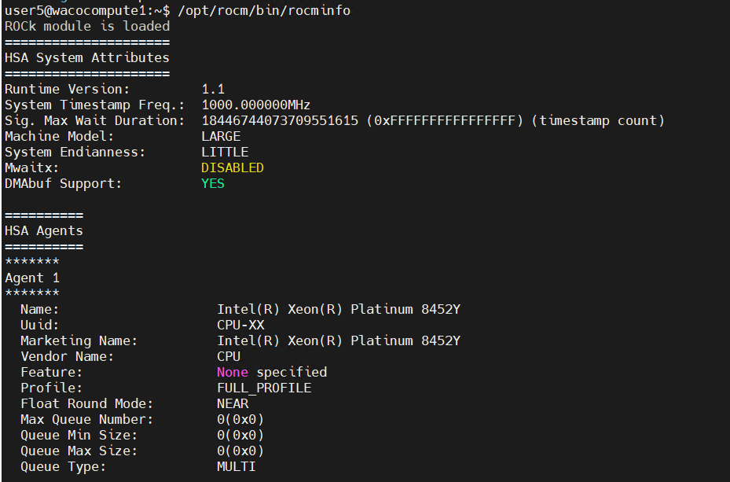

Install the ROCm platform for AMD GPUs
=======================================

This playbook sets up the `AMD ROCm <https://rocm.docs.amd.com/projects/install-on-linux/en/latest/>`_ platform on the clusters. This tool allows users to unlock the full potential of installed AMD GPUs.

Ensure that the ROCm local repositories are configured using the `local_repo.yml <../../CreateLocalRepo/localrepos.html#configure-specific-local-repositories>`_ script.

Ensure that the ``input/software_config.json`` contains valid amdgpu and rocm version. See `input parameters <../../CreateLocalRepo/InputParameters.html>`_ for more information.

.. note:: AMD ROCm driver installation is not supported by Omnia on Rocky Linux cluster nodes.

To install all the latest AMD GPU drivers and toolkits, run the ``omnia.yml`` playbook using the following command: ::

    cd omnia
    ansible-playbook omnia.yml -i inventory

The following configurations take place while executing ``rocm_installation.yml``:

	i. Servers with AMD GPUs are identified and the latest GPU drivers and ROCm platforms are downloaded and installed.
	ii. Servers with no GPU are skipped.

User permissions for ROCm platforms
------------------------------------

* To add an user to the ``render`` and ``video`` group, use the following command: ::

        sudo usermod -a -G render,video <user>

.. note::
        * <user> is the system name of the end user.
        * This command must be run with ``root`` permissions.
        * If the root user wants to provide access to other users and their individual GPU nodes, the previous command needs to be run on all of them separately. ::

* To enable users to use rocm tools, use the following command as shown in the below added sample file: ::

        /opt/rocm/bin/<rocm command>

For any configuration changes, check out ROCm's official documentation `here. <https://rocm.docs.amd.com/projects/install-on-linux/en/latest/how-to/prerequisites.html>`_

