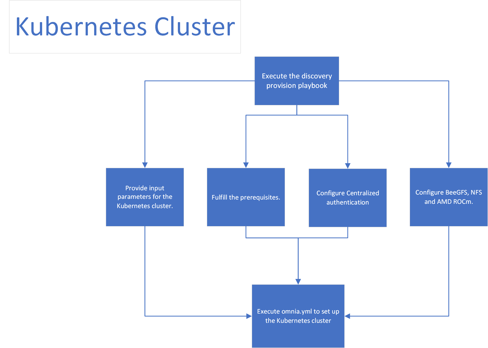

Step 5: Configure the cluster
================================

**Features enabled by omnia.yml**:

    * **Centralized authentication**: Once all the required parameters in `security_config.yml <schedulerinputparams.html#security-config-yml>`_ are filled in, ``omnia.yml`` can be used to set up OpenLDAP.

    * **Kubernetes**: Once all the required parameters in `omnia_config.yml <schedulerinputparams.html#omnia-config-yml>`_ are filled in, ``omnia.yml`` can be used to set up kubernetes.

    * **Login Node (Additionally secure login node)**

.. toctree::
    :maxdepth: 2

    schedulerinputparams
    schedulerprereqs
    installscheduler
    install_kubernetes
    Authentication
    BeeGFS
    NFS
    AMD_ROCm

