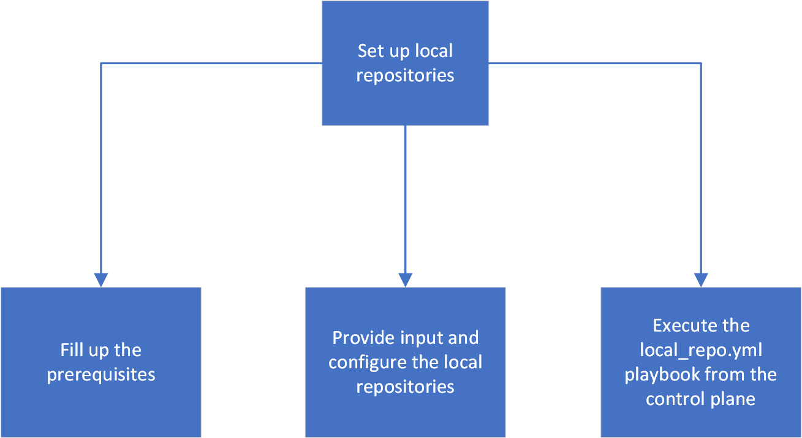

Step 2: Create Local repositories for the cluster
==================================================

The ``local_repo.yml`` playbook creates offline repositories on the control plane server, which all the cluster nodes will access. This playbook execution requires inputs from ``input/software_config.json`` and ``input/local_repo_config.yml``.

.. toctree::
    Prerequisite
    InputParameters
    localrepos
    RunningLocalRepo

