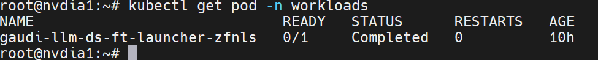

Setup DeepSpeed for clusters containing Intel Gaudi accelerators
==================================================================

DeepSpeed is a deep learning optimization library developed by Microsoft, designed to make training large-scale machine learning models more efficient and scalable. It provides several key features that help accelerate training and reduce the resource requirements for training state-of-the-art models.

Prerequisites
--------------

Before deploying a DeepSpeed MPIJob, the following prerequisites must be fulfilled:

1. Kubeflow must be deployed on all the cluster nodes. `Click here <kubeflow.html>`_ to know more about deploying Kubeflow.

2. Configure the *mpi-operator* package to execute the v2beta1 API. `Click here <mpi_operator_config.html>`_ to know more about this configuration.

3. Verify that the cluster nodes have sufficient allocatable resources for the ``hugepages-2Mi`` and ``Intel Gaudi accelerator``. To check the allocatable resources on all nodes, run: ::

    kubectl describe <intel-gaudi-node-name> | grep -A 10 "Allocatable"

4. [Optional] If required, you can adjust the resource parameters in the ``ds_configuration.yml`` file based on the availability of resources on the nodes.

Deploy DeepSpeed
-----------------

After you have completed all the prerequisites, do the following to deploy a DeepSpeed MPIJob:

1. Create a namespace to manage all your DeepSpeed workloads. Execute the following command: ::

    kubectl create ns workloads

2. Verify that the namespace has been created by executing the following command: ::

    kubectl get namespace workloads

   *Expected output*: ::

       NAME        STATUS  AGE
       workloads   Active  14s

3. To create and apply the DeepSpeed configuration file, follow these steps:

    a. Locate the ``ds_configuration.yml`` file in the ``examples/deepSpeed/`` folder.
    b. Open the ``ds_configuration.yml`` file.
    c. Add the necessary details such as proxy settings, Hugging Face token, and allocated resources for the DeepSpeed MPIJob.
    d. After modifying the file, you have two choices:

        - Directly copy the modified file to your ``kube_control_plane``.
        - Create a new blank ``<DeepSpeed_configuration_filename>.yml`` file, paste the modified contents into it, and save it on your ``kube_control_plane``.

    e. Finally, apply the file using the following command: ::

        kubectl apply -f <DeepSpeed_configuration_filename>.yml

   *Expected output*: ::

       mpijob.kubeflow.org/gaudi-llm-ds-ft created

4. To create and apply the Persistent Volume Claim (PVC) configuration file, required to access shared storage, follow these steps:

    a. Create a new blank ``<PVC_filename>.yml`` file,
    b. Paste the following content into it, and save it on your ``kube_control_plane``. ::

        apiVersion: v1
        kind: PersistentVolumeClaim
        metadata:
          name: shared-model
          namespace: workloads
        spec:
          storageClassName: nfs-client
          accessModes:
            - ReadWriteOnce
          resources:
            requests:
              storage: <storage-size>

    c. Add the necessary details such as name, namespace, and storage size for the DeepSpeed MPIJobs. Use the same configurations as provided in the ``<DeepSpeed_configuration_filename>.yml`` file.
    d. Finally, apply the file using the following command: ::

        kubectl apply -f <PVC_filename>.yml

   *Expected output*: ::

       persistentvolumeclaim/shared-model created

5. After some time, check the status of the pods again to verify if they are up and running. Execute the following command to get the pod status: ::

    kubectl get pod -n workloads

   *Expected output (when pods are running)*: ::

       NAME                             READY  STATUS    RESTARTS  AGE
       gaudi-llm-ds-ft-launcher-zp9mw   1/1    Running   0         33s
       gaudi-llm-ds-ft-worker-0         1/1    Running   0         33s

6. [Optional] To better understand the MPIJob resource, you can use the following command: ::

    kubectl explain mpijob --api-version=kubeflow.org/v2beta1

   *Expected output*: ::

       GROUP: kubeflow.org
       KIND: MPIJob
       VERSION: v2beta1

*Final output*:

Once DeepSpeed deployment is complete (~ after approx 30 minutes), the following output is displayed while checking the status of the pods using the ``kubectl get pod -n workloads`` command. In the below image you can see that the launcher goes to a **Completed** status and the worker nodes are not present, signifying a successful deployment:

