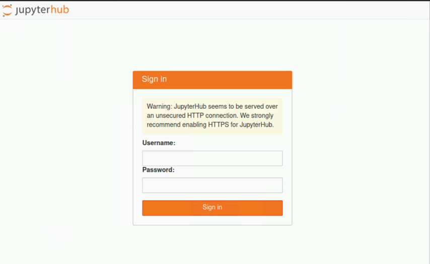
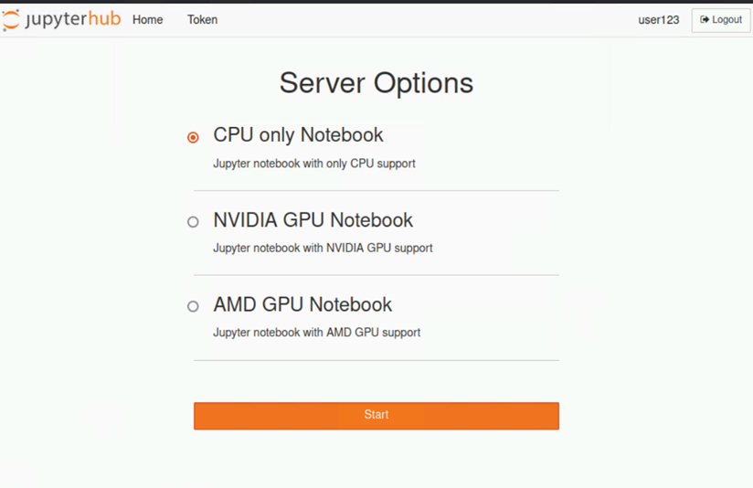
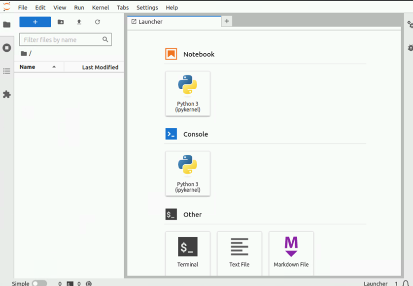

Setup Jupyterhub
-----------------

Omnia installs Jupyterhub (version 3.2.0) on Kubernetes clusters. Once Jupyterhub is deployed, log into the GUI to create your own Jupyter notebook. For more information, `click here <https://z2jh.jupyter.org/en/stable/jupyterhub/customization.html>`_.

**Prerequisites**

* Ensure that Kubernetes is deployed and all pods are running on the cluster.
* MetalLB pod is up and running to provide external IP to jupyterhub service.
* Ensure the passed inventory file includes ``kube_control_plane`` and ``kube_node`` groups. `Click here <../../samplefiles.html>`_ for a sample file.
* Review the ``tools/jupyterhub_config.yml`` file to ensure that the deployment meets your requirements. If not, modify the file.
* Run ``local_repo.yml`` with ``jupyter`` entry in ``software_config.json``.
* Omnia deploys the ``quay.io/jupyterhub/k8s-singleuser-sample:3.2.0`` image irrespective of whether the intended notebooks are CPU-only, NVIDIA GPU, or AMD GPU.  To use a custom image, modify the ``omnia/tools/jupyterhub_config.yml`` file.
* Ensure that NFS storage provisioner has been deployed on the cluster using ``storage.yml`` followed by ``scheduler.yml`` or ``omnia.yml``. Verify that the required NFS storage provisioner is deployed using the below command: ::

    [root@node3 ~]# kubectl get pod -A
    NAMESPACE              NAME                                                              READY   STATUS             RESTARTS       AGE
    default                nfs-omnia-nfs-subdir-external-provisioner-54785fccd-9mp8z         1/1     Running            1 (12m ago)    3h24m

* Verify that the default storage class is set to nfs_client for dynamic persistent volume provisioning. ::

    [root@node3 ~]# kubectl get storageclass
    NAME                   PROVISIONER                                               RECLAIMPOLICY   VOLUMEBINDINGMODE   ALLOWVOLUMEEXPANSION   AGE
    nfs-client (default)   cluster.local/nfs-omnia-nfs-subdir-external-provisioner   Delete          Immediate           true                   17h

**Deploying Jupyterhub**

1. Change directories to the ``tools`` folder: ::

    cd tools

2. Run the ``jupyterhub.yml`` playbook using: ::

       ansible-playbook jupyterhub.yml -i inventory

.. note:: The default namespace for deployment is ``jupyterhub``.

**Accessing the Jupyterhub GUI**

1. Login to the ``kube_control_plane`` and verify that the Jupyterhub service is running.
2. Find the IP address of the Jupyterhub service using:

        ::

            root@omnianode0000x:/usr/local# kubectl get svc -A
            NAMESPACE     NAME           TYPE           CLUSTER-IP      EXTERNAL-IP   PORT(S)                  AGE
            default       kubernetes     ClusterIP      xx.xx.xx.xx      <none>        443/TCP                  2d2h
            jupyterhub    hub            ClusterIP      xx.xx.xx.xx      <none>        8081/TCP                 2d2h
            jupyterhub    proxy-api      ClusterIP      xx.xx.xx.xx      <none>        8001/TCP                 2d2h
            jupyterhub    proxy-public   LoadBalancer   xx.xx.xx.xx   xx.xx.xx.xx    80:31134/TCP               2d2h

    The IP address is listed against ``proxy-public`` under ``External IP``.

3. The Jupyterhub GUI should be accessible from the ``kube_control_plane`` via the external IP mentioned above. Use any browser to log in. Currently Jupyterhub authentication is not linked with openLDAP.

4. Choose your preferred notebook server option and click **Start**. A pod will be created for the user.

.. role:: raw-role(raw)

    :format: html latex

:raw-role:` `

**Stopping the Notebook server**

1. Click **File > Hub Control Plane**.
2. Select **Stop Server**.

.. note:: Stopping the notebook server only terminates the user pod. The users data persists and can be accessed by logging in and starting the notebook server again.

**Redeploy Jupyterhub with new configurations**

1. Update the ``tools/jupyterhub_config.yml`` file with the new configuration.
2. Re-run the ``jupyterhub.yml`` playbook. ::

        cd tools
        ansible-playbook jupyterhub.yml -i inventory

**Clearing Jupyterhub configuration**

Clear the existing configuration by running the below command: ::

    	kubectl delete ns jupyterhub

