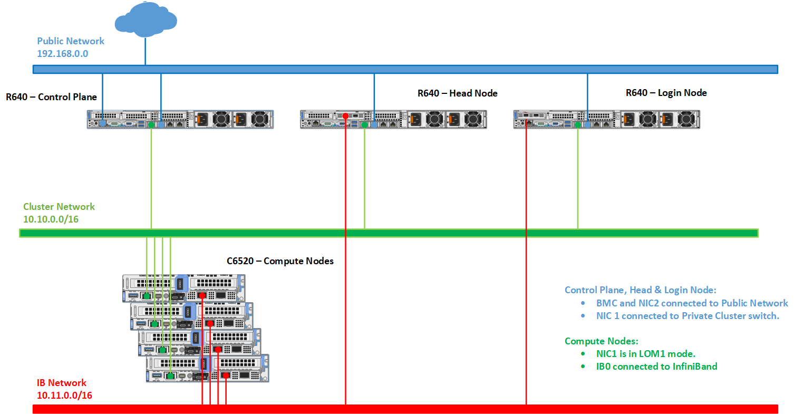

Network Topology: Hybrid setup
=============================

For an environment containing both LOM and BMC ports, the provision tool needs to be run twice to correctly manage all servers in the network.

The first time the provision tool is run (to discover the dedicated BMC ports), ensure that the following variables are set in ``input/provision_config.yml``:

    * ``network_interface_type``: ``dedicated``
    * ``discovery_mechanism``: ``mapping``

.. caution::

* Leave the variables ``bmc_nic_subnet``, ``bmc_static_start_range`` and ``bmc_static_end_range`` blank in ``input/provision_config.yml``. Entering these variables will cause IP reassignment and can interfere with the availability of ports on your target servers.
* Do not use the following methods to discover nodes in a Hybrid setup: snmpwalk, switch-based.

.. note:: For users who don't want internet access routed to target nodes, keep ``primary_dns`` and ``secondary_dns`` blank in ``input/provision_config.yml``.

Once all the dedicated NICs are discovered, re-run the provisioning tool (to discover the shared LOM ports) with the following variables in ``input/provision_config.yml``:

    * ``network_interface_type``: ``lom``
    * ``discovery_mechanism``: ``bmc``

To assign BMC NICs and route internet access to your target nodes, populate the values of ``bmc_nic_subnet``, ``bmc_static_start_range``, ``bmc_static_end_range``, ``primary_dns`` and ``secondary_dns`` in ``input/provision_config.yml`` during the second run of the provision tool.