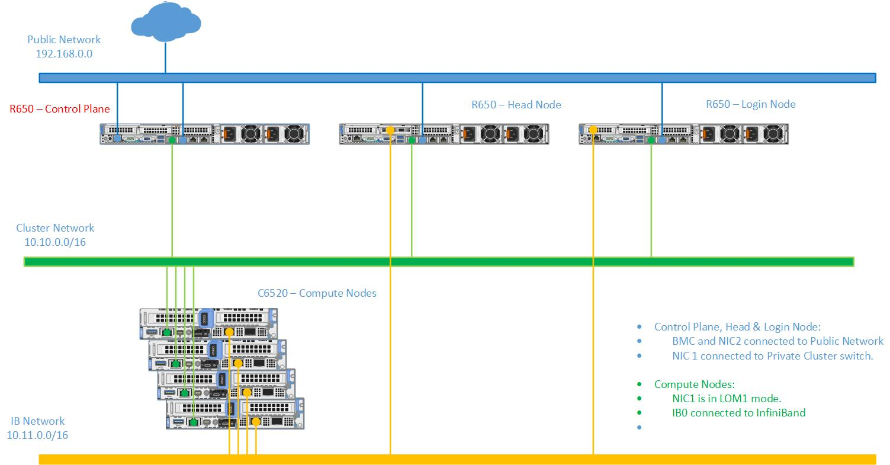

Network Topology: Hybrid setup
=============================

For an environment containing both LOM and BMC ports, the provision tool needs to be run twice to correctly manage all servers in the network.

**Recommended discovery mechanism**

* `mapping <../../InstallationGuides/InstallingProvisionTool/DiscoveryMechanisms/mappingfile.html>`_
* `bmc <../../InstallationGuides/InstallingProvisionTool/DiscoveryMechanisms/bmc.html>`_