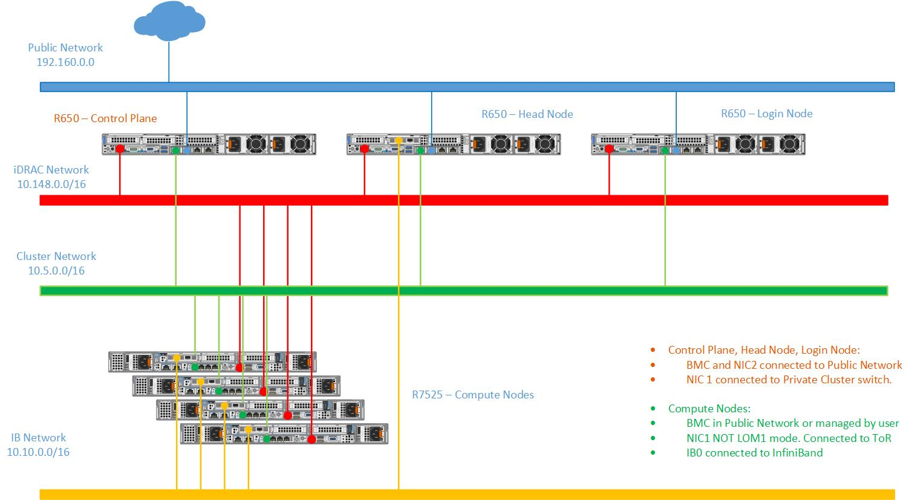

Network Topology: Dedicated Setup
=================================

In a **Dedicated Setup**, all the cluster nodes (head, login, and compute) have dedicated iDRAC connection.

* **Public Network (Blue line)**: This indicates the iDRAC network which is connected to the external public network.

* **iDRAC Network a.k.a. BMC Network (Red line)**: This indicates the private iDRAC network used by the control plane to control the cluster nodes using out-of-band management.

* **Cluster Network (Green line)**: This indicates the admin network utilized by Omnia to provision the cluster nodes.

* **IB Network (Yellow line)**: The network used by the applications on the cluster nodes to communicate among each other.

**Recommended discovery mechanism**

* `mapping <../../InstallationGuides/InstallingProvisionTool/DiscoveryMechanisms/mappingfile.html>`_
* `bmc <../../InstallationGuides/InstallingProvisionTool/DiscoveryMechanisms/bmc.html>`_

