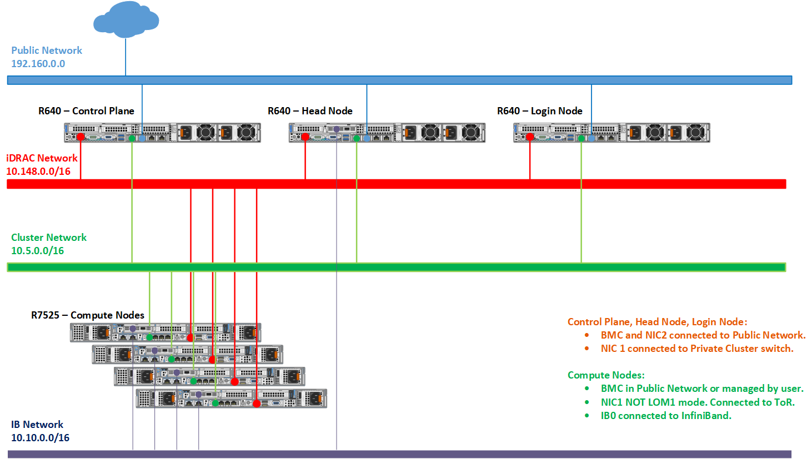

Network Topology: Dedicated Setup
=================================

Depending on internet access for host nodes, there are two ways to achieve a dedicated NIC setup:

1. Dedicated setup with dedicated public NIC on cluster  nodes

When all cluster  nodes have their own public network access, ``primary_dns`` and ``secondary_dns`` in ``provision_config.yml`` become optional variables as the control plane is not required to be a gateway to the network. The network design would follow the above diagram.

2. Dedicated Setup with single NIC on cluster  nodes

In this case, all cluster  nodes rely on the control plane for public network access. The variables ``primary_dns`` and ``secondary_dns`` in ``provision_config.yml`` indicate that the control plane is the gateway for all cluster  nodes to get internet access. Because all public network traffic is routed through the control panel, the user must take precautions to avoid bottlenecks in such a set-up.

**Recommended discovery mechanism**

* `mapping <../../InstallationGuides/InstallingProvisionTool/DiscoveryMechanisms/mapping.html>`_
* `snmpwalk <../../InstallationGuides/InstallingProvisionTool/DiscoveryMechanisms/snmpwalk.html>`_

