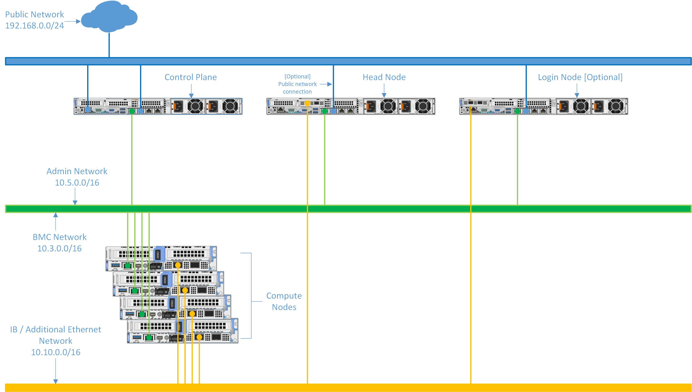

Network Topology: Hybrid setup
=============================

.. note:: The following diagram is for representational purposes only.

In a **Hybrid Setup**, the control plane and special nodes such as the head and login node are connected to the public network, while the iDRAC and the compute nodes use a shared LOM network.

* **Public Network (Blue line)**: This indicates the external public network which is connected to the internet. NIC2 of the Control plane, Head node, and Login node [optional] is connected to the public network. Along with this, BMC NIC of the Head node is connected.

* **Admin Network and BMC network (Green line)**: This indicates the admin network and the BMC network utilized by Omnia to provision the cluster nodes and to control the cluster nodes using out-of-band management. NIC1 of all the nodes are connected to the private switch.

* **IB / Additional Ethernet Network (Yellow line)**: This indicates the Infiniband (IB) or the additional ethernet network used by applications on the cluster nodes to communicate among each other, using Mellanox or high-speed ethernet switch. Control plane connectivity is optional for this switch.

**Recommended discovery mechanism**

* `mapping <../../InstallationGuides/InstallingProvisionTool/DiscoveryMechanisms/mappingfile.html>`_
* `bmc <../../InstallationGuides/InstallingProvisionTool/DiscoveryMechanisms/bmc.html>`_