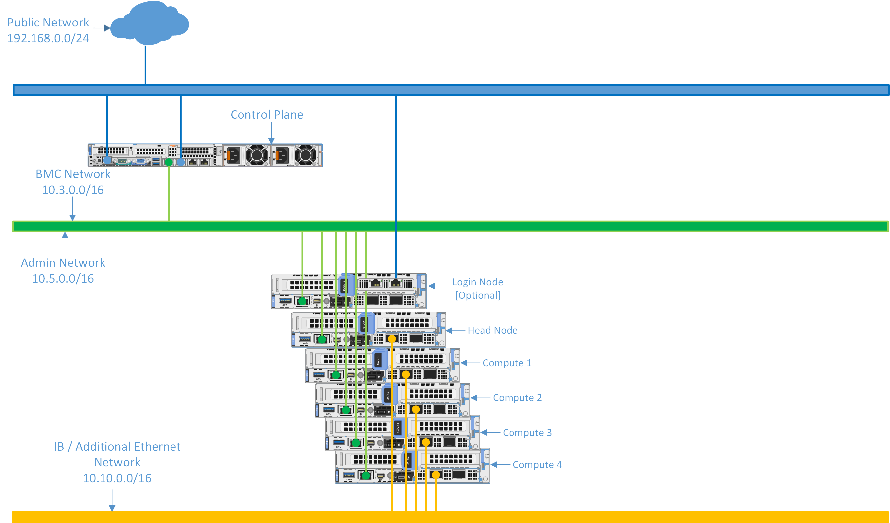

Network Topology: Shared LAN on motherboard (LOM) Setup
=========================================================

.. note:: The following diagram is for representational purposes only.

In a **Shared LOM setup**, the Administration and BMC logical networks share the same ethernet segment and physical connection.

* **Public Network (Blue line)**: This indicates the external public network which is connected to the internet. NIC2 of the Control plane, and Login node [optional] is connected to the public network.

* **Admin Network and BMC network (Green line)**: This indicates the admin network and the BMC network utilized by Omnia to provision the cluster nodes and to control the cluster nodes using out-of-band management. NIC1 of all the nodes are connected to the private switch.

* **IB / Additional Ethernet Network (Yellow line)**: This indicates the Infiniband (IB) or the additional ethernet network used by applications on the cluster nodes to communicate among each other, using Mellanox or high-speed ethernet switch. Control plane connectivity is optional for this switch.

.. note:: Omnia supports classless IP addressing, which allows the Admin network, BMC network, Public network, and the Additional network to be assigned different subnets. However, the Admin and BMC networks must be on the same subnet.

**Recommended discovery mechanism**

* `mapping <../../OmniaInstallGuide/Ubuntu/Provision/DiscoveryMechanisms/mappingfile.html>`_
* `bmc <../../OmniaInstallGuide/Ubuntu/Provision/DiscoveryMechanisms/bmc.html>`_
* `switch-based  <../../OmniaInstallGuide/Ubuntu/Provision/DiscoveryMechanisms/switch-based.html>`_

