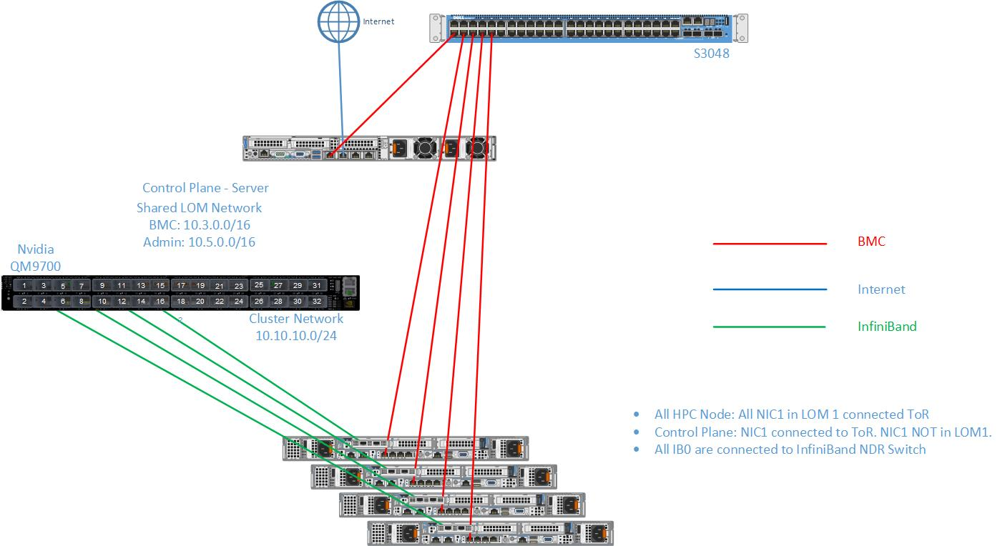
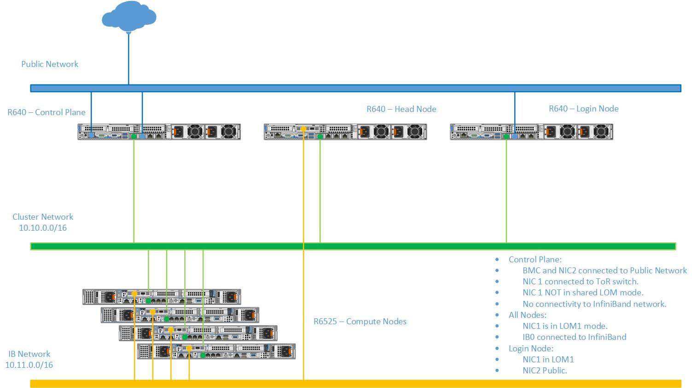

Network Topology: LOM Setup
============================

A LOM port could be shared with the host operating system production traffic. Also, LOM ports can be dedicated to server management. For example, with a four-port LOM adapter, LOM ports one and two could be used for production data while three and four could be used for iDRAC, VNC, RDP, or other operating system-based management data.

.. warning:: Target nodes using LOM ports cannot be discovered via SNMP.

