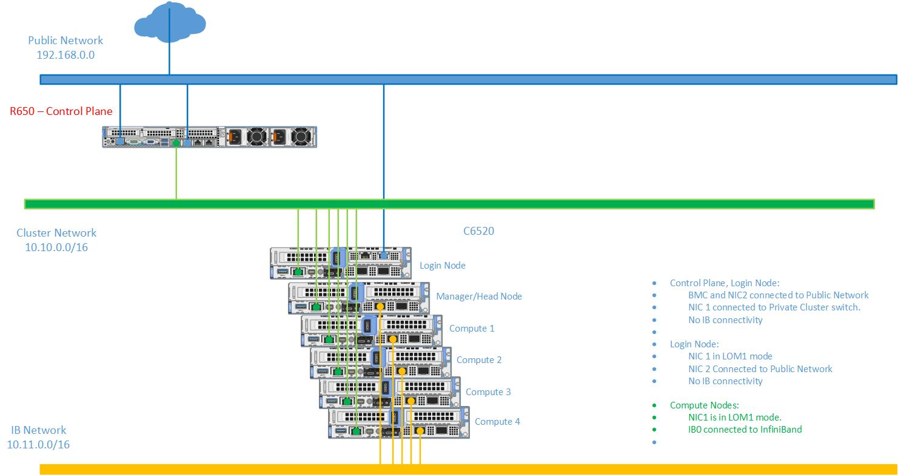

Network Topology: LAN on motherboard (LOM) Setup
==================================================

A LOM port could be shared with the host operating system production traffic. Also, LOM ports can be dedicated for server management. For example, with a four-port LOM adapter, LOM ports one and two could be used for production data while three and four could be used for iDRAC, VNC, RDP, or other operating system-based management data.

In a shared **LOM Setup**, the entire cluster network is shared between the iDRAC and the cluster nodes.

* **Public Network (Blue line)**: This indicates that only the control plane and login node is connected to the external public network.

* **Cluster Network (Green line)**: This indicates the admin network utilized by Omnia to provision all the cluster nodes (login, head, and compute).

* **InfiniBand (IB) Network (Yellow line)**: The network used by the applications on the head and compute nodes to communicate among each other.

**Recommended discovery mechanism**

* `mapping <../../InstallationGuides/InstallingProvisionTool/DiscoveryMechanisms/mappingfile.html>`_
* `bmc <../../InstallationGuides/InstallingProvisionTool/DiscoveryMechanisms/bmc.html>`_
* `switch-based  <../../InstallationGuides/InstallingProvisionTool/DiscoveryMechanisms/switch-based.html>`_

