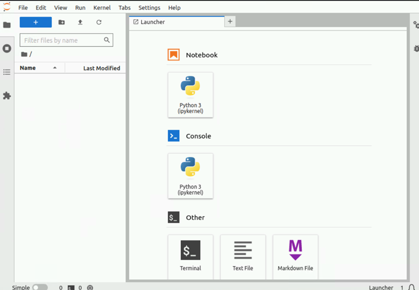

Setup Jupyterhub
-----------------

Using Helm charts, Omnia can install Jupyterhub on Kubernetes clusters. Once Jupyterhub is deployed, log into the UI to create your own notebook servers. For more information, `click here <https://z2jh.jupyter.org/en/stable/jupyterhub/customization.html>`_.

**Prerequisites**

* Ensure the kubernetes cluster is setup and working.
* Ensure the inventory file includes a ``kube_control_plane`` group listing all cluster nodes.
* Review the ``tools/jupyter_config.yml`` file to ensure that the deployment meets your requirements. If not, modify the file.
* Update the ``input/config/<operating_system>/<operating_system_version>/jupyter.json`` file with the correct jupyter helm chart version required. The default value is **3.2.0**.
* Omnia deploys the ``quay.io/jupyterhub/k8s-singleuser-sample:3.2.0`` image irrespective of whether the intended notebooks are CPU-only, NVidia GPU, or AMD GPU.  To use a custom image, modify the ``omnia/tools/roles/jupyter_config.yml`` file.

**Deploying Jupyterhub**

1. Change directories to the ``tools`` folder: ::

    cd tools

2. Run the ``jupyterhub.yml`` playbook using: ::

       ansible-playbook jupyterhub.yml -i inventory

.. note:: The default namespace for deployment is ``jupyterhub``.

**Accessing the Jupyterhub UI**

1. Verify that the Jupyterhub service is running using metallb loadbalancer.
2. Find the IP address of the Jupyterhub service using: ::

        root@omnianode0000x:/usr/local# kubectl get svc -A
        NAMESPACE     NAME           TYPE           CLUSTER-IP      EXTERNAL-IP   PORT(S)                  AGE
        default       kubernetes     ClusterIP      xx.xx.xx.xx      <none>        443/TCP                  2d2h
        jupyterhub    hub            ClusterIP      xx.xx.xx.xx      <none>        8081/TCP                 2d2h
        jupyterhub    proxy-api      ClusterIP      xx.xx.xx.xx      <none>        8001/TCP                 2d2h
        jupyterhub    proxy-public   LoadBalancer   xx.xx.xx.xx   xx.xx.xx.xx    80:31134/TCP               2d2h

The IP address is listed against ``proxy-public``.

3. For the first log in, use the Login Node. Ensure the login node has an OS installed with GUI support. Use any browser to log in with user credentials.

.. image:: ../../images/Jupyterhub_Login.png

4. Choose your preferred notebook server option and click **Start**. A pod will be created for the user. Available server options will depend on the user logging in.

.. image:: ../../images/Jupyterhub_UI.png

**Stopping the Notebook server**

1. Click **File > Hub Control Plane**.
2. Select **Stop Server**.

.. note:: Stopping the notebook server only terminates the user pod. The users data persists and can be accessed by loggin in and starting the notebook server again.
