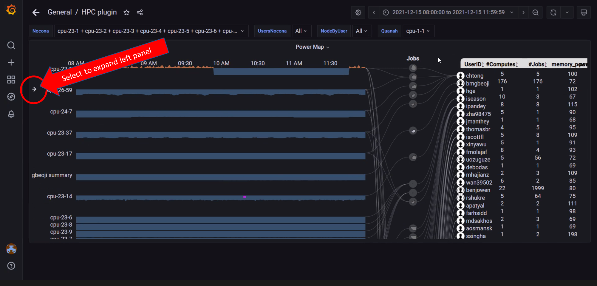
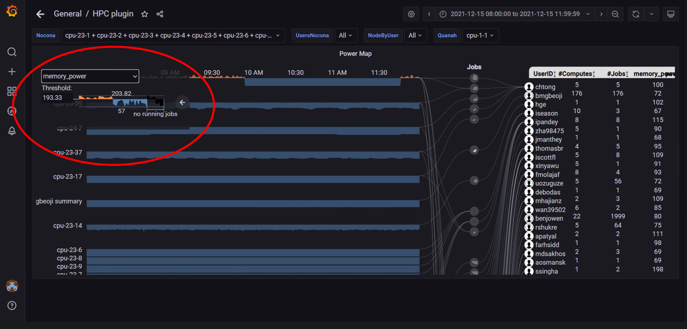
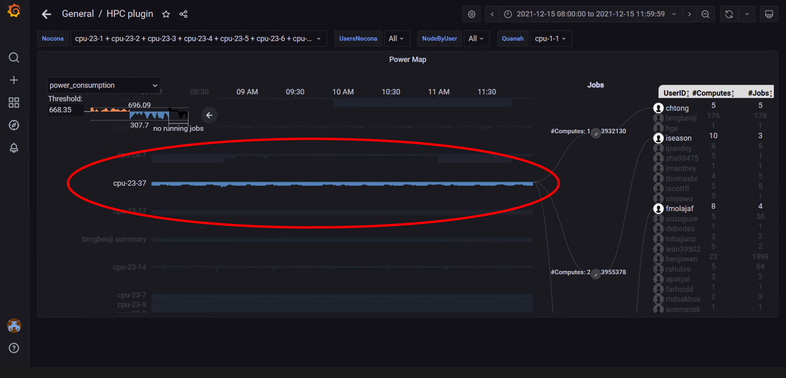
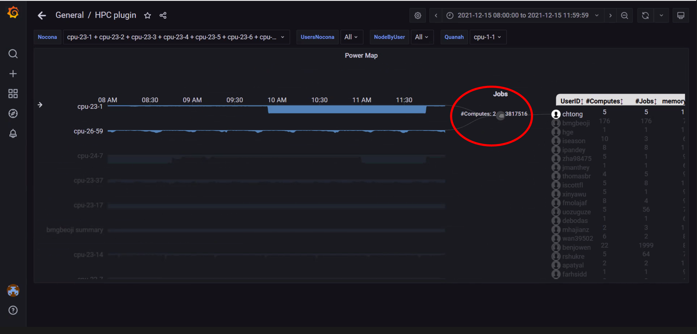
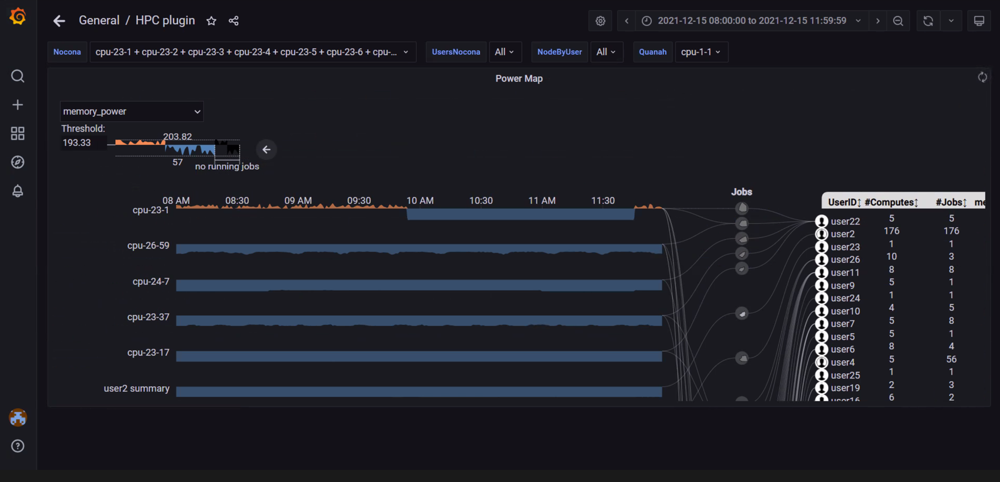

Power Maps
==========

A PowerMap diagram is a visualization used to depict the relationship
between Users, Jobs, and Computes. It can be used to identify heavy or
malfunctioning jobs that could be choking resources. This graph requires
that both iDRAC and slurm telemetry are enabled

    
In the above image, the arrow on the left can be used to expand the left panel and customize the graph

    
In the above image, the left panel is used to select the metric **Memory Power** as the metric to build the power map on. The panel can also be used to change the threshold setting. The threshold is a value (often the mean or median value) based on which the graph points are colored. For example: The threshold above is set to 193.33. Values above the threshold are colored in orange whereas the values below are colored in blue.

    
In the above image, clicking or hovering over a specific node highlights the node, the jobs associated and the relevant users within the specified time range.

    
In the above image, clicking or hovering over a specific job highlights the nodes and users associated with the job.

    
In the above image, the view has been repositioned by clicking and dragging. The view can also be zoomed into by scrolling forwards. Scroll backwards to zoom out.
