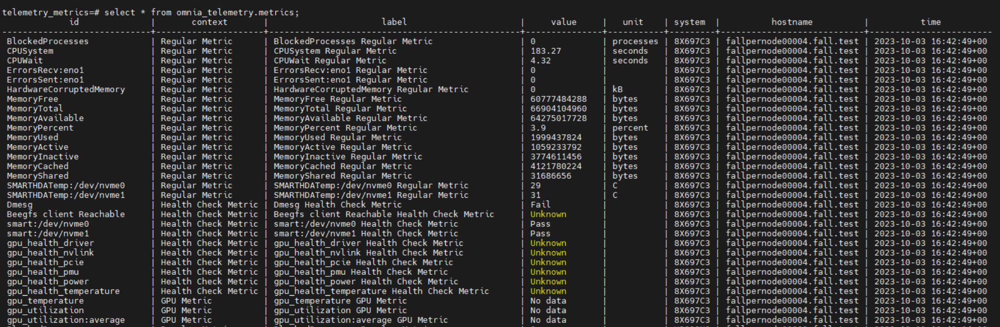

Timescale DB
-------------

**Accessing the timescale DB**

1. Check the IP of the control plane (``ifconfig``): ::

    3: eno8403: <BROADCAST,MULTICAST,UP,LOWER_UP> mtu 1500 qdisc mq state UP group default qlen 1000 link/ether b4:45:06:eb:da:4e brd ff:ff:ff:ff:ff:ff
    inet 198.168.0.11/24 brd 198.168.0.255 scope global dynamic noprefixroute eno8403 validlft 30884289sec preferred_lft 30884289sec ínet6 fe80::b645:6ff:feeb:da4e/64 scope link noprefixroute validlft forever preferredlft forever

2. Check the external port on which timescaleDB is running (``kubectl get svc -A``):

    .. image:: ../../images/TimescaleDB_Ports.png

3. Connect to DB (``psql -h <host_ip> -p <timescaledb_port> -U <timescaledb_username> -d telemetry_metrics``)

.. note:: You will be prompted for the timescaledb password before being given access.

4. Query the database using SQL syntax.

Eg: ::

    select * from omnia_telemetry.metrics;
    select * from public.timeseries_metrics;

.. image:: ../../images/publictimeseries.png

**Data retention policy**

The ``omnia_telemetry.metrics`` has a data retention policy that ensures data is stored for 2 months only. A cleanup job is run everyday to purge metrics older than 60 days.

