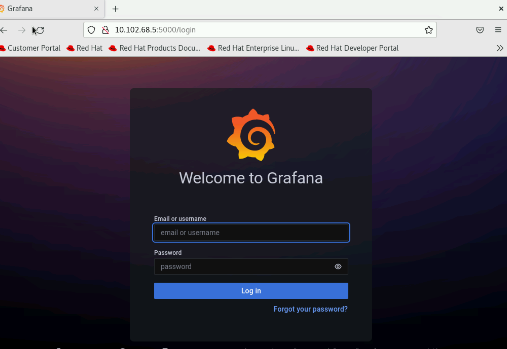
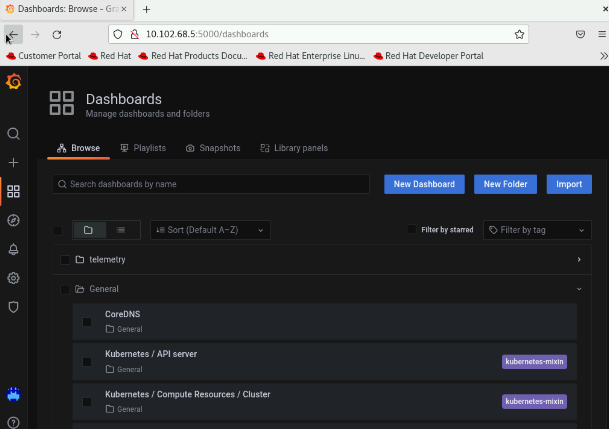
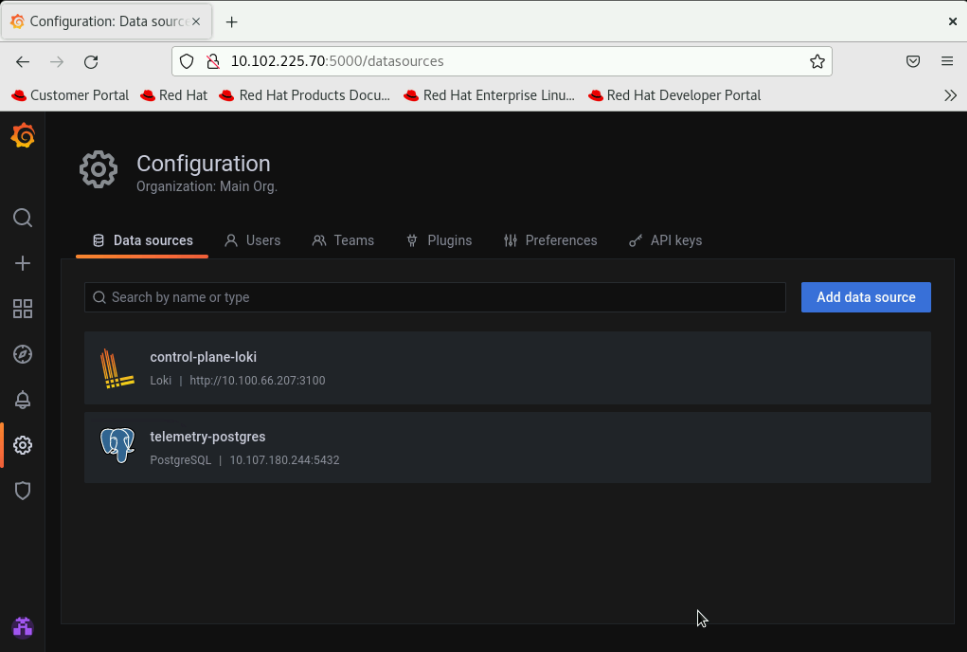

Telemetry and visualizations
------------------------------

The telemetry feature allows the set up  of Omnia telemetry (to poll values from all Omnia provisioned nodes in the cluster) and/or iDRAC telemetry (To poll values from all eligible iDRACs in the cluster). It also installs `Grafana <https://grafana.com/>`_ and `Loki <https://grafana.com/oss/loki/>`_ as Kubernetes pods.

To initiate telemetry support, fill out the following parameters in ``input/telemetry_config.yml``:

.. csv-table:: Parameters
   :file: ../../Tables/telemetry_config.csv
   :header-rows: 1
   :keepspace:

.. [1] Boolean parameters do not need to be passed with double or single quotes.

Once you have executed ``provision.yml`` and has also provisioned the cluster, initiate telemetry on the cluster as part of ``omnia.yml``, which configures the cluster with scheduler, storage and authentication using the below command. ::

    ansible-playbook omnia.yml -i inventory

Optionally, you can initiate only telemetry using the below command: ::

    ansible-playbook telemetry.yml -i inventory

.. note::

    * Depending on the type of telemetry initiated, include the following groups in the inventory:

        * omnia_telemetry: manager, compute, [optional] login

        * idrac_telemetry: idrac

    * If you would like a local backup of the timescaleDB used to store telemetry data, `click here <../Utils/timescaledb_utility.html>`_.

After initiation, new iDRACs can be added for ``idrac_telemetry`` acquisition by running the following commands: ::

    ansible-playbook add_idrac_node.yml -i inventory

**Modifying telemetry information**

To modify how data is collected from the cluster, modify the variables in ``omnia/input/telemetry_config.yml`` and re-run the ``telemetry.yml`` playbook.

* When ``omnia_telemetry_support`` is set to false, Omnia Telemetry Acquisition service will be stopped on all cluster nodes provided in the passed inventory.
* When ``omnia_telemetry_support`` is set to true, Omnia Telemetry Acquisition service will be restarted on all cluster nodes provided in the passed inventory.
* To start or stop the collection of regular metrics, health check metrics, or GPU metrics, update the values of ``collect_regular_metrics``, ``collect_health_check_metrics``, or ``collect_gpu_metrics``. For a list of all metrics collected, `click here <TelemetryMetrics.html>`_.

.. note::
    * Currently, changing the ``grafana_username`` and ``grafana_password`` values is not supported via ``telemetry.yml``.
    * The passed inventory should have an idrac group, if ``idrac_telemetry_support`` is true.
    * If ``omnia_telemetry_support`` is true, then the inventory should have manager and compute groups along with optional login group.
    * Rocky 8.7 is not compatible with the Kubernetes installed by ``telemetry.yml`` due to known issues with cri-o. For more information, `click here <https://github.com/cri-o/cri-o/issues/6197>`_.
    * If a subsequent run of ``telemetry.yml`` fails, the ``telemetry_config.yml`` file will be unencrypted.

**To access the Grafana UI**

*Pre requisites*

    * ``visualisation_support`` should be set to true when running ``telemetry.yml`` or ``omnia.yml``.

i. Find the IP address of the Grafana service using ``kubectl get svc -n grafana``

.. image:: ../../images/grafanaIP.png

ii. Login to the Grafana UI by connecting to the cluster IP of grafana service obtained above via port 5000. That is ``http://xx.xx.xx.xx:5000/login``

iii. Enter the ``grafana_username`` and ``grafana_password`` as mentioned in ``input/telemetry_config.yml``.

Loki log collections can viewed on the explore section of the grafana UI.

.. image:: ../../images/Grafana_Loki.png

Datasources configured by Omnia can be viewed as seen below.

**To use Loki for log filtering**

    i. Login to the Grafana UI by connecting to the cluster IP of grafana service obtained above via port 5000. That is ``http://xx.xx.xx.xx:5000/login``

    ii. In the Explore page, select **control-plane-loki**.

    .. image:: ../../images/Grafana_ControlPlaneLoki.png

    iii. The log browser allows you to filter logs by job, node and/or user.

Ex: ::

    (job)= "cluster deployment logs") |= "nodename"
    (job="compute log messages") |= "nodename" |="node_username"

**To use Grafana to view telemetry data**

    i. Login to the Grafana UI by connecting to the cluster IP of grafana service obtained above via port 5000. That is ``http://xx.xx.xx.xx:5000/login``

    ii. In the Explore page, select **telemetry-postgres**.

    .. image:: ../../images/Grafana_Telemetry_PostGRES.png

    iii. The query builder allows you to create SQL commands that can be used to query the ``omnia_telemetry.metrics`` table. Filter the data required using the following fields:

        * **id**: The name of the metric.
        * **context**: The type of metric being collected (Regular Metric, Health Check Metric and GPU metric).
        * **label**: A combined field listing the **id** and **context** row values.
        * **value**: The value of the metric at the given timestamp.
        * **unit**: The unit measure of the metric (eg: Seconds, kb, percent, etc.)
        * **system**: The service tag of the cluster node.
        * **hostname**: The hostname of the cluster node.
        * **time**: The timestamp at which the metric was polled from the cluster node.

    If you are more comfortable using SQL queries over the query builder, click on **Edit SQL** to directly provide your query.
    Optionally, the data returned from a query can be viewed as a graph.

**Visualizations**

If ``idrac_telemetry_support`` and ``visualisation_support`` is set to true, Parallel Coordinate graphs can be used to view system statistics.

.. toctree::
    Visualizations/index
    TelemetryMetrics
    MetricInfo
    TimescaleDB

