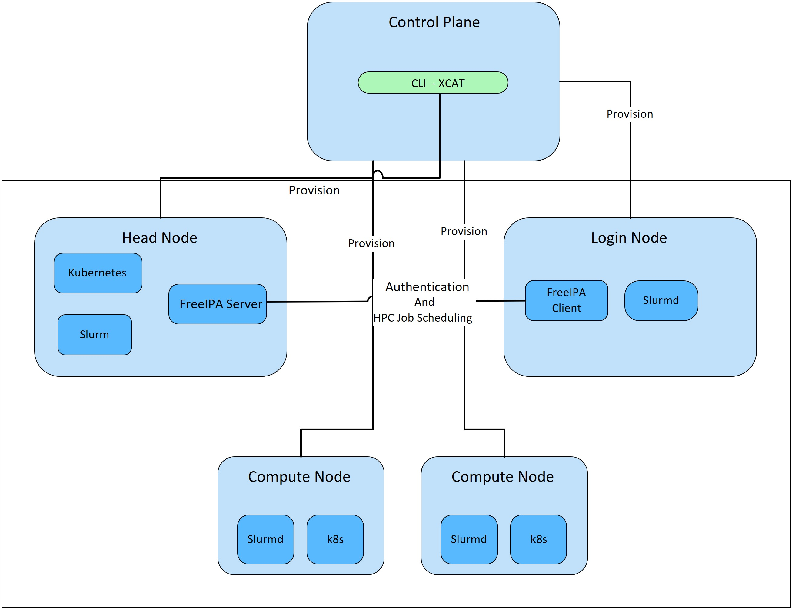

Product and Subsystem Security
===============================

Security controls map
----------------------

Omnia performs bare metal configuration to enable AI/HPC workloads. It uses Ansible playbooks to perform installations and configurations. iDRAC is supported for provisioning bare metal servers. Omnia installs xCAT to enable provisioning of clusters via PXE in different ways:

    - Mapping file **[optional]**: To dictate IP address/MAC mapping, a host mapping file can be provided.

    - BMC discovery **[optional]**: To discover the cluster via BMC (iDRAC), IPMI must be enabled on remote servers. Discovery happens over IPMI. For security best practices when using this method, `click here! <https://www.dell.com/support/manuals/en-us/idrac9-lifecycle-controller-v5.x-series/idrac9_security_configuration_guide/ipmi-security-best-practices?guid=guid-5d99c30c-294f-4f03-b584-596b43d79089&lang=en-us>`_

    - SNMP **[optional]**: To discover the cluster by querying switches, SNMPv2 must be enabled.

    - Switch **[default]**: To discovery the cluster by routing communication through particular switch ports over SNMPv3, non-admin switch credentials must be provided.

.. note:: IPMI is not required on the control plane. However compute nodes (iDRACs in the cluster/private network) require IPMI to be enabled for BMC discovery.

Omnia can be installed via CLI only. Slurm and Kubernetes are deployed and configured on the cluster. FreeIPA or LDAP is installed for providing authentication.

To perform these configurations and installations, a secure SSH channel is established between the management node and the following entities:

* Manager Node

* Compute Nodes

* Login Node

Authentication
---------------

Omnia does not have its own authentication mechanism because bare metal installations and configurations take place using root privileges. Post the execution of Omnia, third-party tools are responsible for authentication to the respective tool.

Cluster authentication tool
----------------------------

In order to enable authentication to the cluster, Omnia installs FreeIPA: an open source tool providing integrated identity and authentication for Linux/UNIX networked environments. As part of the HPC cluster, the login node is responsible for configuring users and managing a limited number of administrative tasks. Access to the manager/head node is restricted to administrators with the root password. For authentication on the manager and compute nodes exclusively, LDAP can also be installed by Omnia on the client.

.. note::  Omnia does not configure LDAP users or groups.

Authentication types and setup
------------------------------

Key-Based authentication
++++++++++++++++++++++++

**Use of SSH authorized_keys**

A password-less channel is created between the management station and compute nodes using SSH authorized keys. This is explained in Security Controls Maps.

Login security settings
------------------------

The following credentials have to be entered to enable different tools on the management station:

    1. iDRAC (Username/ Password)

    2. Ethernet Switch (Username/ Password)

    3. Infiniband Switch (Username/ Password)

    4. PowerVault ME4/ME5 (Username/ Password)

    5. Provisioning OS (Password)

    6. SNMPv3 PXE switch (Non-admin username/ password)

Similarly, passwords for the following tools have to be provided in ``input/omnia_config.yml`` to configure the cluster:

    1. maria_db (Password)

    2. DockerHub (Username/ Password)

For setting up authentication on the cluster, the following credentials have to be provided in ``input/security_config.yml``:

    1. FreeIPA (directory_manager_password, ipa_admin_password)

    2. LDAP (ldap_bind_username, ldap_bind_password)

Once Omnia is invoked, these files are validated and encrypted using Ansible Vault. They are hidden from external visibility and access.

Authentication to external systems
==================================

Third party software installed by Omnia are responsible for supporting and maintaining manufactured-unique or installation-unique secrets.

Configuring remote connections
-------------------------------

When setting up BeeGFS client services on the cluster, a connection authentication file is used to maintain the security of the communications between server and client.

    1. 	Generate the connection authentication file (connAuth) and use it to set up BeeGFS meta, server and storage services.
    2. 	Copy the connAuth file to the control plane and note the filepath.
    3. 	Populate the value of ``beegfs_secret_storage_filepath`` in ``input/storage_config.yml`` with the filepath from the previous step.

Omnia will configure the BeeGFS clients on th cluster using the provided file. BeeGFS is responsible for maintaining and securing connAuthFile. For more information, `click here <https://doc.beegfs.io/latest/advanced_topics/authentication.html>`_.

Network security
================

Omnia configures the firewall as required by the third-party tools to enhance security by restricting inbound and outbound traffic to the TCP and UDP ports.

Network exposure
-----------------

Omnia uses port 22 for SSH connections as Ansible uses port 22.

Firewall settings
------------------

Omnia configures the following ports for use by third-party tools installed by Omnia.

**Kubernetes ports requirements**

        +----------------+--------+-------------------------+-------------------------------+
        | Port           | Number | Layer 4                 | Protocol Purpose Type of Node |
        +================+========+=========================+===============================+
        |                | TCP    | Kubernetes API          | server Manager                |
        | 6443           |        |                         |                               |
        +----------------+--------+-------------------------+-------------------------------+
        |                | TCP    | etcd server             | client API Manager            |
        | 2379-2380      |        |                         |                               |
        +----------------+--------+-------------------------+-------------------------------+
        |                | TCP    | Kube-scheduler Manager  |                               |
        | 10251          |        |                         |                               |
        +----------------+--------+-------------------------+-------------------------------+
        |                | TCP    | Kube-controller manager | Manager                       |
        | 10252          |        |                         |                               |
        +----------------+--------+-------------------------+-------------------------------+
        |                | TCP    | Kubelet API             | Compute                       |
        | 10250          |        |                         |                               |
        +----------------+--------+-------------------------+-------------------------------+
        |                | TCP    | Nodeport services       | Compute                       |
        | 30000-32767    |        |                         |                               |
        +----------------+--------+-------------------------+-------------------------------+
        |                | TCP    | Calico services         | Manager/Compute               |
        | 5473           |        |                         |                               |
        +----------------+--------+-------------------------+-------------------------------+
        |                | TCP    | Calico services         | Manager/Compute               |
        | 179            |        |                         |                               |
        +----------------+--------+-------------------------+-------------------------------+
        |                | UDP    | Calico services         | Manager/Compute               |
        | 4789           |        |                         |                               |
        +----------------+--------+-------------------------+-------------------------------+
        |                | UDP    | Flannel services        | Manager/Compute               |
        | 8285           |        |                         |                               |
        +----------------+--------+-------------------------+-------------------------------+
        |                | UDP    | Flannel services        | Manager/Compute               |
        | 8472           |        |                         |                               |
        +----------------+--------+-------------------------+-------------------------------+

**Slurm port requirements**

        +------+---------+----------------+---------------+
        | Port | Number  | Layer 4        | Protocol Node |
        +======+=========+================+===============+
        | 6817 | TCP/UDP | Slurmctld Port | Manager       |
        +------+---------+----------------+---------------+
        | 6818 | TCP/UDP | Slurmd Port    | Compute       |
        +------+---------+----------------+---------------+
        | 6819 | TCP/UDP | Slurmdbd Port  | Manager       |
        +------+---------+----------------+---------------+

**BeeGFS port requirements**

        +------+-----------------------------------+
        | Port | Service                           |
        +======+===================================+
        | 8008 | Management service (beegfs-mgmtd) |
        +------+-----------------------------------+
        | 8003 | Storage service (beegfs-storage)  |
        +------+-----------------------------------+
        | 8004 | Client service (beegfs-client)    |
        +------+-----------------------------------+
        | 8005 | Metadata service (beegfs-meta)    |
        +------+-----------------------------------+
        | 8006 | Helper service (beegfs-helperd)   |
        +------+-----------------------------------+

**xCAT port requirements**

        +---------------+----------+--------------+
        | Port number   | Protocol | Service Name |
        +===============+==========+==============+
        | 3001          | tcp      | xcatdport    |
        +---------------+----------+--------------+
        | 3001          | udp      | xcatdport    |
        +---------------+----------+--------------+
        | 3002          | tcp      | xcatiport    |
        +---------------+----------+--------------+
        | 3002          | udp      | xcatiport    |
        +---------------+----------+--------------+
        | 3003(default) | tcp      | xcatlport    |
        +---------------+----------+--------------+
        | 7             | udp      | echo-udp     |
        +---------------+----------+--------------+
        | 22            | tcp      | ssh-tcp      |
        +---------------+----------+--------------+
        | 22            | udp      | ssh-udp      |
        +---------------+----------+--------------+
        | 873           | tcp      | rsync        |
        +---------------+----------+--------------+
        | 873           | udp      | rsync        |
        +---------------+----------+--------------+
        | 53            | tcp      | domain-tcp   |
        +---------------+----------+--------------+
        | 53            | udp      | domain-udp   |
        +---------------+----------+--------------+
        | 67            | udp      | bootps       |
        +---------------+----------+--------------+
        | 67            | tcp      | dhcp         |
        +---------------+----------+--------------+
        | 68            | tcp      | dhcpc        |
        +---------------+----------+--------------+
        | 68            | udp      | bootpc       |
        +---------------+----------+--------------+
        | 69            | tcp      | tftp-tcp     |
        +---------------+----------+--------------+
        | 69            | udp      | tftp-udp     |
        +---------------+----------+--------------+
        | 80            | tcp      | www-tcp      |
        +---------------+----------+--------------+
        | 80            | udp      | www-udp      |
        +---------------+----------+--------------+
        | 88            | tcp      | kerberos     |
        +---------------+----------+--------------+
        | 88            | udp      | kerberos     |
        +---------------+----------+--------------+
        | 111           | udp      | sunrpc-udp   |
        +---------------+----------+--------------+
        | 443           | udp      | HTTPS        |
        +---------------+----------+--------------+
        | 443           | tcp      | HTTPS        |
        +---------------+----------+--------------+
        | 514           | tcp      | shell        |
        +---------------+----------+--------------+
        | 514           | tcp      | rsyslogd     |
        +---------------+----------+--------------+
        | 514           | udp      | rsyslogd     |
        +---------------+----------+--------------+
        | 544           | tcp      | kshell       |
        +---------------+----------+--------------+
        | 657           | tcp      | rmc-tcp      |
        +---------------+----------+--------------+
        | 657           | udp      | rmc-udp      |
        +---------------+----------+--------------+
        | 782           | tcp      | conserver    |
        +---------------+----------+--------------+
        | 1058          | tcp      | nim          |
        +---------------+----------+--------------+
        | 2049          | tcp      | nfsd-tcp     |
        +---------------+----------+--------------+
        | 2049          | udp      | nfsd-udp     |
        +---------------+----------+--------------+
        | 4011          | tcp      | pxe          |
        +---------------+----------+--------------+
        | 300           | tcp      | awk          |
        +---------------+----------+--------------+
        | 623           | tcp      | ipmi         |
        +---------------+----------+--------------+
        | 623           | udp      | ipmi         |
        +---------------+----------+--------------+
        | 161           | tcp      | snmp         |
        +---------------+----------+--------------+
        | 161           | udp      | snmp         |
        +---------------+----------+--------------+
        | 162           | tcp      | snmptrap     |
        +---------------+----------+--------------+
        | 162           | udp      | snmptrap     |
        +---------------+----------+--------------+
        | 5432          | tcp      | postgresDB   |
        +---------------+----------+--------------+

.. note:: For more information, check out the `xCAT website. <https://xcat-docs.readthedocs.io/en/stable/advanced/ports/xcat_ports.html>`_

**FreeIPA port requirements**

        +---------------+---------+----------------------+----------------------+
        | Port   Number | Layer 4 | Purpose              | Node                 |
        +===============+=========+======================+======================+
        | 80            | TCP     | HTTP/HTTPS           | Manager/ Login_Node  |
        +---------------+---------+----------------------+----------------------+
        | 443           | TCP     | HTTP/HTTPS           | Manager/ Login_Node  |
        +---------------+---------+----------------------+----------------------+
        | 389           | TCP     | LDAP/LDAPS           | Manager/ Login_Node  |
        +---------------+---------+----------------------+----------------------+
        | 636           | TCP     | LDAP/LDAPS           | Manager/ Login_Node  |
        +---------------+---------+----------------------+----------------------+
        | 88            | TCP/UDP | Kerberos             | Manager/ Login_Node  |
        +---------------+---------+----------------------+----------------------+
        | 464           | TCP/UDP | Kerberos             | Manager/ Login_Node  |
        +---------------+---------+----------------------+----------------------+
        | 53            | TCP/UDP | DNS                  | Manager/ Login_Node  |
        +---------------+---------+----------------------+----------------------+
        | 7389          | TCP     | Dogtag's LDAP server | Manager/ Login_Node  |
        +---------------+---------+----------------------+----------------------+
        | 123           | UDP     | NTP                  | Manager/ Login_Node  |
        +---------------+---------+----------------------+----------------------+

.. note:: To avoid security vulnerabilities, protocols can be restricted on the network using the parameters restrict_program_support and restrict_softwares. However, certain protocols are essential to Omnia's functioning and cannot be disabled: ftp, smbd, nmbd, automount, portmap.

Data security
-------------

Omnia does not store data. The passwords Omnia accepts as input to configure the third party tools are validated and then encrypted using Ansible Vault. Run ``yum update --security`` routinely on the control plane for the latest security updates.

For more information on the passwords used by Omnia, see Login Security Settings.

Auditing and logging
--------------------

Omnia creates a log file at ``/var/log/omnia`` on the management station. The events during the installation of Omnia are captured as logs. For different roles called by Omnia, separate log files are created as listed below:

    * monitor.log
    * network.log
    * provision.log
    * scheduler.log
    * security.log
    * storage.log
    * utils.log

Additionally, an aggregate of the events taking place during storage, scheduler and network role installation called ``omnia.log`` is created in ``/var/log``.

There are separate logs generated by the third party tools installed by Omnia.

Logs
-----

A sample of the ``omnia.log`` is provided below:

::

    2021-02-15 15:17:36,877 p=2778 u=omnia n=ansible | [WARNING]: provided hosts
    list is empty, only localhost is available. Note that the implicit localhost does not
    match 'all'
    2021-02-15 15:17:37,396 p=2778 u=omnia n=ansible | PLAY [Executing omnia roles]
    ************************************************************************************
    2021-02-15 15:17:37,454 p=2778 u=omnia n=ansible | TASK [Gathering Facts]
    *****************************************************************************************
    *
    2021-02-15 15:17:38,856 p=2778 u=omnia n=ansible | ok: [localhost]
    2021-02-15 15:17:38,885 p=2778 u=omnia n=ansible | TASK [common : Mount Path]
    **************************************************************************************
    2021-02-15 15:17:38,969 p=2778 u=omnia n=ansible | ok: [localhost]

These logs are intended to enable debugging.

.. note:: The Omnia product recommends that product users apply masking rules on personal identifiable information (PII) in the logs before sending to external monitoring applications or sources.

Logging format
---------------

Every log message begins with a timestamp and also carries information on the invoking play and task.

The format is described in the following table.

+----------------------------------+----------------------------------+------------------------------------------+
| Field                            | Format                           | Sample Value                             |
+==================================+==================================+==========================================+
| Timestamp                        | yyyy-mm-dd h:m:s                 | 2/15/2021 15:17                          |
+----------------------------------+----------------------------------+------------------------------------------+
| Process Id                       | p=xxxx                           | p=2778                                   |
+----------------------------------+----------------------------------+------------------------------------------+
| User                             | u=xxxx                           | u=omnia                                  |
+----------------------------------+----------------------------------+------------------------------------------+
| Name of the process executing    | n=xxxx                           | n=ansible                                |
+----------------------------------+----------------------------------+------------------------------------------+
| The task being executed/ invoked | PLAY/TASK                        | PLAY [Executing omnia roles]   TASK      |
|                                  |                                  |[Gathering Facts]                         |
+----------------------------------+----------------------------------+------------------------------------------+
| Error                            | fatal: [hostname]: Error Message | fatal: [localhost]: FAILED! =>   {"msg": |
|                                  |                                  |"lookup_plugin.lines}                     |
+----------------------------------+----------------------------------+------------------------------------------+
| Warning                          | [WARNING]: warning message       | [WARNING]: provided hosts list is empty  |
+----------------------------------+----------------------------------+------------------------------------------+

Network vulnerability scanning
------------------------------

Omnia performs network security scans on all modules of the product. Omnia additionally performs Blackduck scans on the open source softwares, which are installed by Omnia at runtime. However, Omnia is not responsible for the third-party software installed using Omnia. Review all third party software before using Omnia to install it.