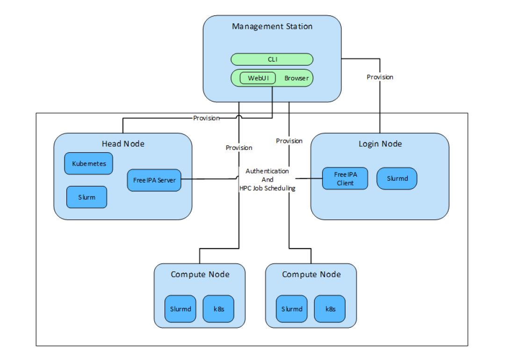

Security Quick Reference
========================

Security profiles
------------------

Omnia requires root privileges during installation because it provisions the operating system on bare metal servers.

Product and Subsystem Security
===============================

Security controls map
----------------------

Omnia performs bare metal configuration to enable AI/HPC workloads. It uses Ansible playbooks to perform installations and configurations. iDRAC is supported for provisioning bare metal servers. Cobbler supports provisioning through pxe. Users with iDRAC enterprise or a datacenter license can use iDRAC provisioning. Omnia can be installed via CLI as well. Slurm and Kubernetes are deployed and configured on the cluster. FreeIPA or LDAP is installed for providing authentication.

To perform these configurations and installations, a secure SSH channel is established between the management node and the following entities:

* Manager Node

* Compute Nodes

* Login Node

Authentication
---------------

Omnia does not have its own authentication mechanism because bare metal installations and configurations take place using root privileges. Post the execution of Omnia, third-party tools are responsible for authentication to the respective tool.

Cluster authentication tool
----------------------------

In order to enable authentication to the cluster, Omnia installs FreeIPA: an open source tool providing integrated identity and authentication for Linux/UNIX networked environments. As part of the HPC cluster, the login node is responsible for configuring users and managing a limited number of administrative tasks. Access to the manager/head node is restricted to administrators with the root password. For authentication on the manager and compute nodes exclusively, LDAP can also be installed by Omnia on the client.

.. note::  Omnia does not configure LDAP users or groups.

Authentication types and setup
------------------------------

Key-Based authentication
++++++++++++++++++++++++

**Use of SSH authorized_keys**

A password-less channel is created between the management station and compute nodes using SSH authorized keys. This is explained in Security Controls Maps.

Login security settings
------------------------

The following credentials have to be entered to enable different tools on the management station:

    1. iDRAC (Username/ Password)

    2. Ethernet Switch (Username/ Password)

    3. Infiniband Switch (Username/ Password)

    4. PowerVault ME4/ME5 (Username/ Password)

    5. Provisioning OS (Password)

Similarly, passwords for the following tools have to be provided in ``input/omnia_config.yml`` to configure the cluster:

    1. maria_db (Password)

    2. DockerHub (Username/ Password)

    3. FreeIPA (directory_manager_password, ipa_admin_password)

    4. LDAP (ldap_bind_username, ldap_bind_password)

After the installation of Omnia is initialized, these files are encrypted using Ansible Vault and are hidden from external visibility

and access.

