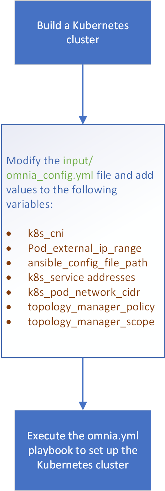

Build a Kubernetes cluster
=============================

* Before your build a cluster.
* Open the input/omnia_config.yml file and modify the default values as required. For more details, see the table below: ##add parameter table##

    - [Optional: If you want RoCE package on your cluster, change k8s_cni to flannel]

* [Optional/Additional] If you want to use FreeIPA or OpenLDAP on your cluster, open the input/security_config.yml file and modify the default values as required. For more details, see the table below: ##add parameter table##
* [Optional/Additional] If you want to enable telemetry services for your cluster, open the input/telemetry_config.yml file and modify the default values as required. For more details, see the table below: ##add parameter table##
* [Optional/Additional] If you want to set up BeeGFS storage, open the input/storage_config.yml file and modify the default values as required. For more details, see the table below: ##add parameter table##
* To create the cluster, execute the omnia.yml playbook using the following command:
* [Additional] You can check if the cluster has been set up using the following command:

