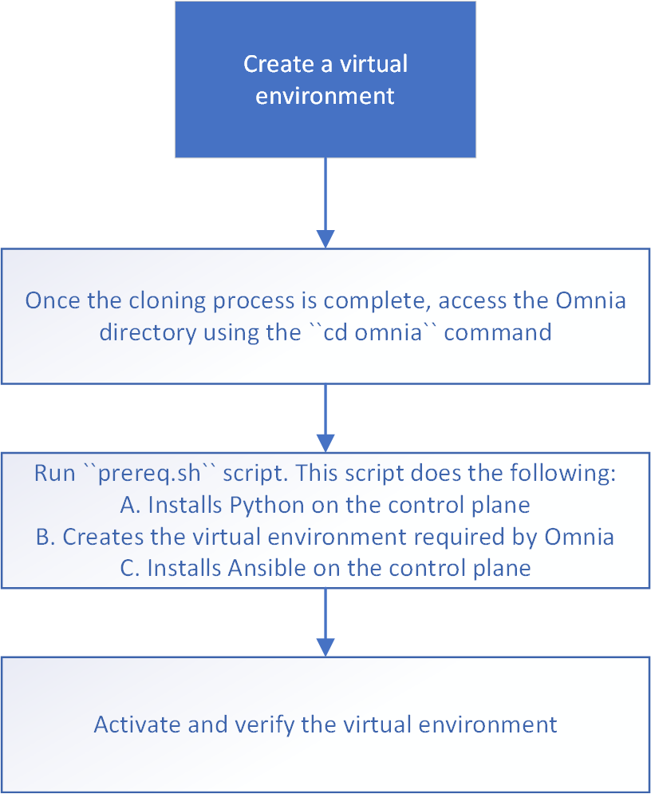

Create a Virtual Environment
==============================

* Access the Omnia directory [cd omnia]
* Run ``prereq.sh`` script. [installs python, creates a virtual environment, and installs Ansible]
* Activate and verify the virtual environment
* [Optional/Additional] Deactivate the virtual environment.

