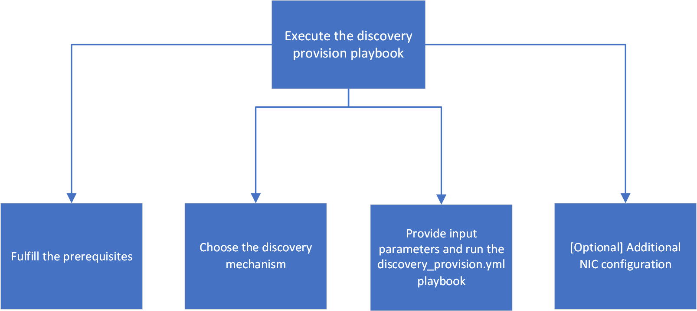

Discover & Provision the OS on the nodes
============================================

* Before you discover and provision your nodes.

    - Configure additional private NIC on the control plane, to set up the cluster network.

* Open the input/provision_config.yml file and modify the default values as required:

    - For switch-based discovery mechanism, see the table below: ##add parameter table##
    - For pxe-mapping discovery mechanism, see the table below: ##add parameter table##

* Open the input/provision_config_credentials.yml file and modify the default values as required. For more details, `link <../../OmniaInstallGuide/Ubuntu/Provision/provisionparams.html#id4>`_.
* Open the input/network_spec.yml file and modify the default values as required. For more details, see the table below.

.. csv-table:: Network Spec
   :file: ../../Tables/network_spec.csv
   :header-rows: 1
   :keepspace:

    - [Optional] If you want to use discover your nodes using iDRAC (BMC), fill the following parameters in network_spec.yml: ##add parameter table##

* To provision the cluster nodes, execute the discovery_provision.yml using the following command:

