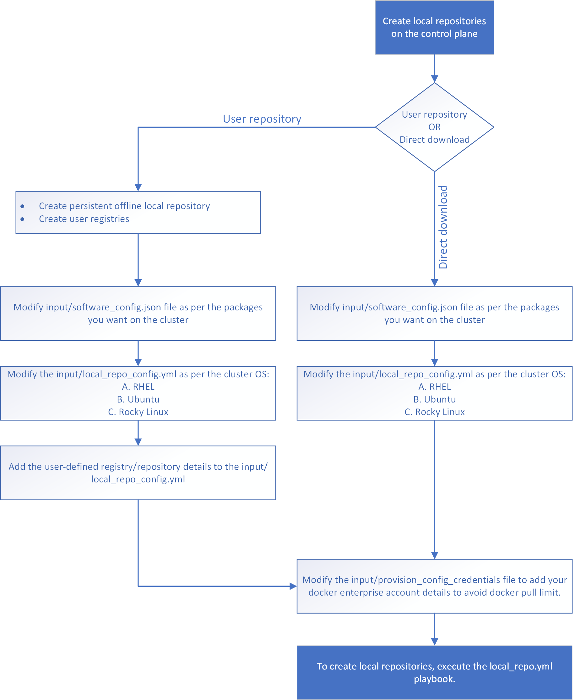

Create Local Repositories on OIM
==================================

[Optional] To store the software packages offline, download the packages manually and keep it in an user registry/user repo.

* Edit the input/software_config.json file as per the packages that you require on the cluster:

    - Go to input/software_config.json file.
    - Ensure you have the following entries in order to set up a K8s cluster (k8s entry must be present). ##add the bare-basic structure of the json file for a k8s cluster##
    - For other software packages, AI tools, and GPU drivers/tools - modify as needed. For more information on how to modify, see ##link to other optional packages page##.

* Open the input/local_repo_config.yml file and modify as required:

    - To download the packages to the default omnia_repo, add the following parameters:

            * ##add parameter table for RHEL##
            * ##add parameter table for Ubuntu##
            * ##add parameter table for Rocky##

    - [Optional] To access (pull or download?) the packages to an user-defined repository, specify the repository and registry URLs to the following parameters: ##add parameter table##

* Open the input/provision_config_credentials.yml file and specify your docker enterprise account details to avoid docker pull limit issues: ##add parameter table##
* To create local repositories, execute the local_repo.yml playbook using the following command:

