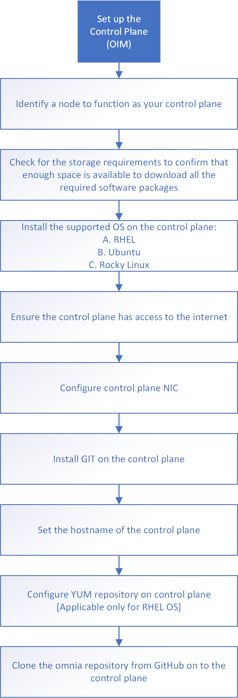

Configure Control Plane (OIM)
===============================

* Identify a node to function as a control plane (CP). Ensure that the node is not part of any existing cluster.
* Check the space requirements for the CP. Add or remove disk space based on the packages that you require. `Click here <../../OmniaInstallGuide/Ubuntu/UbuntuSpace.html>`_
* Install the supported OS on the CP. `Click here <../../Overview/SupportMatrix/OperatingSystems/index.html>`_
* Ensure that the CP has access to the internet.
* Configure the CP NIC. `Click here <../../OmniaInstallGuide/Ubuntu/Provision/provisionprereqs.html>`_
* Install GIT on the control plane.
* Set the hostname of the CP based on the hostname requirements. `Click here <../../Appendices/hostnamereqs.html>`_
* Configure the YUM repository on the CP. [Optional: only applicable to RHEL OS]
* Clone the Omnia repository from GitHub onto the CP.
* [Optional] Set up a proxy server for the CP. `Click here <../../OmniaInstallGuide/Ubuntu/Setup_CP_proxy.html>`_

