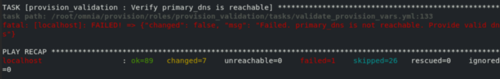

Frequently asked questions
==========================

**What to do if playbook execution fails due to external (network, hardware etc) failure**

Re-run the playbook whose execution failed once the issue is resolved.

**Why is the provisioning status of my node object stuck at 'powering-on'?**

Cause:

    * Hardware issues (Auto-reboot may fail due to hardware tests failing)

Resolution:

    * Resolve/replace the faulty hardware and PXE boot the node.

**Why are the status and admin_mac fields not populated for specific target nodes in the cluster.nodeinfo table?**

Causes:

 * Nodes do not have their first PXE device set as designated active NIC for PXE booting.
 * Nodes that have been discovered via SNMP or mapping file have not been PXE booted.

Resolution:

 * Configure the first PXE device to be active for PXE booting.
 * PXE boot the target node manually.

**Why is the provisioning status of my node object stuck at 'installing'?**

Cause:

    * Disk partition may not have enough storage space per the requirements specified in ``input/provision_config`` (under ``disk_partition``)

    * The provided ISO may be corrupt.

    * Hardware issues

Resolution:

    * Add more space to the server or modify the requirements specified in ``input/provision_config`` (under ``disk_partition``)

    * Download the ISO again, verify the checksum and re-run the provision tool.

    * Resolve/replace the faulty hardware and PXE boot the node.

**Why does the 'Verify primary_dns is  reachable' task fail during provision.yml?**

Currently, the ``primary_dns`` value stored in ``input/provision_config.yml`` cannot be part of any of the subnets (``admin_nic_subnet``, ``ib_nic_subnet`` and ``bmc_nic_subnet``) also defined in ``input/provision_config.yml``.

Ex: If the ``primary_dns`` is set to 10.15.0.7, the subnet ``10.15.0.0`` cannot be used for ``admin_nic_subnet``, ``ib_nic_subnet`` or ``bmc_nic_subnet``.

**Why is the node status stuck at 'powering-on' or 'powering-off' after a control plane reboot?**

Cause: The nodes were powering off or powering on during the control plane reboot/shutdown.

Resolution: In the case of a planned shutdown, ensure that the control plane is shut down after the compute nodes. When powering back up, the control plane should be powered on and xCAT services resumed before bringing up the compute nodes. In short, have the control plane as the first node up and the last node down.

For more information, `click here <https://github.com/xcat2/xcat-core/issues/7374>`_

**What to do if PXE boot fails when discovering target nodes via switch_based discovery**

.. image:: ../images/PXEBootFail.png

1. Rectify any probable causes like incorrect/unavailable credentials (``switch_snmp3_username`` and ``switch_snmp3_password`` provided in ``input/provision_config.yml``), network glitches or incorrect switch IP/port details.
2. Run the clean up script by: ::

     cd utils
     ansible-playbook control_plane_cleanup.yml

3. Re-run the provision tool (``ansible-playbook provision.yml``).

**How to add a new node for provisioning**

1. Using a mapping file:

    * Update the existing mapping file by appending the new entry (without the disrupting the older entries) or provide a new mapping file by pointing ``pxe_mapping_file_path`` in ``provision_config.yml`` to the new location.

    * Run ``provision.yml``.

2. Using the switch IP:

    * Run ``provision.yml`` once the switch has discovered the potential new node.

**Why does the task: 'BeeGFS: Rebuilding BeeGFS client module' fail?**

.. image:: ../images/BeeGFSFailure.png

Potential cause: BeeGFS version 7.3.0 is in use.

Resolution: Use BeeGFS client version 7.3.1 when setting up BeeGFS on the cluster.

**Why does splitting an ethernet Z series port fail with "Failed. Either port already split with different breakout value or port is not available on ethernet switch"?**

Potential Cause:

    1. The port is already split.

    2. It is an even-numbered port.

Resolution:

    Changing the ``breakout_value`` on a split port is currently not supported. Ensure the port is un-split before assigning a new ``breakout_value``.

**How to enable DHCP routing on Compute Nodes:**

To enable routing, update the ``primary_dns`` and ``secondary_dns`` in ``provision_config.yml`` with the appropriate IPs (hostnames are currently not supported). For compute nodes that are not directly connected to the internet (ie only host network is configured), this configuration allows for internet connectivity.

**What to do if the LC is not ready:**

* Verify that the LC is in a ready state for all servers: ``racadm getremoteservicesstatus``

* PXE boot the target server.

**Is Disabling 2FA supported by Omnia?**

* Disabling 2FA is not supported by Omnia and must be manually disabled.

**Is provisioning servers using BOSS controller supported by Omnia?**

Provisioning server using BOSS controller is now supported by Omnia 1.2.1.

**How to re-launch services after a control-plane reboot while running provision.yml**

After a reboot of the control plane while running ``provision.yml``, to bring up ``xcatd`` services, please run the below command: ::

    ansible-playbook discovery_provision.yml

**How to re-provision a server once it's been set up by xCAT**

* Use ``lsdef -t osimage | grep install-compute`` to get a list of all valid OS profiles.

* Use ``nodeset all osimage=<selected OS image from previous command>`` to provision the OS on the target server.

* PXE boot the target server to bring up the OS.

**How many IPs are required within the PXE NIC range?**

Ensure that the number of IPs available between ``pxe_nic_start_range`` and ``pxe_nic_end_range`` is double the number of iDRACs available to account for potential stale entries in the mapping DB.

**What are the licenses required when deploying a cluster through Omnia?**

While Omnia playbooks are licensed by Apache 2.0, Omnia deploys multiple softwares that are licensed separately by their respective developer communities. For a comprehensive list of software and their licenses, `click here <../Overview/SupportMatrix/omniainstalledsoftware.html>`_ .