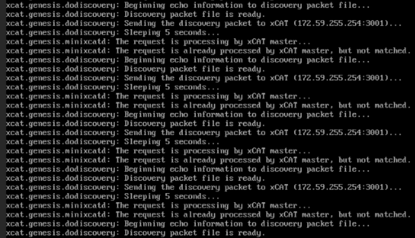

Frequently asked questions
==========================

⦾ **Why does the provisioning status of RHEL/Rocky Linux remote servers remain stuck at ‘installing’ in cluster.nodeinfo (omniadb)?**

.. image:: ../images/InstallingStuckDB.png

.. image:: ../images/InstallCorruptISO.png

**Potential Causes**:

    * Disk partition may not have enough storage space per the requirements specified in ``input/provision_config`` (under ``disk_partition``).

    * The provided ISO may be corrupt/incomplete.

    * Hardware issues (Auto reboot may fail at POST)

    * A virtual disk may not have been created

    * Re-run of the ``discovery_provision.yml`` playbook on the control plane while provisioning is in-progress on the remote nodes.

**Resolution**:

    * Add more space to the server or modify the requirements specified in ``input/provision_config`` (under ``disk_partition``).

    * Download the ISO again, verify the checksum/ download size and re-run the provision tool.

    * Resolve/replace the faulty hardware and PXE boot the node.

    * Create a virtual disk and PXE boot the node.

    * Initiate PXE boot on the remote node after completion of the ``discovery_provision.yml`` playbook execution.

⦾ **Why does the provisioning status of Ubuntu remote servers remain stuck at ‘bmcready’ or 'powering-on' in cluster.nodeinfo (omniadb)?**

.. image:: ../images/ubuntu_pxe_failure.png

**Potential Causes**:

    * Disk partition may not have enough storage space per the requirements specified in ``input/provision_config`` (under ``disk_partition``).

    * The provided ISO may be corrupt/incomplete.

    * Hardware issues (Auto reboot may fail at POST)

    * A virtual disk may not have been created

    * Re-run of the ``discovery_provision.yml`` playbook on the control plane while provisioning is in-progress on the remote nodes.

**Resolution**:

    * Add more space to the server or modify the requirements specified in ``input/provision_config`` (under ``disk_partition``).

    * Download the ISO again, verify the checksum/ download size and re-run the provision tool.

    * Resolve/replace the faulty hardware and PXE boot the node.

    * Create a virtual disk and PXE boot the node.

    * Initiate PXE boot on the remote node after completion of the ``discovery_provision.yml`` playbook execution.

⦾ **Why is the provisioning status of my target servers stuck at ‘powering-on’ in the cluster.info (omniadb)?**

**Potential Cause**:

    * Hardware issues (Auto-reboot may fail due to hardware tests failing)
    * The target node may already have an OS and the first boot PXE device is not configured correctly.

**Resolution**:

    * Resolve/replace the faulty hardware and PXE boot the node.
    * Target servers should be configured to boot in PXE mode with the appropriate NIC as the first boot device.

⦾ **What to do if PXE boot fails while discovering target nodes via switch_based discovery with provisioning status stuck at 'powering-on' in cluster.nodeinfo (omniadb):**

1. Rectify any probable causes like incorrect/unavailable credentials (``switch_snmp3_username`` and ``switch_snmp3_password`` provided in ``input/provision_config.yml``), network glitches, having multiple NICs with the same IP address as the control plane, or incorrect switch IP/port details.
2. Run the clean up script by: ::

     cd utils
     ansible-playbook control_plane_cleanup.yml

3. Re-run the provision tool (``ansible-playbook discovery_provision.yml``).

⦾ **What to do if playbook execution fails due to external (network, hardware etc) failure:**

Re-run the playbook whose execution failed once the issue is resolved.

⦾ **Why don't IPA commands work after setting up FreeIPA on the cluster?**

**Potential Cause**:

    Kerberos authentication may be missing on the target node.

**Resolution**:

    Run ``kinit admin`` on the node and provide the ``kerberos_admin_password`` when prompted. (This password is also entered in ``input/security_config.yml``.)

⦾ **Why am I unable to login using LDAP credentials after successfully creating a user account?**

**Potential Cause**:

    Whitespaces in the LDIF file may have caused an encryption error. Verify whether there are any whitespaces in the file by running ``cat -vet <filename>``.

 **Resolution:**

    Remove the whitespaces and re-run the LDIF file.

⦾ **Why are the status and admin_mac fields not populated for specific target nodes in the cluster.nodeinfo table?**

**Causes**:

    * Nodes do not have their first PXE device set as designated active NIC for PXE booting.
    * Nodes that have been discovered via multiple discovery mechanisms may list multiple times. Duplicate node entries will not list MAC addresses.

**Resolution**:

    * Configure the first PXE device to be active for PXE booting.
    * PXE boot the target node manually.
    * Duplicate node objects (identified by service tag) will be deleted automatically. To manually delete node objects, use ``utils/delete_node.yml``.

⦾ What to do if user login fails when accessing a cluster node:

.. image:: ../images/UserLoginError.png

**Potential Cause**:
    * ssh key on the control plane may be outdated.

**Resolution**:

   * Refresh the key using ``ssh-keygen -R <hostname/server IP>``.
   * Retry login.

⦾ **Why does the 'Import SCP from a local path' task fail during idrac.yml?**

.. image:: ../images/ImportSCPiDRAC_fail.png

**Potential Cause**: The target server may be stalled during the booting process.

**Resolution**: Bring the target node up and re-run the script.

⦾ **Why is the node status stuck at 'powering-on' or 'powering-off' after a control plane reboot?**

**Potential Cause**: The nodes were powering off or powering on during the control plane reboot/shutdown.

**Resolution**: In the case of a planned shutdown, ensure that the control plane is shut down after the compute nodes. When powering back up, the control plane should be powered on and xCAT services resumed before bringing up the compute nodes. In short, have the control plane as the first node up and the last node down.

For more information, `click here <https://github.com/xcat2/xcat-core/issues/7374>`_

⦾ **Why do subscription errors occur on RHEL control planes when rhel_repo_local_path (in input/provision_config.yml) is not provided and control plane does not have an active subscription?**

For many of Omnia's features to work, RHEL control planes need access to the following repositories:

    1. AppStream
    2. BaseOS

This can only be achieved using local repos specified in rhel_repo_local_path  (``input/provision_config.yml``).

.. note::
    To enable the repositories, run the following commands: ::

            subscription-manager repos --enable=codeready-builder-for-rhel-8-x86_64-rpms
            subscription-manager repos --enable=rhel-8-for-x86_64-appstream-rpms
            subscription-manager repos --enable=rhel-8-for-x86_64-baseos-rpms

    Verify your changes by running: ::

            yum repolist enabled

⦾ **Why does the task: Initiate reposync of AppStream, BaseOS and CRB fail?**

**Potential Cause**: The ``repo_url``, ``repo_name`` or ``repo`` provided in ``rhel_repo_local_path`` (``input/provision_config.yml``) may not have been valid.

Omnia does not validate the input of ``rhel_repo_local_path``.

**Resolution**: Ensure the correct values are passed before re-running ``discovery_provision.yml``.

⦾ **How to add a new node for provisioning**

1. Using a mapping file:

    * Update the existing mapping file by appending the new entry (without the disrupting the older entries) or provide a new mapping file by pointing ``pxe_mapping_file_path`` in ``provision_config.yml`` to the new location.

    * Run ``discovery_provision.yml``.

2. Using the switch IP:

    * Run ``discovery_provision.yml`` once the switch has discovered the potential new node.

⦾ **Why does the task: 'BeeGFS: Rebuilding BeeGFS client module' fail?**

.. image:: ../images/BeeGFSFailure.png

**Potential Cause**: BeeGFS version 7.3.0 is in use.

**Resolution**: Use BeeGFS client version 7.3.1 when setting up BeeGFS on the cluster.

⦾ **Why does splitting an ethernet Z series port fail with "Failed. Either port already split with different breakout value or port is not available on ethernet switch"?**

**Potential Cause**:

    1. The port is already split.

    2. It is an even-numbered port.

**Resolution**:

    Changing the ``breakout_value`` on a split port is currently not supported. Ensure the port is un-split before assigning a new ``breakout_value``.

⦾ **What to do if the LC is not ready:**

* Verify that the LC is in a ready state for all servers: ``racadm getremoteservicesstatus``

* PXE boot the target server.

⦾ **Why does the task: 'Orchestrator: Deploy MetalLB IP Address pool' fail?**

.. image:: ../images/Metallb_Telemetry_Apptainer_fail.png

**Potential Cause**: ``/var`` partition is full (potentially due to images not being cleared after intel-oneapi images docker images are used to execute benchmarks on the cluster using apptainer support) .

**Resolution**: Clear the ``/var`` partition and retry ``telemetry.yml``.

⦾ **Why does the task: [Telemetry]: TASK [grafana : Wait for grafana pod to come to ready state] fail with a timeout error?**

**Potential Cause**: Docker pull limit exceeded.

**Resolution**: Manually input the username and password to your docker account on the control plane.

⦾ **Is provisioning servers using BOSS controller supported by Omnia?**

From Omnia 1.2.1, provisioning a server using BOSS controller is supported.

⦾ **What are the licenses required when deploying a cluster through Omnia?**

While Omnia playbooks are licensed by Apache 2.0, Omnia deploys multiple softwares that are licensed separately by their respective developer communities. For a comprehensive list of software and their licenses, `click here <../Overview/SupportMatrix/omniainstalledsoftware.html>`_ .

⦾ **Why does the task: TASK [hostname_validation : Verify the domain name is not blank in hostname] fail?**

**Potential Cause**: Hostname is not configured properly with the domain name, on the target node.

**Resolution**: Use the following commands to configure the hostname properly: ::

        sysctl kernel.hostname=node001.omnia.test
        hostnamectl set-hostname node001.omnia.test

.. note:: ``node001.omnia.test`` is a sample hostname.