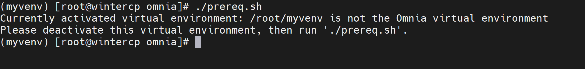
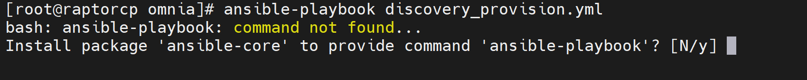
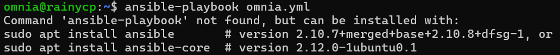

Virtual environment
=====================

⦾ **After executing** ``prereq.sh`` **script, why do I see the following error?**

**Potential Cause**: The virtual environment created by the ``prereq.sh`` script is not activated. The activation of the virtual environment is completely user-driven.

**Resolution**:

* Executing ``./prereq.sh`` installs all the packages and sets up the virtual environment - but doesn't activate it. You can activate the Python virtual environment using the following command: ::

    source /opt/omnia/omnia17_venv/bin/activate

 .. image:: ../../../images/virtual_env_2.png

* To verify that the virtual environment is active, check if the following prompt is displayed: ::

    (omnia) [root@<oim_name> omnia]#

⦾ **While executing any Omnia playbook, why do I encounter a "Command not found" or "Command 'ansible-playbook' not found" error?**

**Potential Cause**: Omnia playbooks are being executed outside of the Omnia virtual environment.

**Resolution**: Use the ``prereq.sh`` script to set up the Omnia virtual environment and install Ansible on the OIM. Activate the virtual environment following the steps provided `here <../../../OmniaInstallGuide/Ubuntu/Prereq.sh/index.html>`_ and then execute the playbooks.

⦾ **Why does executing an Omnia playbook outside the git cloned Omnia repository folder lead to failure?**

**Potential Cause**: Omnia does not support execution of playbooks outside of the git cloned Omnia repository folder.

**Resolution**: Ensure to execute all playbooks from inside the git cloned Omnia repository folder.