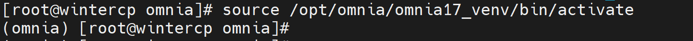

Virtual environment
=====================

⦾ **What to do if the prereq.sh script execution doesn't activate the Python virtual environment?**

.. image:: ../../../images/virtual_env_1.png

**Potential Cause**: Incorrect syntax used while executing the ``prereq.sh`` script.

**Resolution**:

* Ensure to use ``source prereq.sh`` instead of ``./prereq.sh`` while executing the prereq script to automatically activate the virtual environment. For more information, `click here <../../../OmniaInstallGuide/Ubuntu/Prereq.sh/index.html>`_.
* Executing ``./prereq.sh`` installs all the packages and sets up the virtual environment - but doesn't activate it. You can activate the Python virtual environment using the following command: ::

    source /opt/omnia_venv_1_7/bin/activate

* To verify that the virtual environment is active, check if the following prompt is displayed:

