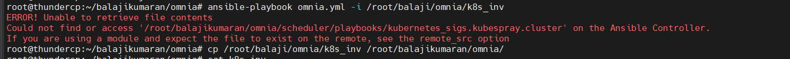
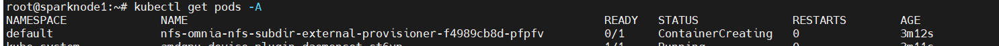
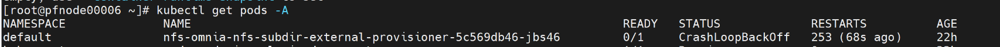
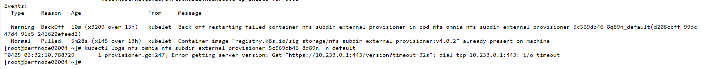
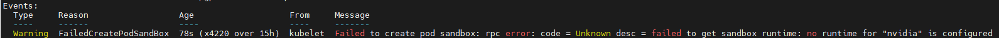

Kubernetes
===========

⦾ **Why do Kubernetes Pods show "ImagePullBack" or "ErrPullImage" errors in their status?**

**Potential Cause**: The errors occur when the Docker pull limit is exceeded.

**Resolution**:

    * Ensure that the ``docker_username`` and ``docker_password`` are provided in ``input/provision_config_credentials.yml``.

    * For a HPC cluster, during ``omnia.yml`` execution, a kubernetes secret 'dockerregcred' will be created in default namespace and patched to service account. User needs to patch this secret in their respective namespace while deploying custom applications and use the secret as imagePullSecrets in yaml file to avoid ErrImagePull. `Click here for more info. <https://kubernetes.io/docs/tasks/configure-pod-container/pull-image-private-registry>`_

.. note:: If the playbook is already executed and the pods are in **ImagePullBack** state, then run ``kubeadm reset -f`` in all the nodes before re-executing the playbook with the docker credentials.

⦾ **What to do if the nodes in a Kubernetes cluster reboot?**

**Resolution**: Wait for 15 minutes after the Kubernetes cluster reboots. Next, verify the status of the cluster using the following commands:

* ``kubectl get nodes`` on the kube_control_plane to get the real-time kubernetes cluster status.

* ``kubectl get pods  all-namespaces`` on the kube_control_plane to check which the pods are in the **Running** state.

* ``kubectl cluster-info`` on the kube_control_plane to verify that both the kubernetes master and kubeDNS are in the **Running** state.

⦾ **What to do when the Kubernetes services are not in "Running" state:**

**Resolution**:

1. Run ``kubectl get pods  all-namespaces`` to verify that all pods are in the **Running** state.

2. If the pods are not in the **Running** state, delete the pods using the command:``kubectl delete pods <name of pod>``

3. Run the corresponding playbook that was used to install Kubernetes: ``omnia.yml``, ``jupyterhub.yml``, or ``kubeflow.yml``.

⦾ **Why do Kubernetes Pods stop communicating with the servers when the DNS servers are not responding?**

**Potential Cause**: The host network is faulty causing DNS to be unresponsive

**Resolution**:

1. In your Kubernetes cluster, run ``kubeadm reset -f`` on all the nodes.

2. On the management node, edit the ``omnia_config.yml`` file to change the Kubernetes Pod Network CIDR. The suggested IP range is 192.168.0.0/16. Ensure that the IP provided is not in use on your host network.

3. List ``k8s`` in ``input/software_config.json`` and re-run ``omnia.yml``.

⦾ **Why does the 'Initialize Kubeadm' task fail with 'nnode.Registration.name: Invalid value: \"<Host name>\"'?**

**Potential Cause**: The OIM does not support hostnames with an underscore in it, such as 'mgmt_station'.

**Resolution**: As defined in RFC 822, the only legal characters are the following:

1. Alphanumeric (a-z and 0-9): Both uppercase and lowercase letters are acceptable, and the hostname is not case-sensitive. In other words, omnia.test is identical to OMNIA.TEST and Omnia.test.

2. Hyphen (-): Neither the first nor the last character in a hostname field should be a hyphen.

3. Period (.): The period should be used only to delimit fields in a hostname (For example, dvader.empire.gov)

⦾ **What to do if** ``omnia.yml`` **playbook execution fails with MetalLB, a load-balancer for bare metal Kubernetes cluster?**

**Resolution**: If your ``omnia.yml`` playbook execution fails while waiting for the MetalLB controller to be up and running, you need to wait for the MetalLB pods to come to running state and then re-run ``omnia.yml/scheduler.yml``.

⦾ **Why does the** ``omnia.yml`` **or** ``scheduler.yml`` **playbook execution fails with a** ``Unable to retrieve file contents`` **error?**

**Potential Cause**: This error occurs when the Kubespray collection is not installed during the execution of ``prepare_cp.yml``.

**Resolution**: Re-run ``prepare_cp.yml``.

⦾ **Why does the NFS-client provisioner go to a "ContainerCreating" or "CrashLoopBackOff" state?**

**Potential Cause**: This issue usually occurs when ``server_share_path`` given in ``storage_config.yml`` for ``k8s_share`` does not have an NFS server running.

**Resolution**:

    * Ensure that ``storage.yml`` is executed on the same inventory which is being used for ``scheduler.yml``.
    * Ensure that ``server_share_path`` mentioned in ``storage_config.yml`` for ``k8s_share: true`` has an active nfs_server running on it.

⦾ **If the Nfs-client provisioner is in "ContainerCreating" or "CrashLoopBackOff" state, why does the** ``kubectl describe <pod_name>`` **command show the following output?**

**Potential Cause**: This is a known issue. For more information, click `here. <https://github.com/helm/charts/issues/23743>`_

**Resolution**:

    1. Wait for some time for the pods to come up. **or**
    2. Do the following:

        * Run the following command to delete the pod: ::

            kubectl delete pod <pod_name> -n <namespace>

        * Post deletion, the pod will be restarted and it will come to running state.

⦾ **Why does the nvidia-device-plugin pods in ContainerCreating status fail with a** ``no runtime for "nvidia" is configured`` **error?**

**Potential Cause**: nvidia-container-toolkit is not installed on GPU nodes.

**Resolution**: Install Kubernetes, download nvidia-container-toolkit, and perform the necessary configurations based on the OS running on the cluster.

⦾ **After running the** ``reset_cluster_configuration.yml`` **playbook on a Kubernetes cluster, which should ideally delete all Kubernetes services and files, it is observed that some Kubernetes logs and configuration files are still present on the** ``kube_control_plane``. **However, these left-over files do not cause any issues for Kubernetes re-installation on the cluster. The files are present under the following directories:**

* ``/var/log/containers/``
* ``/sys/fs/cgroup/``
* ``etc/system``
* ``/run/systemd/transient/``
* ``/tmp/releases``

**Potential Cause**: When ``reset_cluster_configuration.yml`` is executed on a Kubernetes cluster, it triggers the Kubespray playbook ``kubernetes_sigs.kubespray.reset`` internally, which is responsible for removing Kubernetes configuration and services from the cluster. However, this Kubespray playbook doesn't delete all Kubernetes services and files, resulting in some files being left behind on the ``kube_control_plane``.

**Workaround**: After running the ``reset_cluster_configuration.yml`` playbook on a Kubernetes cluster, users can choose to remove the files from the directories mentioned above if they wish to do so.