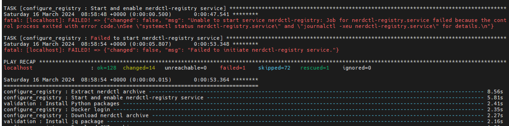
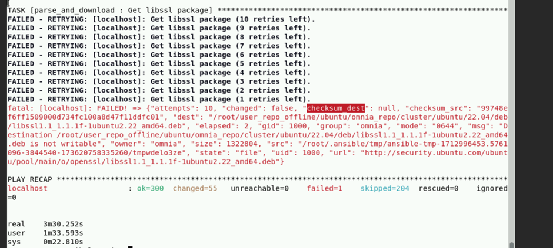
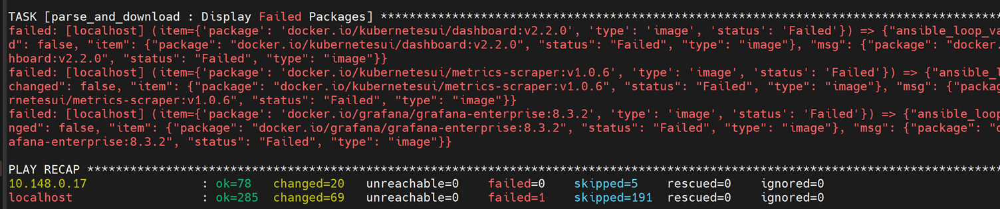

Local Repositories
===================

⦾ **Why does running** ``local_repo.yml`` **fail with connectivity errors?**

**Potential Cause**: The control plane was unable to reach a required online resource due to a network glitch.

**Resolution**: Verify all connectivity and re-run the playbook.

⦾ **Why does any script that installs software fail with "The checksum for <software repository path> did not match."**?

**Potential Cause**: A local repository for the software was not configured by ``local_repo.yml``.

**Resolution**:

    * Delete the tarball/image/deb of the software from ``<repo_path>/cluster/tarball``.
    * Re-run ``local_repo.yml``.
    * Re-run the script to install the software.

⦾ **Why does the task `configure registry: Start and enable nerdctl-registry service` fail with "Job for nerdctl-registry.service failed because the control process exited with error code"?**

**Potential Causes**:

    * The subnet 10.4.0.0/24 has been assigned to the admin, bmc, or additional network. nerdctl uses this subnet by default and cannot be assigned to any other interface in the system.
    * The docker pull limit has been breached.

**Resolutions**:

    * Reassign the conflicting network to a different subnet.
    * Update ``input/provision_config_credentials.yml`` with the ``docker_username`` and ``docker_password``.

⦾ **What to do if** ``local_repo.yml`` **execution fails with the following error:**

**Potential Cause**: Executing ``local_repo.yml`` with ``repo_store_path`` set as an NFS share, but lacking the necessary permissions to access it from the control plane.

**Resolution**: Provide the required (read, write, and execute) permissions for the NFS share. Verify the permissions of NFS share from the root user of the control plane.

⦾ **Why does the task ‘Parse and Download: Display Failed Packages’ fail while running** ``prepare_upgrade.yml`` **?**

**Potential Cause**: This issue may arise while setting up of local repo for Omnia v1.6 and can occur due to internet connection issues on control plane.

**Resolution**: Verify that the internet connectivity on control plane is stable and re-run the ``prepare_upgrade.yml`` playbook.

⦾ **The "TASK [configure_repos : Generate metadata for repositories]" fails during the execution of** ``local_repo.yml`` **on RHEL clusters if the Epel repository is unstable.**

**Potential Cause**: If the external Epel repository link mentioned in ``omnia_repo_url_rhel`` is not stable, then it can cause failures in ``local_repo.yml`` playbook execution.

**Resolution**:

1. Check if the Epel repository link mentioned in ``omnia_repo_url_rhel`` is accessible.

2. Verify the required software listed in ``software_config.json``, by examining the corresponding ``<software>.json`` files located in the ``input/config/rhel/`` directory. User can do either of the following, based on the findings:

    - If none of the packages are dependent on the Epel repository, users can remove the Epel repository URL from ``omnia_repo_url_rhel``.

    - If any package required from the Epel repository is listed in the ``software_config.json`` file, it's advisable to either wait for the Epel repository to stabilize or host those Epel repository packages locally. Afterward, remove the Epel repository link from ``omnia_repo_url_rhel`` and provide the locally hosted URL for the Epel repository packages via the ``user_repo_url`` variable.

⦾ **Why does** ``omnia.yml`` **execution fail during the** ``TASK [Kubernetes_sigs.kubesprate.container-engine/runc : Download_file | Create dest directory on node]`` **?**

**Potential Cause**: This issue may arise if the directory path specified as the ``repo_store_path`` in the ``input/local_repo_config.yml`` does not have 755 permissions.

**Resolution**: Ensure that not only the ``omnia_repo`` folder, but also the entire ``repo_store_path``, has 755 permissions. For example, if you specify ``/root/omnia_repo`` as the ``repo_store_path``, the ``/root`` directory must also have 755 permissions.