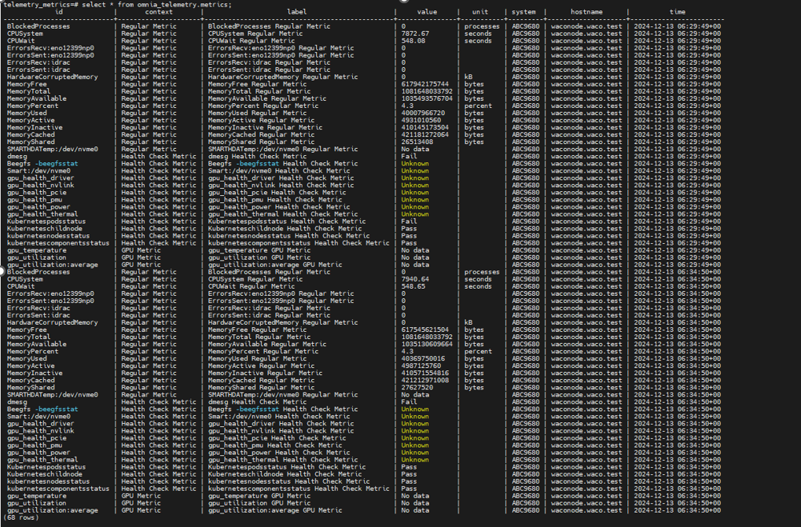

Telemetry
==========

⦾ **Why does the telemetry service fail on a compute node and the Telemetry database remains empty after executing** ``omnia.yml`` **in a cross-OS setup where the control plane is running Ubuntu 22.04 and the compute nodes are on Ubuntu 20.04?**

**Potential Cause**: This issue is encountered when there is a mismatch of libc version between the control plane (running on Ubuntu 22.04) and the compute node (running on Ubuntu 20.04).

**Resolution**: To ensure proper functioning of the telemetry service, ensure that the same libc version is present on the control plane and the compute nodes.

⦾ **Why are there no telemetry metrics available for the AMD MI300 accelerators in Omnia telemetry?**

**Potential Cause**: This issue is encountered due to a change in the API response format introduced in the latest AMD ROCm 6.2.2 driver.